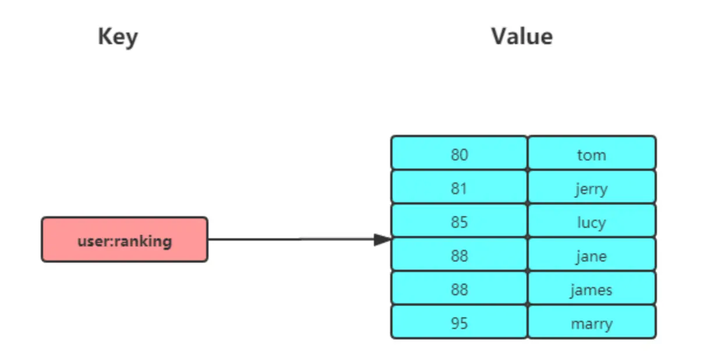

## Zset

### 介绍

想象一下，你需要一个能自动排序的列表，比如实时更新的积分排行榜、按时间先后排列的任务队列，或者任何需要根据某个"分数"来决定顺序的场景。Redis 的 Zset (Sorted Set，有序集合) 就是为此而生的！它和普通的 Set 一样，保证了元素的唯一性，但更强大的是，Zset 为每个元素关联了一个"分数"(score)，并能根据这个分数自动对元素进行排序。

有序集合保留了集合不能有重复成员的特性（分值可以重复），但不同的是，有序集合中的元素可以排序。



### 内部实现

Zset 如何做到既能存储唯一元素又能排序呢？Redis 在底层使用了两种精巧的数据结构：**跳表 (Skip List)** 和 **列表打包 (Listpack)**。

简单来说：
- 当你的 Zset 元素不多（默认小于128个），并且每个元素的值也不大（默认小于64字节）时，Redis 会优先使用 **listpack**。它是一种更紧凑的存储方式，非常节省内存。
- 而当 Zset 元素增多，或者元素值较大，不满足上述条件时，Redis 则会切换到 **跳表**。跳表是一种非常高效的动态排序数据结构，可以快速进行添加、删除和查找操作，其平均时间复杂度接近 O(logN)。

你无需关心 Redis 何时以及如何切换，它会自动选择最优的方式。

(值得注意的是，在 Redis 7.0 之前的版本中使用的是压缩列表而非 listpack，但核心思想是类似的——在小数据量时采用内存优化结构。**自 Redis 7.0 起，压缩列表已被 listpack 完全取代。**)

### 常用命令

理解 Zset 的常用命令是高效使用它的关键。以下是一些核心操作，分为几类以便理解：

#### 添加与修改

```shell
# ZADD key score member [[score member]...]
# 解释：向名为 key 的有序集合中添加一个或多个元素 (member)，并为每个元素指定一个分数 (score)。
# 如果元素已存在，则更新其分数；如果元素不存在，则添加新元素。
# 返回成功添加的新元素数量（不包括仅更新分数的元素）。
# 示例：ZADD myzset 10 "apple" 20 "banana"
ZADD key score member [[score member]...]   

# ZINCRBY key increment member
# 解释：为名为 key 的有序集合中指定元素 member 的分数增加 increment。
# 如果 member 不存在，则添加它，其初始分数为 increment。
# increment 可以是负数，表示减分。
# 示例：ZINCRBY myzset 5 "apple" (apple 的分数变为 15)
ZINCRBY key increment member 
```

#### 删除与查询数量

```shell
# ZREM key member [member...]
# 解释：从名为 key 的有序集合中删除一个或多个指定的元素 member。
# 示例：ZREM myzset "apple"
ZREM key member [member...]                 

# ZCARD key 
# 解释：获取名为 key 的有序集合中的元素总数 (Cardinality)。
# 示例：ZCARD myzset
ZCARD key 
```

#### 获取分数与排序（按分数）

```shell
# ZSCORE key member
# 解释：返回名为 key 的有序集合中指定元素 member 的分数。
# 如果 member 不存在或 key 不存在，则返回 nil。
# 示例：ZSCORE myzset "banana"
ZSCORE key member

# ZRANGE key start stop [WITHSCORES]
# 解释：按分数从小到大的顺序（升序），返回名为 key 的有序集合中指定排名范围内的元素。
# start 和 stop 都是从 0 开始的下标，可以是负数（-1 表示最后一个元素，-2 表示倒数第二个，以此类推）。
# WITHSCORES 选项会同时返回元素的分数。
# 示例：ZRANGE myzset 0 -1 WITHSCORES (获取所有元素及其分数)
ZRANGE key start stop [WITHSCORES]

# ZREVRANGE key start stop [WITHSCORES]
# 解释：按分数从大到小的顺序（降序），返回名为 key 的有序集合中指定排名范围内的元素。
# 参数含义与 ZRANGE 类似。
# 示例：ZREVRANGE myzset 0 2 WITHSCORES (获取分数最高的3个元素及其分数)
ZREVRANGE key start stop [WITHSCORES]
```

#### 范围查询（按分数或字典序）

```shell
# ZRANGEBYSCORE key min max [WITHSCORES] [LIMIT offset count]
# 解释：返回名为 key 的有序集合中，所有分数在 min 和 max 之间（包括 min 和 max）的元素。
# 元素按分数从小到大排序。
# min 和 max 可以是 -inf (负无穷) 和 +inf (正无穷)。
# 使用 ( 前缀表示不包含边界值，例如 (100 表示大于100。
# LIMIT 用于分页，offset 是起始位置，count 是数量。
# 示例：ZRANGEBYSCORE myzset 10 (30 WITHSCORES LIMIT 0 5 (获取分数大于10小于等于30的前5个元素)
ZRANGEBYSCORE key min max [WITHSCORES] [LIMIT offset count]

# ZRANGEBYLEX key min max [LIMIT offset count]
# 解释：当有序集合中所有元素的分数都相同时，此命令按元素的字典序（lexicographical order）返回指定范围内的元素。
# **重要前提：使用 ZRANGEBYLEX 时，目标 Zset 中的所有元素分数 *必须* 相同，否则结果可能不符合预期！**
# min 和 max 是字典序范围。使用 - 和 + 表示负无穷和正无穷的字典序边界。
# 使用 [ 表示包含边界，使用 ( 表示不包含边界。
# 示例：ZRANGEBYLEX myzset "[apple" "(banana" (获取字典序在 apple (含) 和 banana (不含) 之间的元素)
ZRANGEBYLEX key min max [LIMIT offset count]

# ZREVRANGEBYLEX key max min [LIMIT offset count]
# 解释：与 ZRANGEBYLEX 类似，但按字典逆序排列。
# **重要前提：使用 ZREVRANGEBYLEX 时，目标 Zset 中的所有元素分数 *必须* 相同，否则结果可能不符合预期！**
# 示例：ZREVRANGEBYLEX myzset "+ " "[banana" (获取字典序从最大到 banana (含) 的元素)
ZREVRANGEBYLEX key max min [LIMIT offset count]
```

#### 集合运算

Zset 也支持并集和交集运算，但与 Set 不同的是，它可以指定如何处理重复元素的分数。

```shell
# ZUNIONSTORE destkey numkeys key [key ...] [WEIGHTS weight [weight ...]] [AGGREGATE SUM|MIN|MAX]
# 解释：计算给定的一个或多个有序集合 (key) 的并集，并将结果存储在新的有序集合 destkey 中。
# numkeys 指定输入 key 的数量。
# WEIGHTS (可选)：为每个输入集合指定一个乘法因子，元素的原始分数在参与运算前会乘以这个因子。
# AGGREGATE (可选)：指定如何处理并集中相同元素的分数，默认为 SUM (相加)，也可以是 MIN (取最小值) 或 MAX (取最大值)。
# 示例：ZUNIONSTORE outkey 2 zset1 zset2 WEIGHTS 1 2 AGGREGATE MAX
ZUNIONSTORE destkey numkeys key [key...] 

# ZINTERSTORE destkey numkeys key [key ...] [WEIGHTS weight [weight ...]] [AGGREGATE SUM|MIN|MAX]
# 解释：计算给定的一个或多个有序集合 (key) 的交集，并将结果存储在新的有序集合 destkey 中。
# 参数含义与 ZUNIONSTORE 类似。
# 注意：Zset 没有直接的差集运算命令，如果需要，可以通过代码逻辑结合 ZREM 实现。
ZINTERSTORE destkey numkeys key [key...] 
```

### 应用场景

Zset 类型（Sorted Set，有序集合）可以根据元素的权重来排序，我们可以自己来决定每个元素的权重值。比如说，我们可以根据元素插入 Sorted Set 的时间确定权重值，先插入的元素权重小，后插入的元素权重大。

在面对需要展示最新列表、排行榜等场景时，如果数据更新频繁或者需要分页显示，可以优先考虑使用 Sorted Set。

#### 排行榜

有序集合最经典的应用非排行榜莫属了！无论是热门文章榜、游戏玩家积分榜、商品销量榜，还是实时更新的在线用户列表，Zset 都能轻松应对。

我们以博文点赞排名为例，假设用户"小林"发表了五篇博文，它们的赞数（score）和文章ID（member）如下：

```shell
# arcticle:1 文章获得了200个赞
> ZADD user:xiaolin:ranking 200 arcticle:1
(integer) 1
# arcticle:2 文章获得了40个赞
> ZADD user:xiaolin:ranking 40 arcticle:2
(integer) 1
# arcticle:3 文章获得了100个赞
> ZADD user:xiaolin:ranking 100 arcticle:3
(integer) 1
# arcticle:4 文章获得了50个赞
> ZADD user:xiaolin:ranking 50 arcticle:4
(integer) 1
# arcticle:5 文章获得了150个赞
> ZADD user:xiaolin:ranking 150 arcticle:5
(integer) 1
```

如果文章 `arcticle:4` 新增了一个赞，可以使用 `ZINCRBY` 命令轻松更新：

```shell
> ZINCRBY user:xiaolin:ranking 1 arcticle:4
"51" # 返回新的分数
```

想查看某篇文章（比如 `arcticle:4`）的当前赞数，可以使用 `ZSCORE` 命令：

```shell
> ZSCORE user:xiaolin:ranking arcticle:4
"51"
```

获取小林文章中赞数最高的 3 篇文章（降序排名），可以使用 `ZREVRANGE` 命令：

```shell
# WITHSCORES 表示同时显示分数
> ZREVRANGE user:xiaolin:ranking 0 2 WITHSCORES
1) "arcticle:1"
2) "200"
3) "arcticle:5"
4) "150"
5) "arcticle:3"
6) "100"
```

获取小林文章中赞数在 100 到 200 之间的文章（升序排列），可以使用 `ZRANGEBYSCORE` 命令：

```shell
> ZRANGEBYSCORE user:xiaolin:ranking 100 200 WITHSCORES
1) "arcticle:3"
2) "100"
3) "arcticle:5"
4) "150"
5) "arcticle:1"
6) "200"
```

#### 电话、姓名排序 (按字典序)

除了按数值分数排序，Zset 还能在所有元素分数都相同的情况下，按照元素的字典顺序（比如字母顺序、数字顺序）进行排序和范围查找。这就要用到 `ZRANGEBYLEX` (正序) 或 `ZREVRANGEBYLEX` (逆序) 这样的命令了。

**重要前提：使用 `ZRANGEBYLEX` 或 `ZREVRANGEBYLEX` 时，目标 Zset 中的所有元素分数 *必须* 相同，否则结果可能不符合预期！** 通常我们会将这些元素的分数统一设置为 `0`。

*1、电话排序*

我们可以将电话号码作为 member 存入 Zset，并将它们的分数都设为 0，然后根据需要来获取号段：

```shell
> ZADD phone 0 13100111100 0 13110114300 0 13132110901 
(integer) 3
> ZADD phone 0 13200111100 0 13210414300 0 13252110901 
(integer) 3
> ZADD phone 0 13300111100 0 13310414300 0 13352110901 
(integer) 3
```

获取所有号码（按字典序升序）：

```shell
# '-' 和 '+' 表示无穷小的字典序和无穷大的字典序
> ZRANGEBYLEX phone - +
1) "13100111100"
2) "13110114300"
3) "13132110901"
4) "13200111100"
5) "13210414300"
6) "13252110901"
7) "13300111100"
8) "13310414300"
9) "13352110901"
```

获取 132 号段的号码：

```shell
# '[132' 表示大于等于 '132' 的字典序
# '(133' 表示小于 '133' 的字典序
> ZRANGEBYLEX phone [132 (133
1) "13200111100"
2) "13210414300"
3) "13252110901"
```

获取 132、133 号段的号码：

```shell
> ZRANGEBYLEX phone [132 (134
1) "13200111100"
2) "13210414300"
3) "13252110901"
4) "13300111100"
5) "13310414300"
6) "13352110901"
```

*2、姓名排序*

同样，将姓名作为 member 存入 Zset，分数统一设为 0：
```shell
> zadd names 0 Toumas 0 Jake 0 Bluetuo 0 Gaodeng 0 Aimini 0 Aidehua 
(integer) 6
```

获取所有人的名字（按字典序升序）：

```shell
> ZRANGEBYLEX names - +
1) "Aidehua"
2) "Aimini"
3) "Bluetuo"
4) "Gaodeng"
5) "Jake"
6) "Toumas"
```

获取名字中大写字母 A 开头的所有人：

```shell
# '[A' 表示以 A 开头（包含A）
# '(B' 表示小于 B （不包含B）
> ZRANGEBYLEX names [A (B
1) "Aidehua"
2) "Aimini"
```

获取名字中大写字母 C 到 Z 的所有人：

```shell
# '[C' 表示以 C 开头（包含C）
# '[Z' 表示以 Z 开头，由于 ZRANGEBYLEX 是前缀匹配，为了包含所有以Z开头的，可以用 '[Zz' 或者更通用的方式确保能取到以Z结尾的，
# 但这里如果只是想取到Z开头的，可以考虑用一个比Z大的字符的上界，或者分段查询。更简单的是确保最后一个字母是Z的最大可能值。
# 一个更精确的做法是如果想包含所有Z开头的，可以用 [Z (Za (假设没有Za开头的)，但这取决于具体场景。
# 这里原示例的 [Z 意图是C到Z，但其匹配行为是"以C开头"到"以Z开头"。
# 如果要包含所有以 Z 结尾的，则需要更复杂的模式或多次查询。
# 这里保持原意，获取字母 C 到 Z 开头的名字
> ZRANGEBYLEX names [C [Zz
1) "Gaodeng"
2) "Jake"
3) "Toumas"
```

### 总结

总结来说，Redis Zset (有序集合) 以其独特的"元素唯一、自带排序"特性，在需要动态排序、范围查找以及构建各类排行榜的场景中展现出强大的威力。通过灵活运用 `ZADD`, `ZRANGE`, `ZREVRANGE`, `ZRANGEBYSCORE` 等命令，你可以高效地处理各种有序数据需求。
