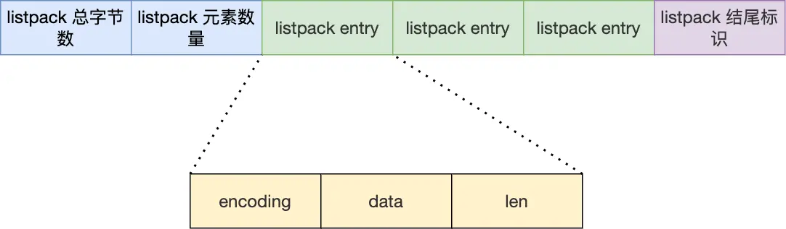

---
title: 'Redis 数据结构：ListPack 详解'
date: 2025-05-27 16:46:00
categories:
  - 八股文
  - REDIS
  - 基础知识
  - 数据结构
tags:
  - REDIS
  - ListPack
  - 数据结构
  - 压缩列表
description: '深入分析 Redis 6.0 引入的 ListPack 数据结构，解读其设计目标、实现原理及对比压缩列表的改进，探讨其在 Redis 中替代 ziplist 的过程与优势。'
--- 

# ListPack 详解

## 1. ListPack 的由来

### 1.1 [压缩列表](/2025/05/21/八股文/REDIS/基础知识/数据结构/压缩列表/)的痛点

虽然 QuickList 通过"分段压缩列表"的方式减轻了连锁更新带来的性能影响，但并未从根本上解决问题，因为：

- QuickList 内部仍然使用压缩列表存储数据
- 连锁更新问题源于压缩列表的**结构设计**
  - 引入`prevLen`字段，记录前一个节点的长度，当前一个节点长度发生变化时，有可能导致后续节点的`prevLen`字段也发生变化，但是原先的`prevLen`字段长度无法记录前一个节点的长度，于是`prevLen`字段也要变大，导致当前节点长度也要变大，于是连锁更新就发生了。
- 当压缩列表中的元素较多时，性能问题仍然存在

### 1.2 革新的需求

要彻底解决这个问题，Redis 开发团队决定：

> 设计一个全新的数据结构来替代压缩列表，从根本上消除连锁更新的隐患

于是，在 **Redis 5.0 版本**中，ListPack 数据结构应运而生。

## 2. 什么是 ListPack？

ListPack 是一种专为 Redis 设计的紧凑型线性数据结构：

- **设计目标**：替代压缩列表，消除连锁更新问题
- **核心特点**：每个节点不再保存前一个节点的长度
- **结构布局**：使用连续内存空间存储数据
- **编码方式**：针对不同类型和大小的数据采用不同编码

## 3. ListPack vs 压缩列表

| 特性 | 压缩列表 (ziplist) | ListPack |
|------|-------------------|---------|
| 内存布局 | 连续内存空间 | 连续内存空间 |
| 节点设计 | 保存前一个节点长度 | 只保存当前节点长度 |
| 连锁更新 | 存在风险 | 完全避免 |
| 插入性能 | 可能导致整体重新分配 | 局部调整，影响小 |
| 实现复杂度 | 相对简单 | 稍微复杂 |

## 4. ListPack 结构设计

### 4.1 整体结构

ListPack 由三部分组成：

1. **头部**：包含 ListPack 总字节数和元素数量
2. **节点列表**：一系列紧密排列的 ListPack 节点
3. **结尾标识**：特殊字节标记 ListPack 结束

### 4.2 节点结构

每个 ListPack 节点包含三个主要部分：

1. **encoding**：指定元素的编码类型
   - 存储数据的类型（整数/字符串）
   - 存储数据的长度
   - 使用变长编码节省空间

2. **data**：实际存储的数据内容
   - 根据 encoding 指定的类型和长度进行解析

3. **len**：当前节点的总长度（encoding + data）
   - 关键改进：**只记录自身长度**，不记录前一个节点长度

## 5. ListPack 如何解决连锁更新问题？

### 5.1 连锁更新的本质

压缩列表之所以会发生连锁更新，本质上是因为：
1. 每个节点需要保存**前一个节点的长度**
2. 当前驱节点长度变化时，后续节点都需要更新这个字段
3. 更新可能导致节点自身长度变化，进而影响更多节点

### 5.2 ListPack 的解决方案

ListPack 的解决方案非常简单但高效：

> **只记录当前节点长度，不记录前一个节点长度**

这样一来：
- 当插入/删除/修改节点时，只会影响当前操作的节点
- 不会导致后续节点的元数据信息变更
- 有效避免了连锁反应

## 6. ListPack 的应用

### 6.1 在 Redis 中的应用进程

Redis 版本对应的 ListPack 应用情况：
- Redis 5.0：引入 ListPack 数据结构
- Redis 6.0：部分数据类型开始使用 ListPack
- Redis 7.0：全面替代压缩列表

### 6.2 支持的数据类型

ListPack 目前在 Redis 中主要用于以下数据类型：
- Hash 对象（小型哈希）
- Zset 对象（小型有序集合）
- 未来会扩展到更多数据类型

## 7. ListPack 的优缺点

### 7.1 优点
- **彻底解决**连锁更新问题
- **保持高效**的内存使用率
- **兼容**压缩列表的大部分优势

### 7.2 局限性
- 访问特定位置元素依然需要线性遍历
- 不适合存储大量元素

## 8. 小结

ListPack 是 Redis 对压缩列表的一次成功革新，通过巧妙的结构设计，既保留了压缩列表节省内存的优势，又解决了其性能隐患。这一改进充分体现了 Redis 团队在优化数据结构方面的深思熟虑和不断创新的精神。

从压缩列表到 QuickList 再到 ListPack，我们可以看到 Redis 数据结构的演进历程，每一步都是为了在内存使用效率和操作性能之间寻找更好的平衡点。
