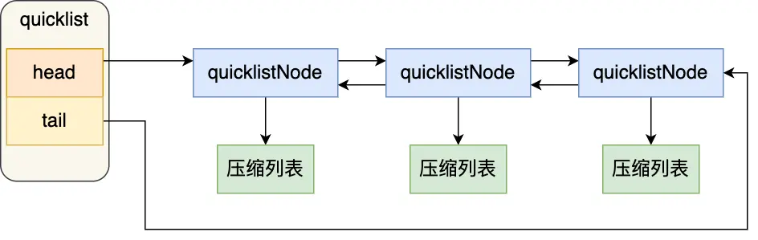

---
title: 'Redis 数据结构：QuickList 详解'
date: 2025-05-27 15:36:00
categories:
  - 八股文
  - Redis
  - 数据结构
tags:
  - Redis
  - QuickList
  - 数据结构
  - 链表
  - 压缩列表
description: '全面介绍 Redis QuickList 的设计思想、内部结构和实现方式，分析其如何结合链表和压缩列表的优势，在 Redis List 类型中提供高效的存储和操作。'
--- 

# QuickList 详解

## 1. QuickList 的由来

在 Redis 3.2 版本之前，Redis 的 List 对象底层实现可以是：
- **双向链表**（易于操作但内存开销大）
- **压缩列表**（节省内存但有性能隐患）

而 Redis 3.2 版本开始，List 对象的底层实现统一改为了 **QuickList** 数据结构。

## 2. 什么是 QuickList？

QuickList 本质上是「**双向链表 + 压缩列表**」的混合体：
- **结构特点**：每个链表节点都包含一个压缩列表
- **设计理念**：兼顾了双向链表的快速插入删除和压缩列表的内存节省优势



## 3. 为什么需要 QuickList？

### 3.1 压缩列表的问题

压缩列表虽然内存利用率高，但存在严重缺陷：
- **连锁更新风险**：当一个元素发生变化，可能导致后续所有元素位置都需要调整
- **性能下降**：元素数量增加或元素变大时，连锁更新风险增加，操作性能急剧下降

### 3.2 QuickList 的解决方案

QuickList 巧妙地解决了这个问题：
- **分而治之**：将数据分散在多个小型压缩列表中
- **限制规模**：通过控制每个压缩列表的大小或元素个数
- **降低风险**：即使发生连锁更新，影响范围被限制在单个节点内

> 📌 **核心思想**：压缩列表越小，连锁更新的影响就越小，访问性能就越好。

## 4. QuickList 的结构设计

### 4.1 主体结构

```c
typedef struct quicklist {
    quicklistNode *head;      // 链表头节点指针
    quicklistNode *tail;      // 链表尾节点指针
    unsigned long count;      // 所有压缩列表中的元素总数
    unsigned long len;        // quicklistNode 节点总数
    // 其他配置参数...
} quicklist;
```

### 4.2 节点结构

```c
typedef struct quicklistNode {
    struct quicklistNode *prev;  // 前一个节点指针
    struct quicklistNode *next;  // 后一个节点指针
    unsigned char *zl;           // 指向压缩列表的指针
    unsigned int sz;             // 压缩列表的字节大小
    unsigned int count : 16;     // 压缩列表中的元素个数
    // 其他配置参数...
} quicklistNode;
```

## 5. QuickList 如何工作？

### 5.1 元素添加过程

当向 QuickList 添加元素时：

1. **先检查**：判断插入位置的压缩列表是否能容纳新元素
2. **能容纳**：直接将元素插入到对应压缩列表中
3. **不能容纳**：创建新的 quicklistNode 节点，并在其中存储新元素

### 5.2 配置参数

Redis 提供了配置参数 `list-max-ziplist-size` 来控制压缩列表的大小：

- **正数值**：表示每个压缩列表最多包含的元素个数
- **负数值**：表示每个压缩列表的最大字节数
  - `-1`: ≤4KB
  - `-2`: ≤8KB
  - `-3`: ≤16KB
  - `-4`: ≤32KB
  - `-5`: ≤64KB

## 6. QuickList 的优缺点

### 6.1 优点
- **内存效率高**：压缩列表节省内存
- **访问性能好**：分段存储限制了连锁更新的影响范围
- **操作灵活**：同时支持高效的表头表尾操作

### 6.2 缺点
- **结构复杂**：比单一数据结构的实现更复杂
- **未完全解决**：虽然降低了风险，但没有彻底消除连锁更新问题

## 7. 小结

QuickList 是 Redis 在内存使用和操作效率之间寻求平衡的产物，通过"分段压缩列表"的方式，有效控制了连锁更新的风险范围。虽然没有彻底解决压缩列表的固有问题，但在实际应用中已经取得了很好的效果。

这也启发了 Redis 后续开发 ListPack 数据结构，以彻底解决连锁更新问题。