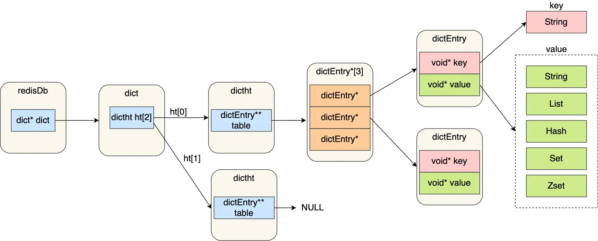
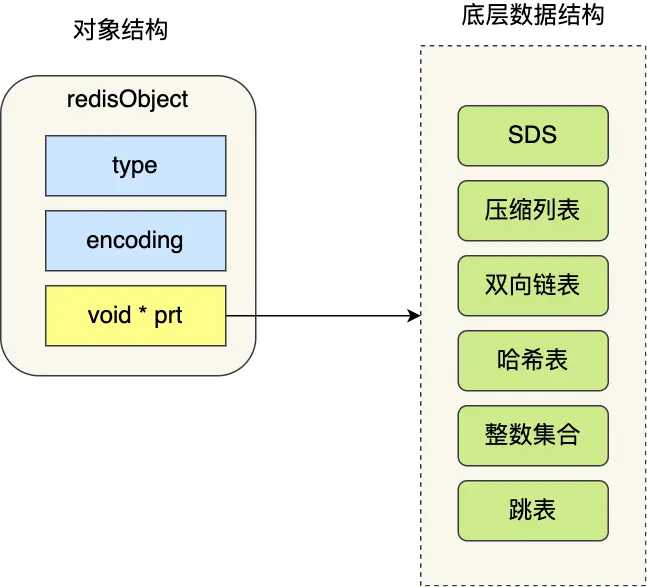
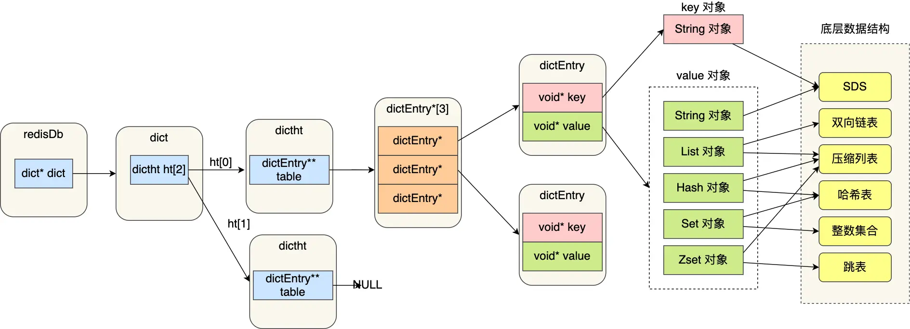

## 键值对数据库是怎么实现的？

在介绍具体数据结构之前，需要先了解 Redis 是如何实现键值对（key-value）数据库的基本原理。

Redis 的键值对中的 key 是字符串对象，而 **value 可以是字符串对象，也可以是集合数据类型的对象**，比如 List 对象、Hash 对象、Set 对象和 Zset 对象。

下面是几种 Redis 新增键值对的命令示例：

```redis
> SET name "xiaolincoding"
OK

> HSET person name "xiaolincoding" age 18
0

> RPUSH stu "xiaolin" "xiaomei"
(integer) 2
```

这些命令分别表示：

- 第一条命令：name 是一个**字符串键**，因为键的**值是一个字符串对象**；
- 第二条命令：person 是一个**哈希表键**，因为键的**值是一个包含两个键值对的哈希表对象**；
- 第三条命令：stu 是一个**列表键**，因为键的**值是一个包含两个元素的列表对象**；

那么这些不同类型的键值对是如何保存在 Redis 中的呢？

Redis 使用「哈希表」来存储所有的键值对。哈希表的一大优势是能够以 O(1) 的时间复杂度快速查找数据——你可以把它想象成一个高效的索引系统。从根本上说，哈希表是一个数组，数组中的每个位置被称为一个「哈希桶」。

每个哈希桶中存储的是指向「哈希表节点」（`dictEntry`）的指针。这个节点是理解 Redis 如何存储数据的关键。一个 `dictEntry` 结构并不直接包含键和值的数据本身，而是通过两个特殊的指针 `void* key` 和 `void* value`，分别指向实际的键对象和值对象。这种设计使得 Redis 能够灵活地处理各种不同类型的值。

下图展示了 Redis 保存键值对所涉及的核心数据结构：



这些数据结构的内部细节我们稍后在讨论哈希表时会深入探究。现在，我们先来认识一下图中这些结构各自扮演的角色：

- `redisDb` 结构：可以看作是 Redis 中的一个“数据库实例”。它里面最重要的就是指向 `dict` 结构的指针，这个 `dict` 结构是实现我们常说的字典（或哈希表）的核心。
- `dict` 结构：这就是字典（或称为关联数组、map）的实现。有趣的是，它内部维护了两个哈希表（即两个 `dictht` 结构）。通常情况下，数据都存在「哈希表 1」中。「哈希表 2」则是在特殊时期——比如哈希表需要扩容或缩容（这个过程称为 rehash）时才会用到。
- `dictht` 结构：代表一个实际的哈希表。它包含一个数组，这个数组就是哈希表的主体，数组的每个元素都是一个指针，指向一个「哈希表节点」（`dictEntry`）。
- `dictEntry` 结构：这就是哈希表中的基本单元——「哈希表节点」。每个节点保存一个键值对。它包含两个至关重要的指针：
  - `void* key`：指向键对象。在 Redis 中，键总是一个字符串对象。
  - `void* value`：指向值对象。这个值对象既可以是字符串，也可以是更复杂的集合类型，如列表（List）、哈希（Hash）、集合（Set）或有序集合（ZSet）。

这里需要特别强调的是，`dictEntry` 中的 `key` 和 `value` 指针，它们指向的并不是原始数据本身，而是指向一种叫做「Redis 对象」（`redisObject`）的统一封装结构。可以说，在 Redis 的世界里，无论是键还是值，都会被包装成一个 `redisObject`。这种对象的结构如下图所示：



一个 `redisObject` 包含了以下几个关键信息：

- `type`：标记了这个对象是哪种数据类型（例如，字符串、列表、哈希等），明确了它可以执行哪些操作。
- `encoding`：指明了该对象内部使用了哪种更底层的具体数据结构来实现（例如，一个列表类型的对象，其底层可能是用压缩列表或双向链表实现的，Redis 会根据情况选择最优的编码方式）。
- `ptr`：这是一个核心指针，它指向了真正存储数据的底层数据结构。

下图展示了 Redis 键值对数据库的全景图，清晰展示了 Redis 对象和数据结构之间的关系：


