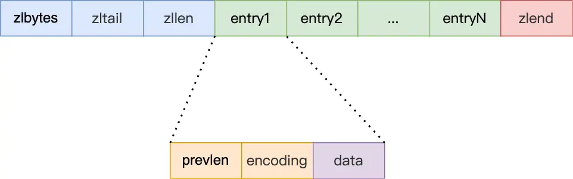
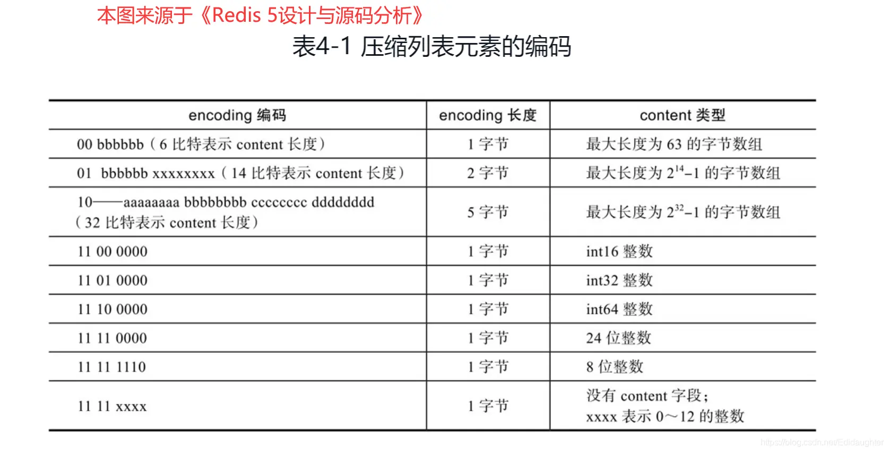
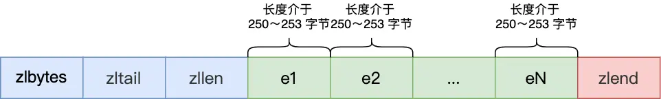
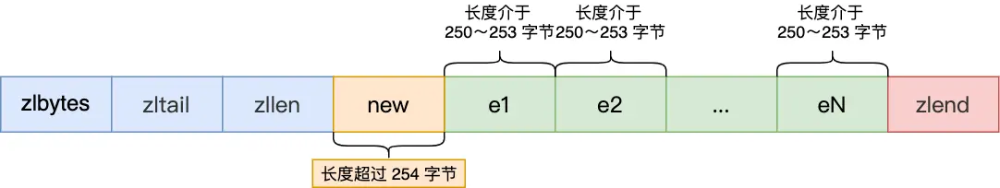
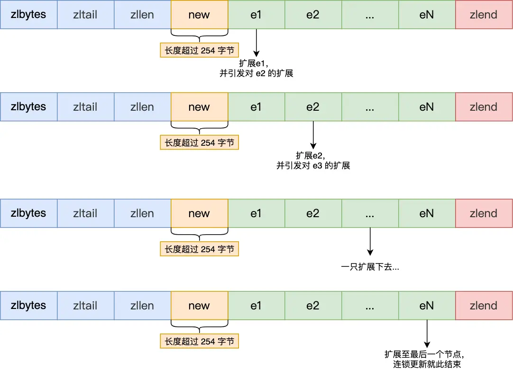

---
title: 'Redis 数据结构：压缩列表详解'
date: 2025-05-21 18:41:00
categories:
  - 八股文
  - REDIS
  - 基础知识
  - 数据结构
tags:
  - REDIS
  - 压缩列表
  - 数据结构
description: '深入解析 Redis 压缩列表（ziplist）的设计原理、内存布局及优化策略，探讨其在 Redis 中的应用场景及如何实现高效的内存利用。'
--- 

## 压缩列表

压缩列表（ziplist）是 Redis 为了极致优化内存使用而设计的一种数据结构。它将所有元素存储在**一块连续的内存空间**中，通过针对不同长度的数据进行特殊编码，从而**显著节省内存**。这种设计使其能够很好地利用 CPU 缓存。

然而，压缩列表也存在固有的缺陷：

- **查询效率**: 当保存的元素过多时，查询效率会明显下降，因为查找非头尾节点需要遍历。
- **更新效率**: 新增或修改元素时，可能需要重新分配整个压缩列表的内存空间，极端情况下甚至可能引发**连锁更新（cascade update）**问题。

因此，Redis 仅在列表对象（List）、哈希对象（Hash）、有序集合对象（Zset）包含的元素数量较少或元素值较小时，才会选择压缩列表作为其底层实现。

接下来，我们将深入探讨压缩列表的内部结构与运作机制。

### 压缩列表结构设计

压缩列表是由一系列特殊编码的连续内存块组成的顺序型数据结构，其核心思想是**空间换时间**。

*图1: 压缩列表整体内存布局*

压缩列表的头部包含以下几个关键字段：

- ***zlbytes*** (4字节): 记录整个压缩列表占用的内存字节数。
- ***zltail*** (4字节): 记录压缩列表尾节点相对于起始地址的偏移量，方便快速定位尾节点。
- ***zllen*** (2字节): 记录压缩列表包含的节点数量。
- ***zlend*** (1字节): 特殊标记，固定值为 `0xFF` (十进制255)，表示压缩列表的结束。

通过这些头部字段，我们可以 O(1) 复杂度定位首尾节点。但**查找其他节点时，则需要从头或尾开始逐个遍历，时间复杂度为 O(N)**。因此，压缩列表不适合存储大量元素。

压缩列表中的每个节点（entry）则由以下三部分构成：

*图2: 压缩列表节点结构*

- ***prevlen***: 记录前一个节点的长度。这个字段使得压缩列表可以从后向前遍历。其自身占用的空间根据前一个节点的实际长度动态调整（1字节或5字节）。
- ***encoding***: 记录当前节点实际数据的类型（整数或字符串）和长度。其自身占用的空间根据数据的类型和大小动态调整。
- ***data***: 存储节点的实际数据，其类型和长度由 `encoding` 字段决定。

这种根据数据实际大小和类型动态调整 `prevlen` 和 `encoding` 字段长度的设计，是压缩列表实现**极致内存优化的关键**。

具体来说：

**prevlen 字段的长度**:
- 如果前一个节点的长度**小于 254 字节**，`prevlen` 字段占用 **1 字节**。
- 如果前一个节点的长度**大于等于 254 字节**，`prevlen` 字段占用 **5 字节** (第一个字节固定为 `0xFE`，后四个字节存储实际长度)。

**encoding 字段的编码规则**:

`encoding` 字段会根据存储的数据是整数还是字符串，以及字符串的长度，采用不同的编码方式，其自身占用的空间可能是1字节、2字节或5字节。

*图3: encoding 字段的编码规则 (content 即 data 字段)*

- 若**数据是整数**：`encoding` 字段为 **1 字节**，其具体值指明了整数的类型（如int16, int32等），`data` 字段则直接存储该整数值。
- 若**数据是字符串**：`encoding` 字段的**前几位**用于标识类型和字符串长度的编码方式，**后续位**则存储字符串的实际长度。`data` 字段存储字符串内容。`encoding` 字段本身可能占用1、2或5字节。

### 连锁更新

除了查询效率较低外，压缩列表还面临一个严重的问题：**连锁更新**。

当向压缩列表插入新元素或修改现有元素导致空间不足时，需要重新分配内存。如果这个操作导致某个节点的长度发生变化（例如，从小于254字节变为大于等于254字节），那么其后继节点的 `prevlen` 字段可能也需要调整大小（从1字节扩展到5字节）。这种调整可能会像多米诺骨牌一样，**从被修改的节点开始，依次向后传播，导致后续多个节点的 `prevlen` 字段都需要扩展，进而引发多次内存重分配**。

**连锁更新的触发条件**：
当一个压缩列表中存在多个连续的、长度接近254字节（例如250-253字节）的节点时，它们各自的后继节点的 `prevlen` 字段都为1字节。

*图4: 连锁更新前各节点 prevlen 为1字节*

此时，若在这些节点之前插入一个长度大于等于254字节的新节点（或修改第一个节点使其长度超过253字节），会导致第一个节点的 `prevlen` 字段从1字节扩展到5字节。

*图5: 新节点导致节点e1的 prevlen 扩展*

这个扩展操作使得节点e1的总长度增加，如果增加后的长度也超过了253字节，那么e1的后继节点e2原先用1字节存储的 `prevlen` 也不再足够，同样需要扩展到5字节。

*图6: 连锁更新的多米诺效应*

这个过程会一直持续下去，直到遇到一个 `prevlen` 扩展后总长度仍未超过253字节的节点，或者到达列表末尾。

**连锁更新的代价是高昂的，因为它涉及到多次连续的内存空间扩展和数据迁移，会严重影响压缩列表的性能。**

### 压缩列表的缺陷与演进

综上所述，压缩列表的主要缺陷在于：

- **读取/查找效率低**：对于非头尾节点的访问，时间复杂度为 O(N)。
- **写操作代价高**：插入或删除元素可能导致整个列表的内存重分配。
- **连锁更新风险**：在特定情况下，更新操作可能触发连锁更新，导致严重的性能抖动。

**尽管压缩列表通过其紧凑的内存布局实现了极致的内存节省，但其性能问题，特别是连锁更新的风险，限制了其适用场景。**

因此，压缩列表通常只适用于存储节点数量不多且元素较小的场景。只要节点数量控制在一定范围内，即使发生连锁更新，其影响也是可控的。

为了克服压缩列表的这些不足，同时尽可能保留其节省内存的优点，Redis 在后续版本中引入了新的数据结构：

- **Quicklist** (Redis 3.2 引入)：作为列表对象（List）新的底层实现，它是由多个压缩列表（ziplist）组成的双向链表。这既减少了单个压缩列表的长度，降低了连锁更新的风险和影响范围，又保留了压缩列表的内存效率。
- **Listpack** (Redis 5.0 引入)：设计上比压缩列表更简单，它去除了 `prevlen` 字段，转而在每个节点头部记录自己的总长度和编码类型，从而彻底避免了连锁更新问题。Listpack 主要用于替换 Hash 和 Zset 对象底层的压缩列表实现，以及在 Stream 数据类型中使用。

这些演进体现了 Redis 在数据结构设计上对内存效率和性能之间的持续权衡与优化。
