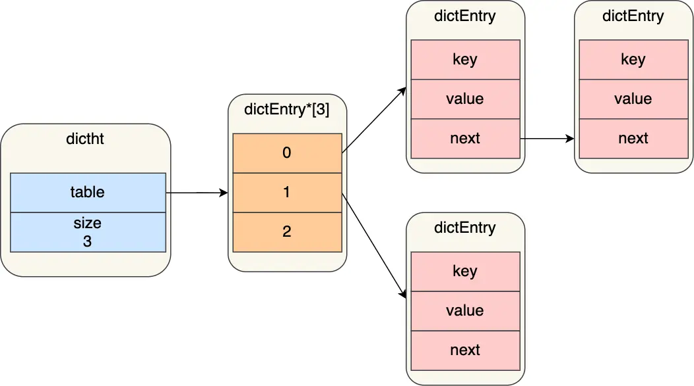
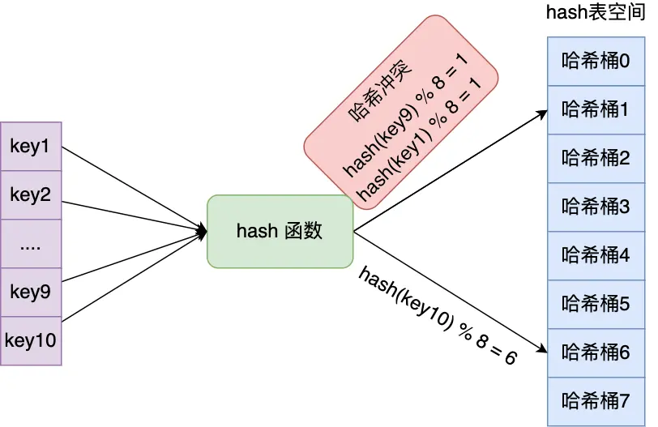
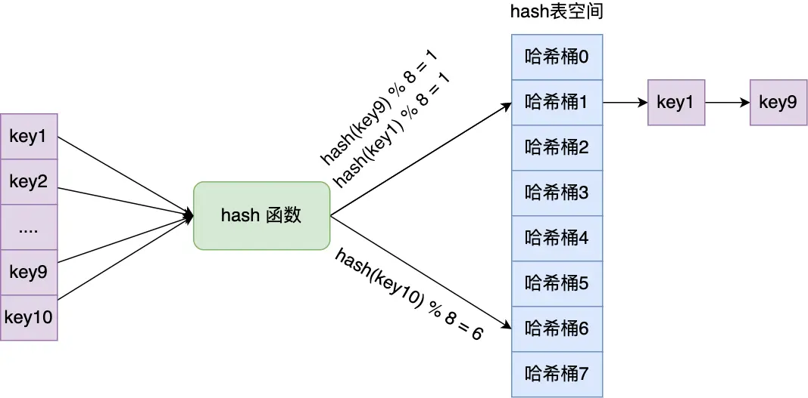
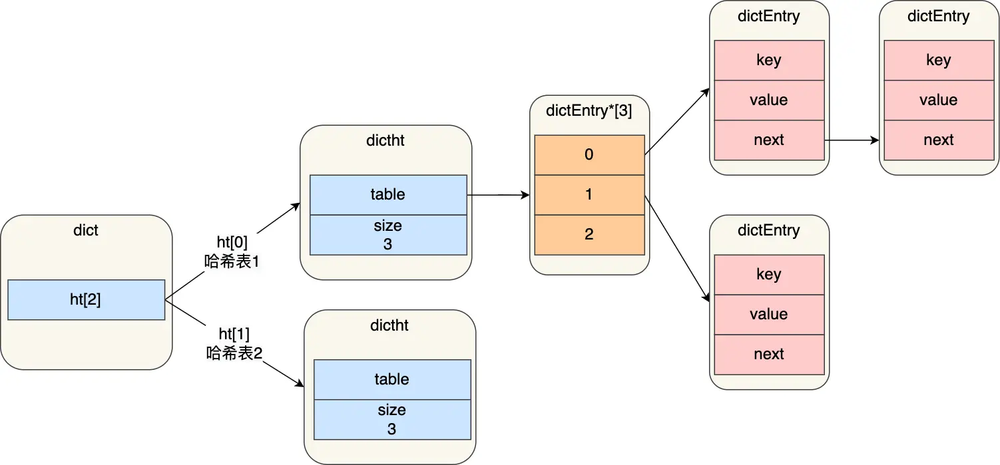
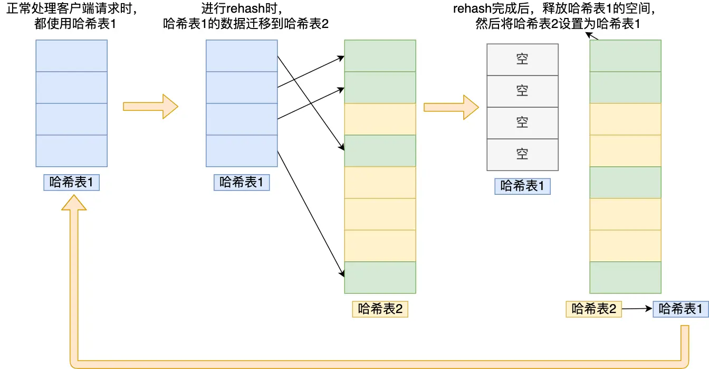

---
title: 'Redis 数据结构：哈希表详解'
date: 2025-05-21 18:42:00
categories:
  - 八股文
  - Redis
  - 数据结构
tags:
  - Redis
  - 哈希表
  - 数据结构
  - 字典
description: '全面剖析 Redis 哈希表（Hash Table）的实现原理、扩容策略和渐进式 rehash 机制，解读其在 Redis 字典中的核心作用及性能优化手段。'
--- 
## 哈希表

哈希表是一种用于存储键值对（key-value）的高效数据结构。在哈希表中，每个键都是唯一的，通过键可以快速查找、更新或删除对应的值。

Redis 的 Hash 对象有两种底层实现：一种是本文将要详细介绍的哈希表，另一种是压缩列表（在最新的 Redis 版本中已被 listpack 替代）。

哈希表的最大优势在于其**时间复杂度为 O(1) 的查询效率**。实现原理是将键通过哈希函数计算得到哈希值，然后通过这个哈希值定位到哈希表（本质是数组）中的具体位置，从而实现快速访问数据。

然而，当哈希表大小固定而数据量不断增加时，**哈希冲突**的概率会显著提高，这会影响查询效率。为解决这一问题，Redis 采用了「链式哈希」和「rehash」两种关键机制，下面将详细介绍。

### 哈希表结构设计

Redis 中哈希表的结构定义如下：

```c
typedef struct dictht {
    //哈希表数组
    dictEntry **table;
    //哈希表大小
    unsigned long size;  
    //哈希表大小掩码，用于计算索引值
    unsigned long sizemask;
    //该哈希表已有的节点数量
    unsigned long used;
} dictht;
```

从结构体定义可以看出，哈希表本质上是一个数组（`dictEntry **table`），数组的每个元素都是指向哈希表节点（`dictEntry`）的指针。



哈希表节点的结构定义如下：

```c
typedef struct dictEntry {
    //键值对中的键
    void *key;
  
    //键值对中的值
    union {
        void *val;
        uint64_t u64;
        int64_t s64;
        double d;
    } v;
    //指向下一个哈希表节点，形成链表
    struct dictEntry *next;
} dictEntry;
```

`dictEntry` 结构不仅包含指向键和值的指针，还包含指向下一个哈希表节点的指针。这个 `next` 指针使得多个哈希值相同的键值对能够链接成链表，从而解决哈希冲突问题，这就是链式哈希的实现基础。

值得注意的是，`dictEntry` 结构中的值使用了联合体（`union`）定义，这意味着值可以是指向实际数据的指针，也可以直接是 64 位整数（有符号或无符号）或双精度浮点数。这种设计能够节省内存空间——当值为整数或浮点数时，可以直接内嵌在 `dictEntry` 结构中，无需额外的指针引用，从而减少内存开销。

### 哈希冲突

哈希表实际上是一个数组，数组中的每个元素称为哈希桶。键值对在哈希表中的存储位置是通过以下步骤确定的：

1. 键通过哈希函数计算得到哈希值
2. 将哈希值与哈希表大小进行取模运算（哈希值 % 哈希表大小）
3. 取模的结果就是该键值对在哈希表数组中的索引位置

当两个或多个不同的键经过上述计算后得到相同的索引位置时，就发生了哈希冲突。

例如，假设有一个包含 8 个哈希桶的哈希表。如果 key1 和 key9 通过哈希计算后都映射到哈希桶 1，那么这两个键就发生了哈希冲突，如下图所示：



### 链式哈希

为了解决哈希冲突，Redis 采用了「链式哈希」（chain hashing）技术。

链式哈希的原理是：当多个键映射到同一个哈希桶时，这些键值对会通过 `next` 指针连接成一个单向链表。这样，即使发生哈希冲突，也能通过遍历链表找到目标键值对。

以前面的例子为例，当 key1 和 key9 都映射到哈希桶 1 时，它们会形成如下图所示的链表结构：



然而，链式哈希也有其局限性。随着链表长度增加，在链表中查找特定键的时间复杂度会从 O(1) 退化为 O(n)，这会显著降低查询效率。要解决这个问题，需要通过 rehash 操作来扩展哈希表的大小，减少哈希冲突的概率。

### rehash 机制

在前面介绍哈希表结构时，我们看到了 Redis 使用 `dictht` 结构体表示哈希表。但在实际使用中，Redis 定义了一个包含两个哈希表的 `dict` 结构体：

```c
typedef struct dict {
    …
    //两个哈希表，交替使用，用于 rehash 操作
    dictht ht[2]; 
    …
} dict;
```

这两个哈希表的设计目的是为了支持 rehash 操作。下图展示了包含两个哈希表的 `dict` 结构：



在正常情况下，所有数据都存储在「哈希表 1」中，而「哈希表 2」并不分配空间。当需要扩展哈希表容量时，Redis 会触发 rehash 操作，该过程分为三个步骤：

1. 为「哈希表 2」分配空间，通常是「哈希表 1」容量的两倍
2. 将「哈希表 1」中的所有数据重新计算哈希值并迁移到「哈希表 2」中
3. 迁移完成后，释放「哈希表 1」的空间，将「哈希表 2」设置为「哈希表 1」，并在「哈希表 2」位置创建一个新的空哈希表，为下一次 rehash 做准备

rehash 过程如下图所示：



然而，这种一次性迁移的方式存在问题：当「哈希表 1」中的数据量非常大时，一次性迁移会涉及大量数据拷贝，可能导致 Redis 服务暂时阻塞，无法处理其他请求，这对于要求高性能的 Redis 服务是不可接受的。

### 渐进式 rehash

为了避免 rehash 过程中的服务阻塞，Redis 实现了「渐进式 rehash」机制，将数据迁移工作分散到多次操作中完成。

渐进式 rehash 的步骤如下：

1. 为「哈希表 2」分配空间
2. 在 rehash 进行期间，每次对哈希表执行增删改查操作时，除了完成请求的操作外，还会顺带将「哈希表 1」中一部分数据迁移到「哈希表 2」
3. 随着客户端请求的不断处理，「哈希表 1」的数据会逐渐迁移完毕，最终完成整个 rehash 过程

这种方式巧妙地将大量数据迁移的开销分摊到了多次操作中，避免了一次性 rehash 可能导致的服务阻塞。

在渐进式 rehash 期间，两个哈希表同时有效，数据操作会按照以下规则进行：

- 查找操作：先在「哈希表 1」中查找，如果未找到，再到「哈希表 2」中查找
- 新增操作：只在「哈希表 2」中进行，确保「哈希表 1」的数据只减不增
- 更新和删除操作：在两个哈希表中都可能执行，取决于要操作的键所在的哈希表

随着 rehash 操作的进行，「哈希表 1」中的数据会逐渐减少，最终变为空表，此时整个 rehash 过程完成。

### rehash 触发条件

rehash 的触发与「负载因子」(load factor) 密切相关。负载因子计算公式为：

$$
负载因子 = 哈希表已保存节点数量 / 哈希表大小
$$

Redis 触发 rehash 操作的条件主要有两个：

1. **当负载因子大于等于 1，且 Redis 没有在执行 RDB 快照（bgsave）或 AOF 重写（bgrewriteaof）时**，触发 rehash 操作。这是一个较为宽松的条件，表示哈希表已经装满，但系统资源尚有空闲，可以进行 rehash。

2. **当负载因子大于等于 5 时**，无论当前是否在执行 RDB 快照或 AOF 重写，都会强制进行 rehash 操作。这是一个较为严格的条件，表示哈希冲突已经非常严重，必须立即扩容，否则会严重影响性能。

通过这种机制，Redis 在保证性能的同时，也能够有效管理内存资源，达到性能与资源利用的平衡。

## 总结

Redis 哈希表是一种高效的数据结构，通过精心设计实现了 O(1) 时间复杂度的数据访问。其核心机制包括：

1. **链式哈希**：通过将具有相同哈希值的键值对链接成链表，有效解决了哈希冲突问题
2. **rehash 机制**：当哈希表负载过高时，通过扩容并重新分布键值对，降低哈希冲突概率
3. **渐进式 rehash**：将数据迁移工作分散到多次操作中，避免服务阻塞，保证了 Redis 的高性能特性

这些精心设计的机制使得 Redis 哈希表能够在保持高性能的同时，有效应对大规模数据存储和高并发访问的挑战，是 Redis 高性能的重要基础。
