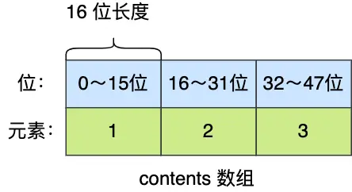
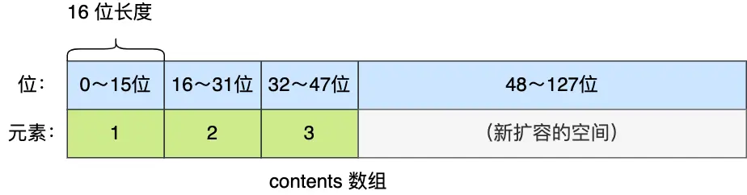
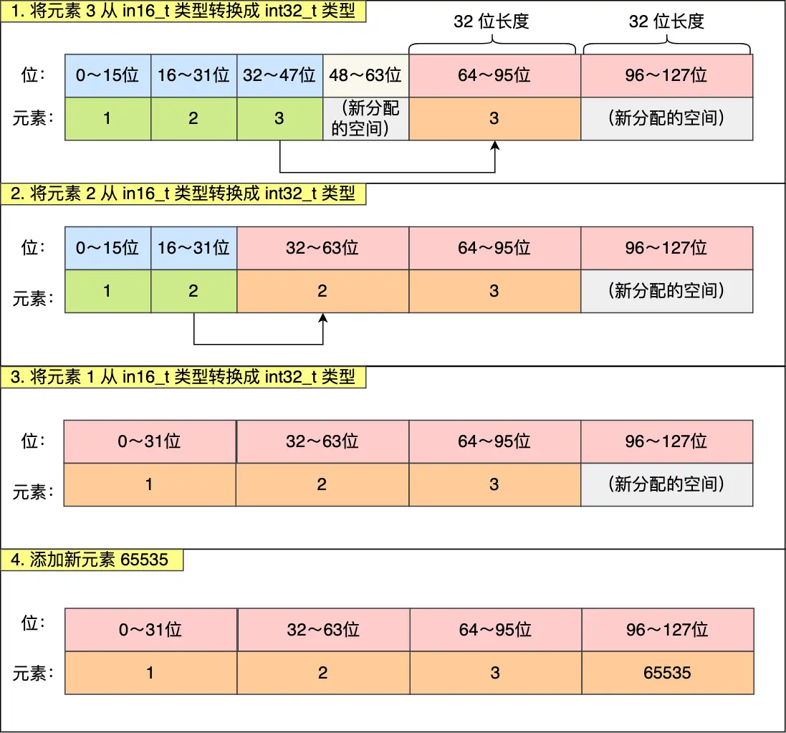

---
title: 'Redis 数据结构：整数集合详解'
date: 2025-05-21 18:43:00
categories:
  - 八股文
  - REDIS
  - 基础知识
  - 数据结构
tags:
  - REDIS
  - 整数集合
  - 数据结构
  - intset
description: '详细讲解 Redis 整数集合（intset）的实现原理、升级机制和内存优化策略，分析其在 Redis Set 类型中的应用及如何平衡空间与时间效率。'
--- 

## 概述

整数集合（intset）是 Redis 中的一个重要底层数据结构，主要用于优化 Set 数据类型在特定场景下的内存使用效率。当一个 Set 集合中的元素都是整数且元素数量较少时，Redis 会使用整数集合而非哈希表来存储数据，从而大幅降低内存占用。整数集合的设计体现了 Redis 对内存效率的极致追求，也是理解 Redis 内存优化策略的典型案例。

## 核心概念

### 整数集合的定义

整数集合是 Redis Set 对象的底层实现之一。当一个 Set 对象同时满足以下两个条件时，Redis 会选择使用整数集合作为其底层实现：
1. 集合中的元素都是整数值
2. 集合的元素数量不超过一定阈值（默认配置下为 512 个元素）

### 整数集合结构设计

整数集合本质上是一块连续内存空间，它的结构定义如下：

```c
typedef struct intset {
    // 编码方式，决定整数的类型和长度
    uint32_t encoding;
    // 集合包含的元素数量
    uint32_t length;
    // 保存元素的数组，实际类型取决于encoding
    int8_t contents[];
} intset;
```

虽然 contents 被声明为 int8_t 类型的数组，但实际上它存储的元素类型由 encoding 属性决定：

- `INTSET_ENC_INT16`：contents 作为 int16_t 类型数组，每个元素占 2 字节
- `INTSET_ENC_INT32`：contents 作为 int32_t 类型数组，每个元素占 4 字节
- `INTSET_ENC_INT64`：contents 作为 int64_t 类型数组，每个元素占 8 字节

## 实现机制

### 整数集合的升级操作

整数集合的一个关键特性是**升级机制**。当向整数集合中添加一个新元素，如果该元素的类型比集合现有所有元素的类型都要长时，整数集合会进行升级操作：

1. 根据新元素的类型扩展 contents 数组的空间
2. 将现有元素转换为新类型并重新排列到正确的位置
3. 将新元素添加到集合中并保持有序性

例如，当一个存储 int16_t 类型元素的整数集合需要添加一个 int32_t 类型的新元素时：



假设要添加的新元素是 65535（需要 int32_t 类型存储），首先需要扩展 contents 数组空间：



然后将原有的三个 int16_t 类型元素转换为 int32_t 类型，并放置到正确的位置：



### 升级的好处与限制

整数集合升级的主要好处是**节省内存资源**。如果所有元素都能用较小的整数类型表示，就不必为所有元素都分配最大类型的空间。只有在确实需要更大类型时，整数集合才会进行升级。

然而，整数集合**不支持降级操作**。一旦升级到更大的整数类型，即使删除了所有需要该类型的元素，整数集合也不会回退到较小的类型。这是出于性能考虑的设计决策，避免了频繁的内存重分配操作。

## 使用方法

Redis 自动管理整数集合的使用，用户无需直接操作。当使用 Set 相关命令且满足使用整数集合的条件时，Redis 会自动选择整数集合作为底层实现：

```bash
# 创建一个包含整数的集合
SADD numbers 1 2 3 4 5

# 查看底层实现（在小集合且都是整数时会是intset）
OBJECT ENCODING numbers  # 返回 "intset"

# 添加一个非整数元素会导致转换为哈希表实现
SADD numbers "a"
OBJECT ENCODING numbers  # 返回 "hashtable"
```

## 整数集合的操作复杂度

整数集合的主要操作时间复杂度如下：

- **查找元素**：O(log N)，使用二分查找
- **添加元素**：O(N)，可能需要移动大量元素
- **删除元素**：O(N)，需要移动被删除元素之后的所有元素

整数集合虽然节省内存，但在添加和删除操作上并不如哈希表高效，这也是为什么它只用于小型集合的原因。

## 常见问题与解决方案

### 问题：整数集合何时会转换为哈希表？

**解决方案**：在以下情况下，Redis 会将整数集合转换为哈希表：
1. 添加了非整数元素
2. 元素数量超过了设定阈值（默认为 512）

### 问题：为什么整数集合不支持降级？

**解决方案**：不支持降级是出于性能考虑。降级操作需要重新分配内存并移动元素，这些操作成本较高，而且可能会因为反复的升级和降级导致性能波动。

## 最佳实践

1. **小型整数集合的优势**：当确定 Set 只包含少量整数时，可以放心使用，Redis 会自动优化内存使用
2. **避免混合类型**：如果要利用整数集合的内存优化，确保集合中只存储整数值
3. **控制集合大小**：当整数集合元素数量超过阈值后，会转换为哈希表，失去内存优化的好处

## 面试要点

1. **整数集合的定义与使用场景**：用于优化只包含整数且元素数量较少的 Set 集合
2. **升级机制**：当添加更大类型的整数时如何进行升级，以及升级的具体步骤
3. **不支持降级的原因**：性能考虑，避免频繁的内存重分配
4. **整数集合的优缺点**：
   - 优点：内存效率高，适合存储小型整数集合
   - 缺点：添加和删除操作的时间复杂度为 O(N)，不如哈希表

## 参考资料

- [Redis 设计与实现](http://redisbook.com/)
- [Redis 官方文档](https://redis.io/documentation)
- [Redis 内部数据结构详解](http://zhangtielei.com/posts/blog-redis-dict.html)
