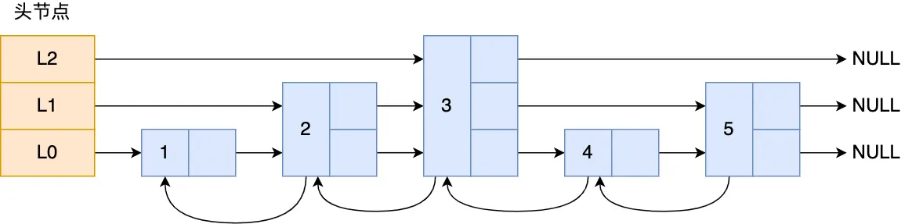
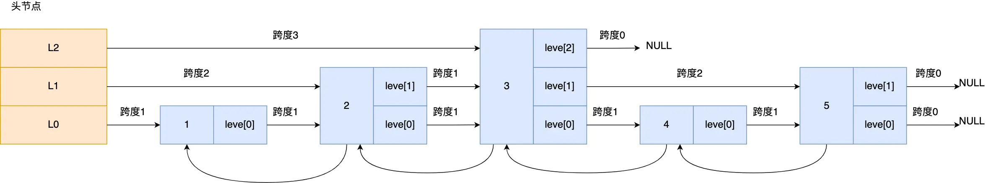
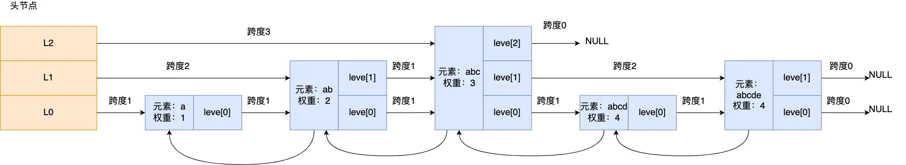
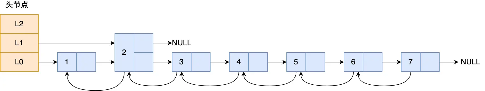
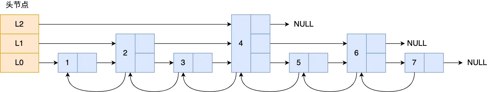

---
title: 'Redis 数据结构：跳表详解'
date: 2025-05-27 15:10:00
categories:
  - 八股文
  - Redis
  - 数据结构
tags:
  - Redis
  - 跳表
  - 数据结构
  - skiplist
description: '深度解析 Redis 跳表（skiplist）的原理、实现细节和性能特性，探讨其在有序集合（Sorted Set）中的应用以及相比于其他数据结构的优势。'
--- 

## 跳表

**什么是跳表？**

跳表（Skip List）可以简单理解为"**带电梯的多层楼房**"。想象一下：
- 普通链表就像一层楼的走廊，要找某个房间只能一个一个房间地走过去
- 跳表就像多层楼房，上层楼有"快速通道"，可以快速跳跃到目标区域，然后再到下层精确查找

Redis 只有 Zset（有序集合）对象的底层实现用到了跳表，跳表的优势是能支持平均 O(logN) 复杂度的节点查找。

**为什么 Zset 同时使用跳表和哈希表？**

zset 结构体里有两个数据结构：一个是跳表，一个是哈希表。这样设计的好处是：
- **跳表负责范围查询**：比如查找分数在 80-90 之间的所有学生
- **哈希表负责单点查询**：比如快速查找张三的具体分数

```c
typedef struct zset {
    dict *dict;
    zskiplist *zsl;
} zset;
```

**数据一致性是如何保证的？**

Zset 对象在执行数据插入或更新时，会同时在跳表和哈希表中进行相同操作，确保两个数据结构的信息保持一致。就像酒店的房间登记系统，既要在楼层分布图上标记，也要在客户信息表中记录。

具体来说：
- **支持范围查询**（如 ZRANGEBYSCORE 操作）：依靠跳表的有序特性
- **支持快速单点查询**（如 ZSCORE 操作）：依靠哈希表的 O(1) 查找

**为什么通常只说跳表是 Zset 的底层结构？**

虽然 Zset 实际使用的是「哈希表 + 跳表」的组合结构，但我们讨论时通常只提跳表，是因为：
- 哈希表主要起**辅助作用**，用于快速获取元素权重
- **核心操作都是由跳表实现的**，比如范围查询、排序等
- 跳表决定了 Zset 的主要特性和性能表现

接下来，详细的说下跳表。

### 跳表结构设计

在理解跳表之前，我们先看看普通链表的问题。

**普通链表的查找问题：**
链表在查找元素时，只能从头开始一个一个节点地遍历，就像在一条长长的队伍中找人，只能从队头开始一个个问过去，效率很低，时间复杂度是 O(N)。

**跳表的解决方案：**
跳表是在链表基础上改进过来的，实现了一种「多层」的有序链表。就像给队伍安排了多个"队长"，可以先问队长大概位置，再在小范围内精确查找，这样能快速定位数据。

那跳表长什么样呢？我这里举个例子，下图展示了一个层级为 3 的跳表。



图中头节点有 L0~L2 三个头指针，分别指向了不同层级的节点，然后每个层级的节点都通过指针连接起来：

- **L0 层级**（最底层）：共有 5 个节点，分别是节点 1、2、3、4、5（包含所有节点）
- **L1 层级**（中间层）：共有 3 个节点，分别是节点 2、3、5（部分节点）
- **L2 层级**（最高层）：只有 1 个节点，也就是节点 3（更少节点）

**查找效率对比：**
- **普通链表**：要找节点 4，需要从头开始：1→2→3→4，查找 4 次
- **跳表查找**：只需要 2 次跳跃：
  1. 从 L2 层直接跳到节点 3
  2. 从节点 3 在 L0 层向前一步找到节点 4

可以看到，这个查找过程就是在多个层级上跳来跳去，最后定位到元素。当数据量很大时，跳表的查找复杂度就是 O(logN)。

**跳表节点是怎么实现多层级的？**

要理解跳表的多层级结构，我们需要看看「跳表节点」的数据结构：

```c
typedef struct zskiplistNode {
    //Zset 对象的元素值
    sds ele;
    //元素权重值
    double score;
    //后向指针
    struct zskiplistNode *backward;
  
    //节点的 level 数组，保存每层上的前向指针和跨度
    struct zskiplistLevel {
        struct zskiplistNode *forward;
        unsigned long span;
    } level[];
} zskiplistNode;
```

让我们逐个分析这个结构体的字段：

**1. 数据存储字段：**
- `sds ele`：存储 Zset 对象的元素值（比如学生姓名"张三"）
- `double score`：存储元素的权重值（比如学生分数 85.5）

**2. 后向指针：**
- `struct zskiplistNode *backward`：指向前一个节点
- 作用：方便从跳表尾节点开始倒序遍历，就像可以从队尾往前走一样

**3. 关键的多层级实现：**
- `struct zskiplistLevel level[]`：这是实现多层级的关键！

**level 数组是如何工作的？**
- level 数组中的每个元素代表跳表的一层
- `level[0]` 表示第一层（L0），`level[1]` 表示第二层（L1），以此类推
- 每层包含两个信息：
  - `forward`：指向下一个跳表节点的指针
  - `span`：跨度，记录两个节点之间的距离

比如，下面这张图，展示了各个节点的跨度。



**跨度（span）的作用是什么？**

很多人第一眼看到跨度，会以为是用来辅助遍历的，但实际上并不是。遍历操作只需要用前向指针（forward）就可以完成了。

**跨度的真正作用：计算节点排位**
- 跳表中的节点都是按分数排序的
- 要计算某个节点在跳表中的排位（排第几名），就需要用到跨度
- 计算方法：从头节点到目标节点的查找路径上，将沿途经过的所有层的跨度累加起来

**举个例子：**
查找图中节点 3 在跳表中的排位：
1. 从头节点开始查找节点 3
2. 查找过程只经过了一个层（L2）
3. L2 层的跨度是 3
4. 所以节点 3 在跳表中的排位是第 3 名

这就像马拉松比赛中的距离标记，通过累加经过的距离标记，可以知道跑了多远。

**头节点的特殊性：**
图中的头节点其实也是 zskiplistNode 跳表节点，只不过头节点比较特殊：
- 后向指针、权重、元素值都没有用到（所以图中省略了）
- 主要作用是作为各层链表的起始点

**跳表的整体管理结构：**
那么，由谁来管理整个跳表，定义哪个节点是头节点呢？这就需要介绍「跳表」结构体了：

```c
typedef struct zskiplist {
    struct zskiplistNode *header, *tail;
    unsigned long length;
    int level;
} zskiplist;
```

跳表结构里包含了四个重要信息：

- **header/tail**：跳表的头尾节点指针
  - 好处：可以在 O(1) 时间内直接访问头节点和尾节点
  - 就像电梯楼层显示器，可以直接知道最高层和最低层
  
- **length**：跳表的节点数量
  - 好处：可以在 O(1) 时间内获取跳表有多少个节点
  - 就像楼房的住户统计表，直接知道总共有多少住户
  
- **level**：跳表的最大层数
  - 好处：可以在 O(1) 时间内知道跳表的最高层是第几层
  - 就像建筑物的楼层标识，直接知道这栋楼有多高

### 跳表节点查询过程

**跳表查找的基本策略：**
跳表查找就像在多层停车场找车位一样，先从最高层快速定位区域，再逐层下降精确查找。

**具体查找过程：**
跳表会从头节点的最高层开始，逐一遍历每一层。在每一层查找时，有明确的判断规则：

**何时继续在当前层前进？**
满足以下任一条件就继续在当前层向前移动：
1. **权重比较**：下一个节点的权重 < 目标权重
2. **相同权重时的元素比较**：下一个节点的权重 = 目标权重，但元素值 < 目标元素值

**何时跳到下一层？**
如果上面两个条件都不满足，或者下一个节点为空，就跳到下一层继续查找。

这个策略确保了：
- 在每一层都能快速跳过明显不符合的节点
- 权重相同时还能根据元素值进行精确比较
- 逐层下降，最终精确定位目标节点

举个例子，下图有个 3 层级的跳表。



**实际查找示例：**
假设要查找「元素：abcd，权重：4」的节点，整个查找过程如下：

**第一步：从 L2 层开始**
- 当前位置：头节点的 L2 层
- 下一个节点：「元素：abc，权重：3」
- 判断：3 < 4（目标权重），符合条件1，继续在 L2 层前进
- 到达「元素：abc，权重：3」节点

**第二步：继续在 L2 层查找**
- 当前位置：「元素：abc，权重：3」的 L2 层
- 下一个节点：空节点
- 判断：下一个节点为空，跳到下一层（L1）

**第三步：在 L1 层查找**
- 当前位置：「元素：abc，权重：3」的 L1 层
- 下一个节点：「元素：abcde，权重：4」
- 判断：权重相同（4=4），但 "abcde" > "abcd"，不符合条件2，跳到下一层（L0）

**第四步：在 L0 层查找**
- 当前位置：「元素：abc，权重：3」的 L0 层
- 下一个节点：「元素：abcd，权重：4」
- 判断：找到目标节点！查找结束

这个过程展示了跳表如何利用多层结构快速定位，避免了逐个遍历所有节点。

### 跳表节点层数设置

**层级比例对性能的影响**

跳表的性能很大程度上取决于相邻两层节点数量的比例。如果比例不当，查询效率会大打折扣。

**不良设计的例子：**
下图展示了一个设计不佳的跳表，第二层只有 1 个节点，而第一层有 6 个节点。



**问题分析：**
如果要查询节点 6，会发生什么？
- 第二层只能跳到节点 3，然后就没有更多节点了
- 只能在第一层从节点 3 开始：3→4→5→6，逐个查找
- 这样就失去了跳表的优势，查询复杂度退化为 O(N)

**理想的层级比例：**
为了保持跳表的高效性，**相邻两层的节点数量最理想的比例是 2:1**，这样可以将查找复杂度维持在 O(logN)。

**良好设计的例子：**
下图展示了一个设计良好的跳表，相邻两层的节点数量比例接近 2:1。



> 那怎样才能维持相邻两层的节点数量的比例为 2 : 1  呢？

**如何维持理想的层级比例？**

传统做法是在新增或删除节点时调整跳表结构来维持 2:1 比例，但这会带来额外的计算开销。

**Redis 的巧妙解决方案：随机层数生成**

Redis 采用了一种更巧妙的方法：**在创建节点时随机生成每个节点的层数**，而不是严格维持 2:1 比例。

**随机生成算法：**
1. 生成一个 [0-1] 范围的随机数
2. 如果随机数 < 0.25（25% 概率），层数增加 1
3. 继续生成下一个随机数，重复步骤 2
4. 直到随机数 ≥ 0.25 为止，确定最终层数

**这种方法的特点：**
- 每增加一层的概率是 25%
- 层数越高，出现概率越低
- 层高最大限制是 64（Redis 7.0 中是 32）

**为什么随机方法有效？**
- 25% 的概率意味着平均每 4 个节点中有 1 个会出现在更高层
- 这自然形成了接近 4:1 的比例关系（虽然不是严格的 2:1，但仍然有效）
- 避免了复杂的平衡调整操作

**关于头节点的层数：**
前面图例中为了简化说明，头节点只画了 3 层，但实际上**头节点会直接创建最大层数的结构**。如果最大层数限制是 32，那么头节点就有 32 层，这样可以支持任意高度的节点插入。

**头节点的创建过程：**
从下面的代码可以看到，创建跳表时：
- 头节点的 level 数组有 ZSKIPLIST_MAXLEVEL 个元素（层）
- 头节点不存储任何实际数据（member 和 score 都为空）
- 所有层的 forward 指针都指向 NULL
- 所有层的 span 值都为 0

```c
/* Create a new skiplist. */
zskiplist *zslCreate(void) {
    int j;
    zskiplist *zsl;

    zsl = zmalloc(sizeof(*zsl));
    zsl->level = 1;
    zsl->length = 0;
    zsl->header = zslCreateNode(ZSKIPLIST_MAXLEVEL,0,NULL);
    for (j = 0; j < ZSKIPLIST_MAXLEVEL; j++) {
        zsl->header->level[j].forward = NULL;
        zsl->header->level[j].span = 0;
    }
    zsl->header->backward = NULL;
    zsl->tail = NULL;
    return zsl;
}
```

**不同版本的最大层数限制：**
- Redis 7.0：32 层
- Redis 5.0：64 层  
- Redis 3.0：32 层

可以看到，Redis 在不同版本中对最大层数进行了调整，这是为了在内存使用和性能之间找到更好的平衡点。

### 为什么用跳表而不用平衡树？

**常见面试题解析**

这是一个非常经典的面试题：为什么 Zset 选择跳表而不是平衡树（如 AVL 树、红黑树等）？

这个问题，我们可以看看 Redis 作者 @antirez 的[原话](https://news.ycombinator.com/item?id=1171423)：

> There are a few reasons:
>
> 1) They are not very memory intensive. It's up to you basically. Changing parameters about the probability of a node to have a given number of levels will make then less memory intensive than btrees.
>
> 2) A sorted set is often target of many ZRANGE or ZREVRANGE operations, that is, traversing the skip list as a linked list. With this operation the cache locality of skip lists is at least as good as with other kind of balanced trees.
>
> 3) They are simpler to implement, debug, and so forth. For instance thanks to the skip list simplicity I received a patch (already in Redis master) with augmented skip lists implementing ZRANK in O(log(N)). It required little changes to the code.

**作者观点的总结和深入分析：**

作者主要从三个方面说明了选择跳表的原因，让我详细解释一下：

**1. 内存使用更灵活**
- **平衡树**：每个节点固定包含 2 个指针（左右子树）
- **跳表**：每个节点的指针数量是动态的，平均为 1/(1-p)
- 在 Redis 中，p=1/4，所以平均每个节点包含 1.33 个指针
- **结论**：跳表比平衡树节省内存

**2. 范围查询更简单**
- **平衡树的问题**：找到范围的起始值后，需要进行复杂的中序遍历来找到范围内的所有节点
- **跳表的优势**：找到起始值后，只需要在第 1 层（最底层）链表上连续遍历即可
- **比喻**：就像在图书馆找书，跳表相当于找到书架后直接从左到右拿书，而平衡树需要在整个图书馆里按特定顺序跳着找书

**3. 实现和维护更简单**
- **平衡树的复杂性**：插入和删除可能触发复杂的树结构调整（旋转操作），代码复杂，调试困难
- **跳表的简单性**：插入和删除只需要修改相邻节点的指针，就像在链表中插入节点一样简单
- **实际好处**：代码易读、易维护、易扩展（比如添加 ZRANK 功能只需要少量代码修改）

**为什么这些特点对 Redis 很重要？**
- **Zset 经常需要范围查询**（ZRANGE、ZREVRANGE 等命令）
- **Redis 强调简单和可靠性**，复杂的平衡树增加了出错风险
- **内存是 Redis 的重要考量**，跳表的内存效率更符合需求