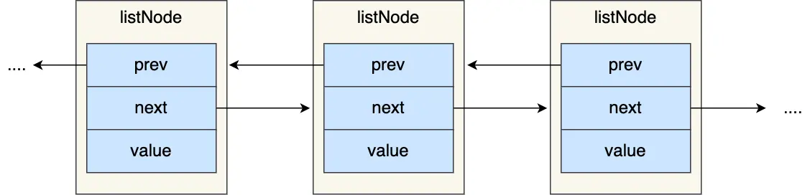
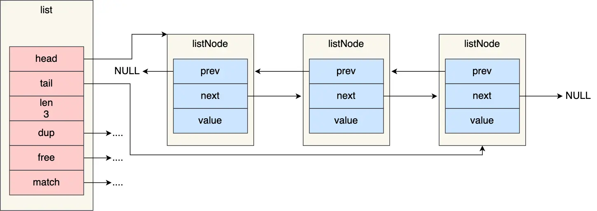

## 链表

链表是除了数组之外，另一种广为人知的基础数据结构。

C 语言标准库并未内置链表，因此 Redis 实现了自定义的链表结构。

### 链表节点结构设计

首先，我们来看 Redis 中「链表节点」（`listNode`）的定义：

```c
typedef struct listNode {
    //前置节点
    struct listNode *prev;
    //后置节点
    struct listNode *next;
    //节点的值
    void *value;
} listNode;
```

从 `prev` 和 `next` 指针可以看出，Redis 的链表是双向链表。



### 链表结构设计

在 `listNode` 的基础上，Redis 进一步封装了 `list` 结构体来管理整个链表，以方便操作。其定义如下：


```c
typedef struct list {
    //链表头节点
    listNode *head;
    //链表尾节点
    listNode *tail;
    //节点值复制函数
    void *(*dup)(void *ptr);
    //节点值释放函数
    void (*free)(void *ptr);
    //节点值比较函数
    int (*match)(void *ptr, void *key);
    //链表节点数量
    unsigned long len;
} list;
```

`list` 结构包含了头指针 `head`、尾指针 `tail`、节点数量 `len`，以及三个函数指针：`dup` (用于复制节点值)、`free` (用于释放节点值)、`match` (用于比较节点值)。这些函数指针使得链表可以存储不同类型的数据并支持自定义操作，赋予了 Redis 链表更强的灵活性。

举个例子，下面是由 `list` 结构和 3 个 `listNode` 结构组成的链表。



### 链表的优势与缺陷

Redis 的链表实现具有以下优点：

- 节点包含 `prev` 和 `next` 指针，构成**双向无环链表**。这使得获取任意节点的前驱和后继节点的时间复杂度都是 O(1)。
- 通过 `list` 结构中的 `head` 和 `tail` 指针，可以在 O(1) 时间内访问链表的头尾节点。
- `len` 属性使得获取链表长度的操作时间复杂度为 O(1)。
- 节点值通过 `void*` 指针保存，结合 `list`结构中的 `dup`、`free` 和 `match` 函数指针，实现了**多态链表**，可以存储不同类型的数据并自定义处理逻辑。

链表也存在一些固有的缺陷：

- 节点的内存非连续分配，这降低了 **CPU 缓存的命中率**，影响访问效率。相比之下，数组由于其内存连续性，能更好地利用 CPU 缓存（基于空间局部性原理）。
- 每个节点除了存储数据外，还需要额外的空间存储前后指针（`prev` 和 `next`），导致**内存开销相对较大**。

因此，在 Redis 3.0 版本之前，当 List 对象包含的元素较少时，会采用「压缩列表」（ziplist）作为其底层实现，以节省内存并利用其内存紧凑的特性。

然而，压缩列表在某些场景下存在性能瓶颈（例如连锁更新）。为此，Redis 3.2 版本引入了 `quicklist`，它结合了链表和压缩列表的优点，并成为 List 对象新的底层实现。

后续，Redis 5.0 推出了 `listpack`，它同样是一种紧凑的序列化数据结构，旨在替代压缩列表。在较新的 Redis 版本中，`listpack` 已被用于实现 Hash 和 Zset 对象的部分底层结构，逐步取代了原先的压缩列表。
