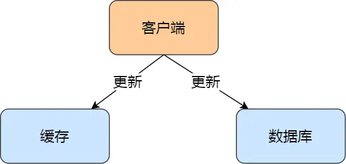
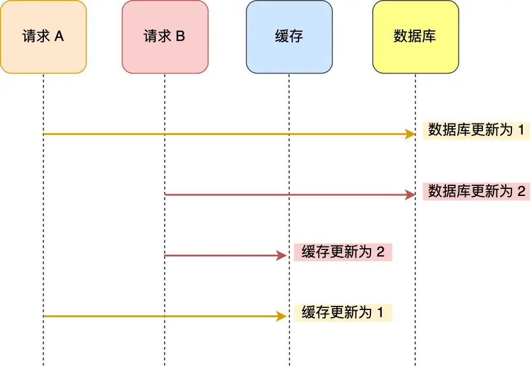
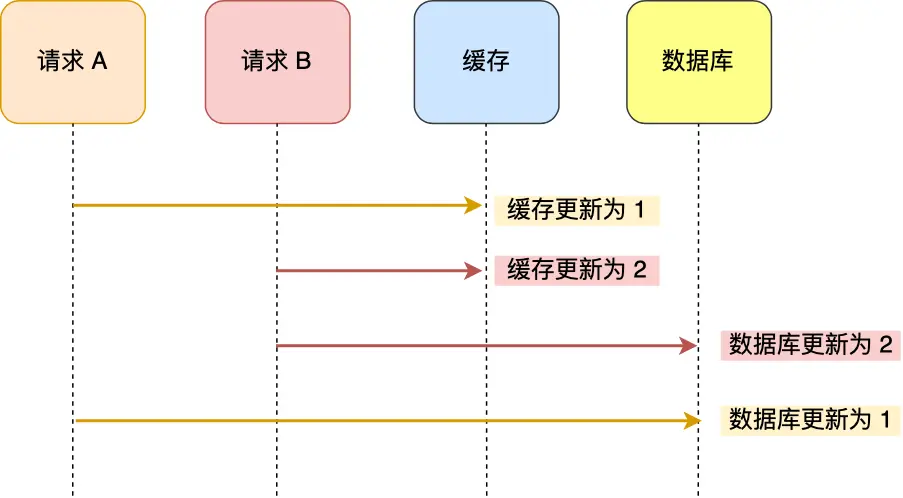
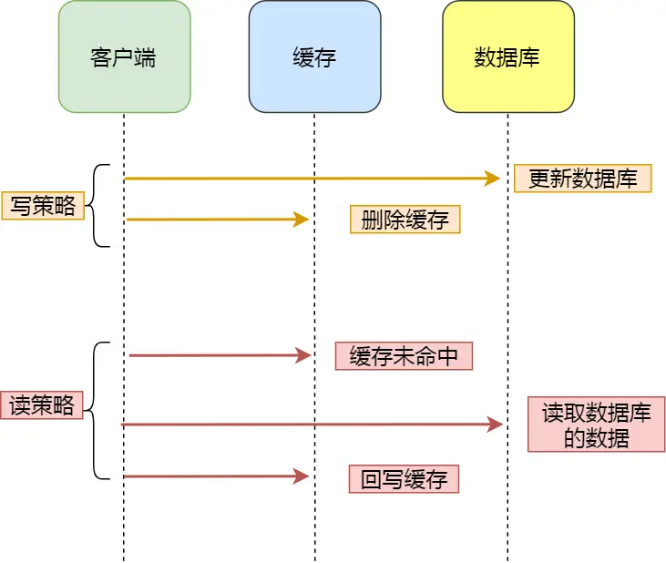
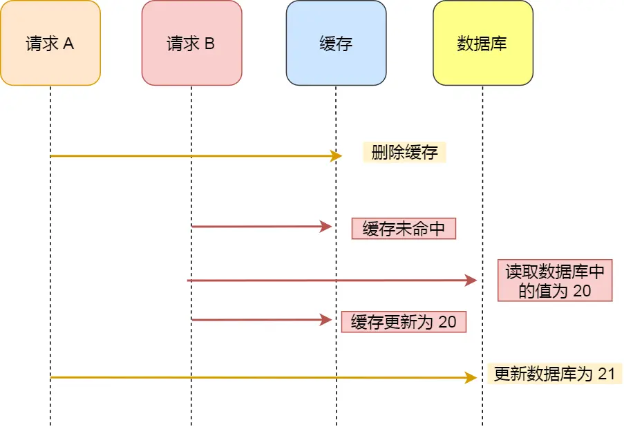
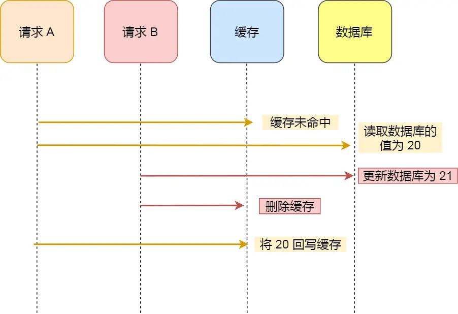
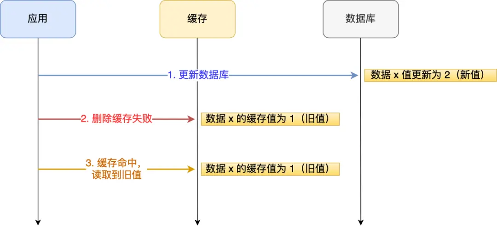
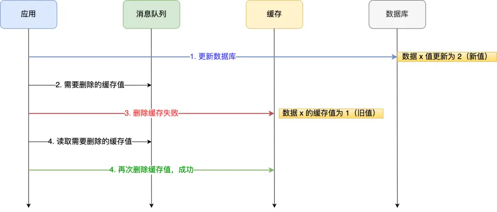
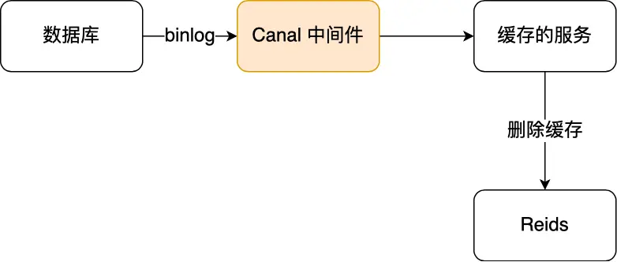

# 数据库和缓存如何保证一致性？

## 问题背景

当系统用户量不断增长时，数据库往往成为性能瓶颈。此时引入 Redis 作为缓存层是常见的优化方案。

通过缓存，在客户端请求数据时，如果能在缓存中命中数据，就直接返回缓存结果，无需查询数据库，从而减轻数据库压力，提高系统性能。

但是，引入缓存后，我们面临一个新的挑战：**如何保证缓存和数据库之间的数据一致性？**

## 更新策略对比分析

### 方案一：先更新数据库，再更新缓存



#### 存在的问题

在并发场景下，这种方案可能会导致数据不一致。

**问题场景：**
假设「请求 A」和「请求 B」两个请求，同时更新「同一条」数据，可能出现这样的执行顺序：



1. 请求 A 先将数据库的数据更新为 1
2. 在 A 更新缓存前，请求 B 将数据库的数据更新为 2
3. 请求 B 将缓存更新为 2
4. 请求 A 最后将缓存更新为 1

**结果：** 数据库中的数据是 2，而缓存中的数据却是 1，出现了数据不一致现象。

### 方案二：先更新缓存，再更新数据库

这种方案同样存在并发问题。

**问题场景：**



1. 请求 A 先将缓存的数据更新为 1
2. 在 A 更新数据库前，请求 B 将缓存的数据更新为 2
3. 请求 B 将数据库更新为 2
4. 请求 A 最后将数据库的数据更新为 1

**结果：** 数据库中的数据是 1，而缓存中的数据却是 2，同样出现了数据不一致现象。

#### 结论

无论是「先更新数据库，再更新缓存」，还是「先更新缓存，再更新数据库」，这两个方案都存在并发问题，当两个请求并发更新同一条数据时，可能会出现缓存和数据库中的数据不一致的现象。

## Cache Aside 旁路缓存策略

既然更新缓存的方案存在并发问题，我们可以考虑另一种策略：**在更新数据时，不更新缓存，而是删除缓存中的数据。然后，到读取数据时，发现缓存中没了数据之后，再从数据库中读取数据，更新到缓存中。**

这个策略叫做 **Cache Aside 策略**，也称为旁路缓存策略。



### 策略详解

Cache Aside 策略分为「读策略」和「写策略」：

#### 写策略步骤
1. 更新数据库中的数据
2. 删除缓存中的数据

#### 读策略步骤
1. 如果读取的数据命中了缓存，则直接返回数据
2. 如果读取的数据没有命中缓存，则从数据库中读取数据，然后将数据写入到缓存，并且返回给用户

### 写策略的执行顺序分析

在「写策略」中，我们需要选择执行顺序：
- 先删除缓存，再更新数据库
- 先更新数据库，再删除缓存

#### 方案一：先删除缓存，再更新数据库

**问题场景：**
假设某个用户的年龄是 20，请求 A 要更新用户年龄为 21：



1. 请求 A 删除缓存中的内容
2. 请求 B 读取该用户年龄，缓存未命中，从数据库读取到年龄为 20
3. 请求 B 将年龄 20 写入缓存
4. 请求 A 将数据库中的年龄更新为 21

**结果：** 缓存中是 20（旧值），数据库中是 21（新值），数据不一致。

#### 方案二：先更新数据库，再删除缓存

**问题场景：**
假如某个用户数据在缓存中不存在：



1. 请求 A 从数据库中查询到年龄为 20
2. 请求 B 更新数据库中的年龄为 21，并删除缓存
3. 请求 A 将从数据库中读到的年龄 20 写入缓存

**结果：** 缓存中是 20（旧值），数据库中是 21（新值），数据不一致。

#### 推荐方案

虽然从理论上分析，「先更新数据库，再删除缓存」也会出现数据不一致性的问题，**但是在实际中，这个问题出现的概率并不高**。

**原因：**
- 缓存的写入通常要远远快于数据库的写入
- 在实际中很难出现请求 B 已经更新了数据库并且删除了缓存，请求 A 才更新完缓存的情况
- 一旦请求 A 早于请求 B 删除缓存之前更新了缓存，那么接下来的请求就会因为缓存不命中而从数据库中重新读取数据

因此，**「先更新数据库 + 再删除缓存」的方案，是可以保证数据一致性的**。

### 进一步的保障措施

为了确保万无一失，还可以：

1. **给缓存数据加上过期时间**：即使在这期间存在缓存数据不一致，有过期时间来兜底，也能达到最终一致
2. **处理删除缓存失败的情况**：当删除缓存（第二个操作）失败时，需要有重试机制

## 删除缓存失败的解决方案

在实际应用中，可能出现这样的问题：明明更新了数据，但是数据要过一段时间才生效。

经过排查发现，问题的原因是：**在删除缓存（第二个操作）的时候失败了，导致缓存中的数据是旧值**。

### 问题示例

应用要把数据 X 的值从 1 更新为 2：



1. 成功更新了数据库（X = 2）
2. 在 Redis 缓存中删除 X 的缓存操作失败
3. 数据库中 X 的新值为 2，Redis 中的 X 的缓存值为 1

后续访问数据 X 的请求，会先在 Redis 中查询，因为缓存并没有被删除，所以会缓存命中，但是读到的却是旧值 1。

### 解决方案

针对删除缓存失败的问题，有两种有效的解决方案：

#### 方案一：消息队列重试机制

我们可以引入**消息队列**，将第二个操作（删除缓存）要操作的数据加入到消息队列，由消费者来操作数据。



**工作流程：**
1. 如果应用**删除缓存失败**，可以从消息队列中重新读取数据，然后再次删除缓存（重试机制）
2. 如果重试超过一定次数还是没有成功，需要向业务层发送报错信息
3. 如果**删除缓存成功**，就要把数据从消息队列中移除，避免重复操作

#### 方案二：订阅 MySQL binlog

「**先更新数据库，再删缓存**」策略的第一步是更新数据库，更新数据库成功就会产生一条变更日志，记录在 binlog 里。

我们可以通过订阅 binlog 日志，拿到具体要操作的数据，然后再执行缓存删除。阿里巴巴开源的 **Canal 中间件**就是基于这个实现的。



**Canal 工作原理：**
1. Canal 模拟 MySQL 主从复制的交互协议，把自己伪装成一个 MySQL 的从节点
2. 向 MySQL 主节点发送 dump 请求
3. MySQL 收到请求后，开始推送 Binlog 给 Canal
4. Canal 解析 Binlog 字节流，转换为便于读取的结构化数据
5. 供下游程序订阅使用，执行缓存删除操作

所以，**如果要想保证「先更新数据库，再删缓存」策略第二个操作能执行成功，我们可以使用「消息队列来重试缓存的删除」，或者「订阅 MySQL binlog 再操作缓存」，这两种方法有一个共同的特点，都是采用异步操作缓存。**

## 其他策略补充

### 延迟双删策略

针对「先删除缓存，再更新数据库」方案在「读 + 写」并发请求而造成缓存不一致的解决办法是「**延迟双删**」。

**实现伪代码：**
```java
// 删除缓存
redis.delKey(X)
// 更新数据库
db.update(X)
// 睡眠
Thread.sleep(N)
// 再删除缓存
redis.delKey(X)
```

**工作原理：**
加了个睡眠时间，主要是为了确保请求 A 在睡眠的时候，请求 B 能够在这一段时间完成「从数据库读取数据，再把缺失的缓存写入缓存」的操作，然后请求 A 睡眠完，再删除缓存。

**局限性：**
- 睡眠时间需要大于请求 B「从数据库读取数据 + 写入缓存」的时间
- 具体睡眠多久其实是个**玄学**，很难评估出来
- 这个方案也只是**尽可能**保证一致性，极端情况下依然可能出现缓存不一致

### 更新缓存策略的优化

如果业务对缓存命中率有很高的要求，可以采用「更新数据库 + 更新缓存」的方案，因为更新缓存并不会出现缓存未命中的情况。

**并发问题的解决方案：**
1. **分布式锁**：在更新缓存前先加个分布式锁，保证同一时间只运行一个请求更新缓存（会对写入性能产生影响）
2. **较短的过期时间**：在更新完缓存时，给缓存加上较短的过期时间，这样即使出现缓存不一致的情况，缓存的数据也会很快过期

## 总结

### 核心要点

1. **并发问题是关键**：无论选择什么策略，并发更新都是导致数据不一致的根本原因

2. **推荐方案**：「先更新数据库，再删除缓存」+ Cache Aside 策略
   - 理论上可能存在问题，但实际发生概率很低
   - 缓存写入速度远快于数据库写入

3. **必要的保障措施**：
   - 给缓存设置过期时间作为兜底
   - 处理删除缓存失败的情况

4. **删除缓存失败的解决方案**：
   - 消息队列重试机制
   - 订阅 MySQL binlog
   - 两种方案都采用异步操作缓存

### 方案对比

| 方案 | 优点 | 缺点 | 适用场景 |
|------|------|------|----------|
| 先更新数据库，再删除缓存 | 实际不一致概率低，简单易实现 | 理论上存在不一致可能 | 推荐使用 |
| 先删除缓存，再更新数据库 | 逻辑简单 | 并发时容易出现不一致 | 不推荐 |
| 更新数据库 + 更新缓存 | 缓存命中率高 | 并发问题明显，需要额外措施 | 对缓存命中率要求极高的场景 |
| 延迟双删 | 一定程度解决并发问题 | 睡眠时间难以确定，仍有风险 | 特殊场景下的补充方案 |

通过「消息队列来重试缓存的删除」或「订阅 MySQL binlog 再操作缓存」的方案，可以有效解决缓存删除失败的问题，确保数据库和缓存的一致性。这些方案的共同特点是采用异步操作缓存，提高了系统的可靠性和数据一致性保障。

## 面试要点

1. **能够分析各种方案的并发问题**：清楚地解释为什么会出现数据不一致
2. **推荐 Cache Aside 策略**：「先更新数据库，再删除缓存」
3. **了解实际应用中的保障措施**：过期时间、消息队列重试、binlog 订阅
4. **理解延迟双删的局限性**：不作为主要方案推荐
