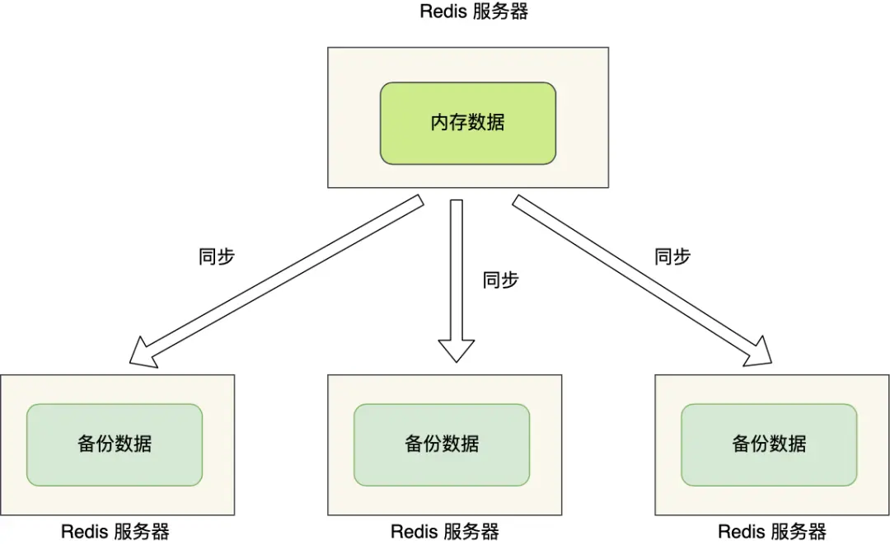
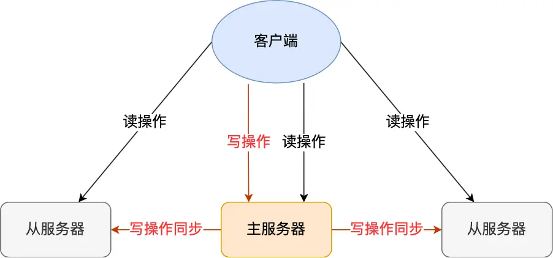
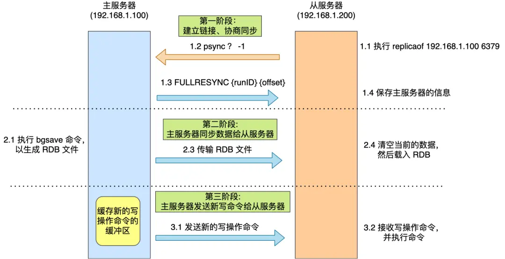
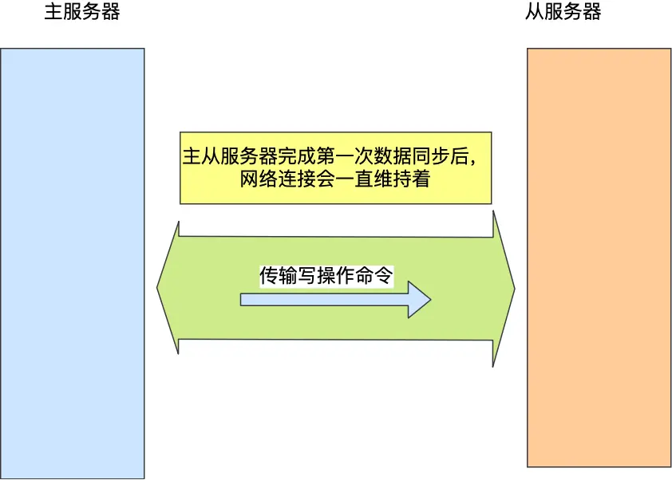
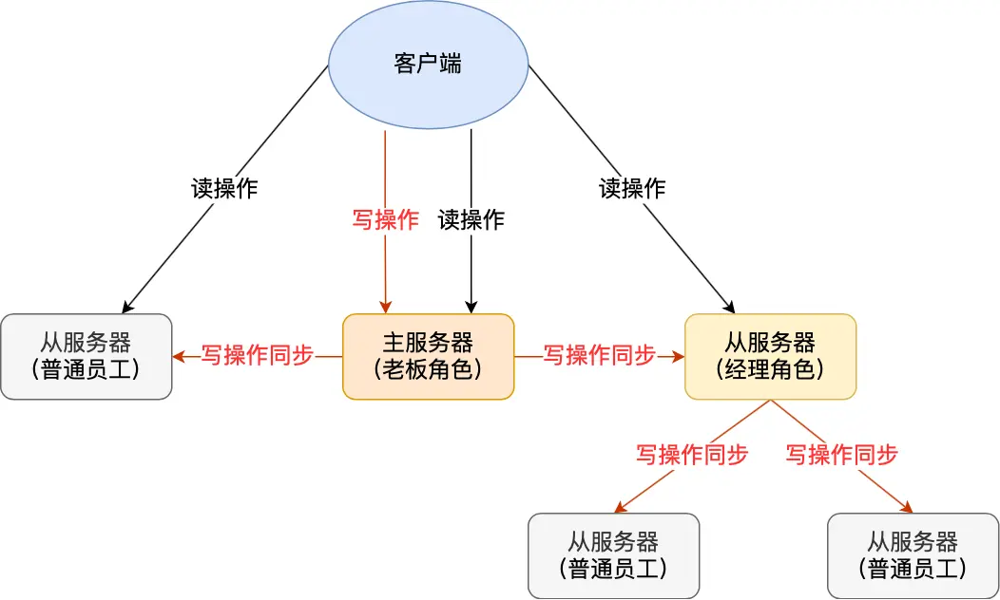
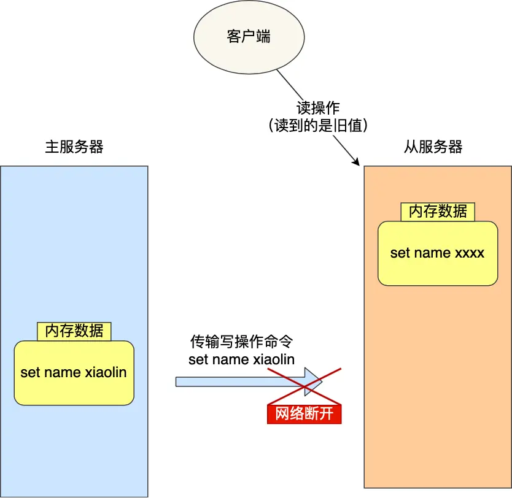
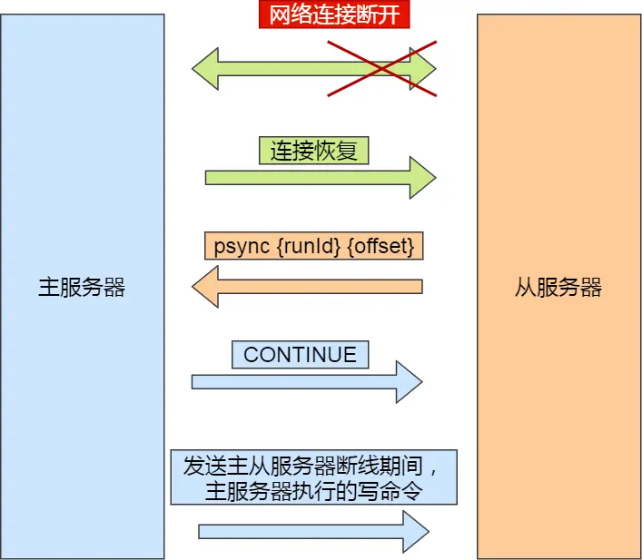
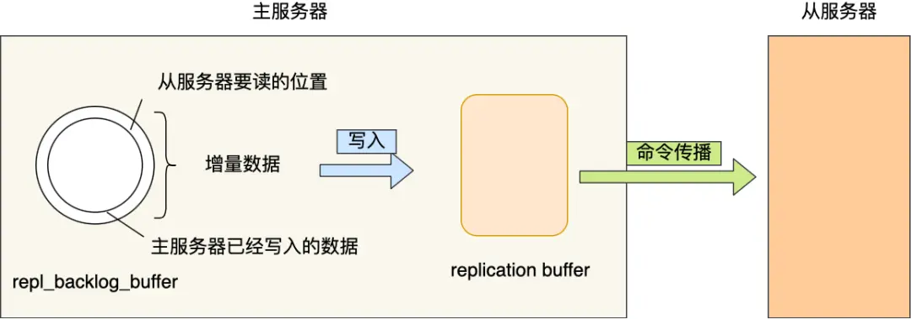

# Redis主从复制详解

## 前言

在之前的文章中，我们学习了Redis的AOF和RDB持久化技术，这两种技术可以保证即使服务器重启也不会丢失数据（或仅丢失少量数据）。

但是，将所有数据存储在一台服务器上仍然存在风险：
- **服务器宕机**：数据恢复需要时间，期间无法提供服务
- **硬盘故障**：可能导致数据完全丢失

为了解决这些**单点故障**问题，最好的方案是将数据备份到多台服务器上，让这些服务器都能对外提供服务。这样即使一台服务器出现故障，其他服务器仍能继续工作。



但这样又带来了新的问题：
- 多台服务器之间如何保持数据一致性？
- 读写操作应该如何分配？

Redis通过**主从复制模式**解决了这些问题。

## 什么是主从复制？

主从复制是一种数据同步机制，具有以下特点：

1. **一主多从**：一个主服务器（Master），多个从服务器（Slave）
2. **读写分离**：主服务器负责写操作，从服务器负责读操作
3. **自动同步**：主服务器的写操作会自动同步到从服务器



这样设计的好处是：
- 保证了数据的一致性
- 提高了系统的可用性
- 实现了读写分离，提升了性能

## 主从复制的工作原理

### 建立主从关系

要建立主从关系，我们使用`replicaof`命令（Redis 5.0之前使用`slaveof`）：

```shell
# 在从服务器上执行
replicaof <主服务器IP> <主服务器端口>
```

执行这个命令后，从服务器就会成为主服务器的从服务器，并开始同步数据。

### 第一次同步过程

主从服务器的第一次同步分为三个阶段：



#### 第一阶段：建立连接、协商同步

1. **发送psync命令**：从服务器向主服务器发送`psync`命令
   - `runID`：主服务器的唯一标识（第一次为"?"）
   - `offset`：复制进度（第一次为-1）

2. **响应FULLRESYNC**：主服务器返回`FULLRESYNC`命令
   - 包含主服务器的runID和当前复制进度offset
   - 表示将进行全量复制

#### 第二阶段：主服务器同步数据

1. **生成RDB文件**：主服务器执行`bgsave`命令生成RDB快照
2. **发送RDB文件**：将RDB文件传输给从服务器
3. **加载RDB文件**：从服务器清空旧数据，加载新的RDB文件

**重要**：在生成、传输、加载RDB期间，主服务器收到的新写命令会保存在`replication buffer`缓冲区中。

#### 第三阶段：发送增量数据

1. 从服务器加载完RDB后，发送确认消息给主服务器
2. 主服务器将`replication buffer`中的增量数据发送给从服务器
3. 从服务器执行这些命令，完成数据同步

### 命令传播

第一次同步完成后，主从服务器维护一个**长连接**：



- 主服务器通过这个连接持续将写命令发送给从服务器
- 从服务器执行这些命令，保持数据一致性
- 使用长连接避免了频繁建立连接的开销

## 性能优化策略

### 分摊主服务器压力

当从服务器数量很多时，主服务器可能面临压力：
- 频繁fork进程生成RDB文件
- 大量网络带宽用于传输RDB文件

**解决方案**：建立多级主从架构



```shell
# 让从服务器也成为其他服务器的主服务器
replicaof <中间服务器IP> 6379
```

这样可以：
- 减轻主服务器的CPU压力
- 分摊网络带宽使用
- 提高整体的扩展性

## 增量复制机制

### 网络断开重连问题

在命令传播阶段，如果网络中断会怎么办？



**Redis 2.8之前**：重新进行全量复制（效率低）
**Redis 2.8之后**：采用增量复制（只同步断线期间的数据）

### 增量复制过程



1. **重连请求**：从服务器发送psync命令（offset不是-1）
2. **响应CONTINUE**：主服务器决定采用增量复制
3. **发送增量数据**：主服务器发送断线期间的写命令

### 关键组件

#### repl_backlog_buffer环形缓冲区
- **作用**：保存最近的写命令
- **特点**：环形结构，写满后覆盖旧数据
- **默认大小**：1MB

#### replication offset复制偏移量
- **master_repl_offset**：主服务器写入位置
- **slave_repl_offset**：从服务器读取位置

### 同步策略判断

主服务器根据偏移量差异决定同步方式：

```
如果 slave要读取的数据 在 repl_backlog_buffer中：
    执行增量复制
否则：
    执行全量复制
```



### 缓冲区大小优化

为避免频繁全量复制，需要合理设置缓冲区大小：

**计算公式**：
```
repl_backlog_buffer_size = write_size_per_second × 断线重连时间(秒)
```

**举例**：
- 主服务器每秒产生1MB写命令
- 平均断线重连需要5秒
- 建议缓冲区大小：5MB × 2 = 10MB

**配置方法**：
```shell
# 修改配置文件
repl-backlog-size 10mb
```

## 总结

Redis主从复制包含三种核心机制：

1. **全量复制**：第一次同步，传输完整数据
2. **命令传播**：基于长连接的实时同步
3. **增量复制**：网络恢复后的差异同步

**关键优化点**：
- 使用多级主从架构分摊压力
- 合理配置repl_backlog_buffer大小
- 保证主从节点网络稳定性

## 面试题详解

### Redis主从节点是长连接还是短连接？

**答案**：长连接

**解释**：主从服务器在完成第一次全量同步后，会维护一个TCP长连接用于命令传播，避免频繁建立和断开连接的性能开销。

### 怎么判断Redis某个节点是否正常工作？

**答案**：通过ping-pong心跳检测机制

**详细说明**：
- **主节点监控**：默认每10秒向从节点发送ping命令（可通过`repl-ping-slave-period`配置）
- **从节点上报**：每1秒发送`replconf ack{offset}`命令，包含：
  - 实时监测网络状态
  - 上报复制偏移量
  - 检查数据是否丢失
- **失效判断**：当一半以上节点ping某个节点无响应时，认为该节点下线

### 主从复制架构中，过期key如何处理？

**答案**：由主节点统一处理

**处理流程**：
1. 主节点检测到key过期或通过淘汰算法删除key
2. 主节点模拟发送`del`命令给所有从节点
3. 从节点收到删除命令后执行相应操作
4. 保证主从节点对过期key处理的一致性

### Redis是同步复制还是异步复制？

**答案**：异步复制

**特点**：
- 主节点收到写命令后立即返回给客户端
- 写命令先存入内部缓冲区，然后异步发送给从节点
- 优点：响应速度快，不阻塞主节点
- 缺点：可能存在短暂的数据不一致

### 主从复制中两个Buffer有什么区别？

**replication buffer vs repl backlog buffer**：

| 特性 | replication buffer | repl backlog buffer |
|------|-------------------|-------------------|
| **出现阶段** | 全量复制 + 增量复制 | 仅增量复制 |
| **分配方式** | 每个从节点一个 | 整个主节点一个 |
| **满了之后** | 断开连接，重新全量复制 | 覆盖旧数据（环形结构） |
| **主要作用** | 缓存待发送的命令 | 支持增量复制 |

### 如何应对主从数据不一致？

**产生原因**：主从复制是异步的，存在网络延迟

**解决方案**：

1. **网络优化**：
   - 保证主从节点网络连接质量
   - 避免跨机房部署

2. **监控复制进度**：
   ```shell
   # 查看复制进度
   INFO replication
   ```
   - 监控`master_repl_offset`和`slave_repl_offset`差值
   - 当差值超过阈值时，暂时停止从该从节点读取数据

3. **设置合理阈值**：
   - 根据业务需求设置可接受的数据延迟范围
   - 在一致性和可用性之间找到平衡

### 主从切换如何减少数据丢失？

**数据丢失场景**：

#### 1. 异步复制数据丢失
**原因**：主节点收到写请求后立即返回，但还未同步到从节点时宕机

**解决方案**：配置`min-slaves-max-lag`参数
```shell
# 当所有从节点复制延迟超过10秒时，主节点拒绝写入
min-slaves-max-lag 10
```

**降级策略**：
- 将数据写入本地缓存/磁盘
- 使用消息队列（如Kafka）缓存数据
- 主节点恢复后重新写入

#### 2. 脑裂数据丢失
**原因**：网络分区导致出现两个主节点，旧主节点数据在重新加入时被清空

**解决方案**：组合使用两个参数
```shell
# 至少需要1个从节点连接
min-slaves-to-write 1
# 复制延迟不能超过12秒
min-slaves-max-lag 12
```

**保护机制**：
- 当条件不满足时，主节点拒绝写入
- 防止在网络分区期间写入无法同步的数据
- 确保只有健康的主节点能接收写请求

**实际案例**：
假设配置：
- `min-slaves-to-write = 1`
- `min-slaves-max-lag = 12s`  
- 哨兵`down-after-milliseconds = 10s`

当主节点卡住15秒时：
1. 哨兵在10秒后判断主节点下线，开始主从切换
2. 由于超过12秒无法与从节点同步，主节点停止接收写请求
3. 切换完成后，只有新主节点能接收请求，避免数据丢失

### 主从如何做到故障自动切换？

**问题**：主节点故障时，从节点无法自动升级为主节点

**解决方案**：Redis哨兵机制（Sentinel）

**哨兵功能**：
- **故障发现**：自动检测主节点是否可用
- **故障转移**：自动选举新的主节点
- **通知应用**：将变更通知给客户端
- **配置管理**：更新主从配置信息

**实现高可用**：
- 无需人工干预
- 快速故障恢复
- 保证服务连续性
