# Redis 哨兵模式详解：故障转移的自动化解决方案

> Redis 哨兵（Sentinel）是 Redis 高可用架构的核心组件，它通过监控、故障检测和自动故障转移，确保 Redis 主从架构的稳定性和可用性。

## 为什么需要哨兵机制？

在 Redis 的主从架构中，由于主从模式是读写分离的，如果主节点（master）挂了，那么将没有主节点来服务客户端的写操作请求，也没有主节点给从节点（slave）进行数据同步了。

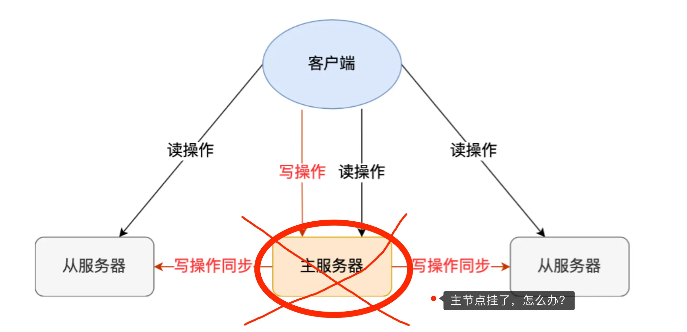

### 传统主从架构的局限性

- **单点故障风险**：主节点故障导致整个系统无法写入
- **人工干预成本**：需要手动选择新主节点并重新配置
- **切换时间长**：人工故障转移流程复杂且耗时
- **客户端重连复杂**：需要手动更新客户端配置

这时如果要恢复服务的话，需要人工介入，选择一个「从节点」切换为「主节点」，然后让其他从节点指向新的主节点，同时还需要通知上游那些连接 Redis 主节点的客户端，将其配置中的主节点 IP 地址更新为「新主节点」的 IP 地址。

Redis 在 2.8 版本以后提供的**哨兵（Sentinel）机制**，它的作用是实现**主从节点故障转移**。它会监测主节点是否存活，如果发现主节点挂了，它就会选举一个从节点切换为主节点，并且把新主节点的相关信息通知给从节点和客户端。

## 哨兵机制的工作原理

哨兵其实是一个运行在特殊模式下的 Redis 进程，所以它也是一个节点。从"哨兵"这个名字也可以看得出来，它相当于是"观察者节点"，观察的对象是主从节点。

当然，它不仅仅是观察那么简单，在它观察到有异常的状况下，会做出一些"动作"，来修复异常状态。

### 哨兵的三大核心职责

哨兵节点主要负责三件事情：**监控、选主、通知**。

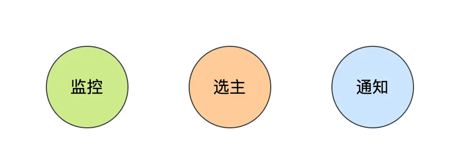

1. **监控（Monitoring）**
   - 定期检查主从节点的健康状态
   - 维护节点状态信息
   - 检测网络连接质量

2. **选主（Master Selection）**
   - 在主节点故障时选举新的主节点
   - 执行故障转移操作
   - 重新配置主从关系

3. **通知（Notification）**
   - 向客户端通知主节点变更
   - 更新从节点的复制目标
   - 发布故障转移事件

## 故障检测机制：如何判断主节点真的故障了？

### 主观下线（Subjective Down）

哨兵会每隔 1 秒给所有主从节点发送 PING 命令，当主从节点收到 PING 命令后，会发送一个响应命令给哨兵，这样就可以判断它们是否在正常运行。

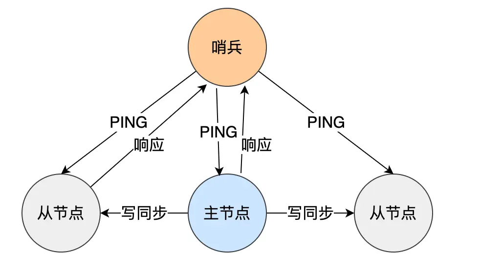

如果主节点或者从节点没有在规定的时间内响应哨兵的 PING 命令，哨兵就会将它们标记为「**主观下线**」。这个「规定的时间」是配置项 `down-after-milliseconds` 参数设定的，单位是毫秒。

### 客观下线（Objective Down）

**为什么需要客观下线？**

之所以针对「主节点」设计「主观下线」和「客观下线」两个状态，是因为有可能「主节点」其实并没有故障，可能只是因为主节点的系统压力比较大或者网络发送了拥塞，导致主节点没有在规定时间内响应哨兵的 PING 命令。

所以，为了减少误判的情况，哨兵在部署的时候不会只部署一个节点，而是用多个节点部署成**哨兵集群**（*最少需要三台机器来部署哨兵集群*），**通过多个哨兵节点一起判断，就可以就可以避免单个哨兵因为自身网络状况不好，而误判主节点下线的情况**。同时，多个哨兵的网络同时不稳定的概率较小，由它们一起做决策，误判率也能降低。

**客观下线的判定流程：**

当一个哨兵判断主节点为「主观下线」后，就会向其他哨兵发起命令，其他哨兵收到这个命令后，就会根据自身和主节点的网络状况，做出赞成投票或者拒绝投票的响应。

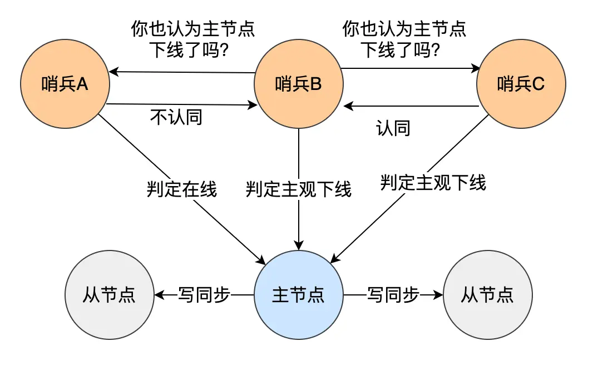

当这个哨兵的赞同票数达到哨兵配置文件中的 **quorum** 配置项设定的值后，这时主节点就会被该哨兵标记为「客观下线」。

> **配置示例**：现在有 3 个哨兵，quorum 配置的是 2，那么一个哨兵需要 2 张赞成票，就可以标记主节点为"客观下线"了。这 2 张赞成票包括哨兵自己的一张赞成票和另外两个哨兵的赞成票。

**最佳实践**：quorum 的值一般设置为哨兵个数的二分之一加 1，例如 3 个哨兵就设置 2。

## 哨兵 Leader 选举机制

### 为什么需要 Leader 选举？

前面说过，为了更加"客观"的判断主节点故障了，一般不会只由单个哨兵的检测结果来判断，而是多个哨兵一起判断，这样可以减少误判概率，所以**哨兵是以哨兵集群的方式存在的**。

问题来了，由哨兵集群中的哪个节点进行主从故障转移呢？

所以这时候，还需要在哨兵集群中选出一个 leader，让 leader 来执行主从切换。

### Leader 选举流程

**1. 候选者确定**
哪个哨兵节点判断主节点为「客观下线」，这个哨兵节点就是候选者，所谓的候选者就是想当 Leader 的哨兵。

**2. 投票过程**
举个例子，假设有三个哨兵。当哨兵 B 先判断到主节点「主观下线后」，就会给其他实例发送 `is-master-down-by-addr` 命令。接着，其他哨兵会根据自己和主节点的网络连接情况，做出赞成投票或者拒绝投票的响应。

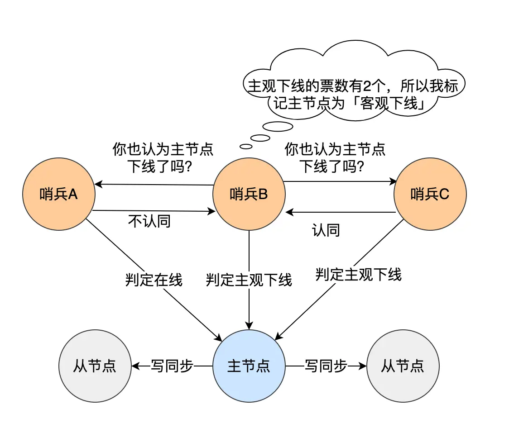

当哨兵 B 收到赞成票数达到哨兵配置文件中的 quorum 配置项设定的值后，就会将主节点标记为「客观下线」，此时的哨兵 B 就是一个 Leader 候选者。

**3. 选举条件**
候选者会向其他哨兵发送命令，表明希望成为 Leader 来执行主从切换，并让所有其他哨兵对它进行投票。

任何一个「候选者」要成为 Leader，必须满足两个条件：
- **第一**：拿到半数以上的赞成票
- **第二**：拿到的票数同时还需要大于等于哨兵配置文件中的 quorum 值

**4. 投票规则**
- 每个哨兵只有一次投票机会
- 可以投给自己或投给别人
- 只有候选者才能把票投给自己
- 先到先得的投票原则

### 为什么哨兵节点至少要有 3 个？

**双节点的问题**：
如果哨兵集群中只有 2 个哨兵节点，此时如果一个哨兵想要成功成为 Leader，必须获得 2 票，而不是 1 票。

所以，如果哨兵集群中有个哨兵挂掉了，那么就只剩一个哨兵了，如果这个哨兵想要成为 Leader，这时票数就没办法达到 2 票，就无法成功成为 Leader，这时是无法进行主从节点切换的。

**三节点的优势**：
因此，通常我们至少会配置 3 个哨兵节点。这时，如果哨兵集群中有个哨兵挂掉了，那么还剩下两个哨兵，如果这个哨兵想要成为 Leader，这时还是有机会达到 2 票的，所以还是可以选举成功的，不会导致无法进行主从节点切换。

### 实际场景分析

**案例分析**：Redis 1 主 4 从，5 个哨兵，quorum 设置为 3，如果 2 个哨兵故障，当主节点宕机时，哨兵能否判断主节点"客观下线"？主从能否自动切换？

**分析结果**：
- **哨兵集群可以判定主节点"客观下线"**。哨兵集群还剩下 3 个哨兵，当一个哨兵判断主节点"主观下线"后，询问另外 2 个哨兵后，有可能能拿到 3 张赞同票，这时就达到了 quorum 的值，因此，哨兵集群可以判定主节点为"客观下线"。

- **哨兵集群可以完成主从切换**。当有个哨兵标记主节点为「客观下线」后，就会进行选举 Leader 的过程，因为此时哨兵集群还剩下 3 个哨兵，那么还是可以拿到半数以上（5/2+1=3）的票，而且也达到了 quorum 值，满足了选举 Leader 的两个条件，所以就能选举成功，因此哨兵集群可以完成主从切换。

**最佳实践建议**：
- **quorum 的值建议设置为哨兵个数的二分之一加 1**，例如 3 个哨兵就设置 2，5 个哨兵设置为 3
- **哨兵节点的数量应该是奇数**，避免脑裂问题

## 主从故障转移详细流程

在哨兵集群中通过投票的方式，选举出了哨兵 leader 后，就可以进行主从故障转移的过程了：

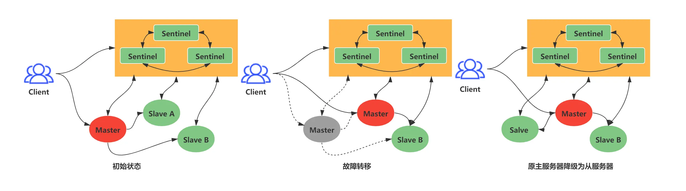

主从故障转移操作包含以下四个步骤：

### 步骤一：选出新主节点

故障转移操作第一步要做的就是在已下线主节点属下的所有「从节点」中，挑选出一个状态良好、数据完整的从节点，然后向这个「从节点」发送 `SLAVEOF no one` 命令，将这个「从节点」转换为「主节点」。

#### 从节点筛选策略

**1. 初步筛选**
- 过滤掉已经下线的从节点
- 过滤掉网络状态不佳的从节点

**网络状态判断标准**：Redis 有个叫 `down-after-milliseconds * 10` 配置项，如果发生断连的次数超过了 10 次，就说明这个从节点的网络状况不好，不适合作为新主节点。

**2. 三轮考察选择**

**第一轮：优先级考察**
- Redis 有个叫 `slave-priority` 配置项，可以给从节点设置优先级
- 优先级越小排名越靠前
- 根据服务器性能配置来设置从节点的优先级

**第二轮：复制进度考察**
如果优先级相同，则比较复制进度：


- 主节点用 `master_repl_offset` 记录最新写操作位置
- 从节点用 `slave_repl_offset` 记录当前复制进度
- `slave_repl_offset` 最接近 `master_repl_offset` 的从节点优先

**第三轮：ID 号考察**
- 如果优先级和复制进度都相同，比较从节点 ID 号
- ID 号小的从节点胜出

#### 选主流程总结

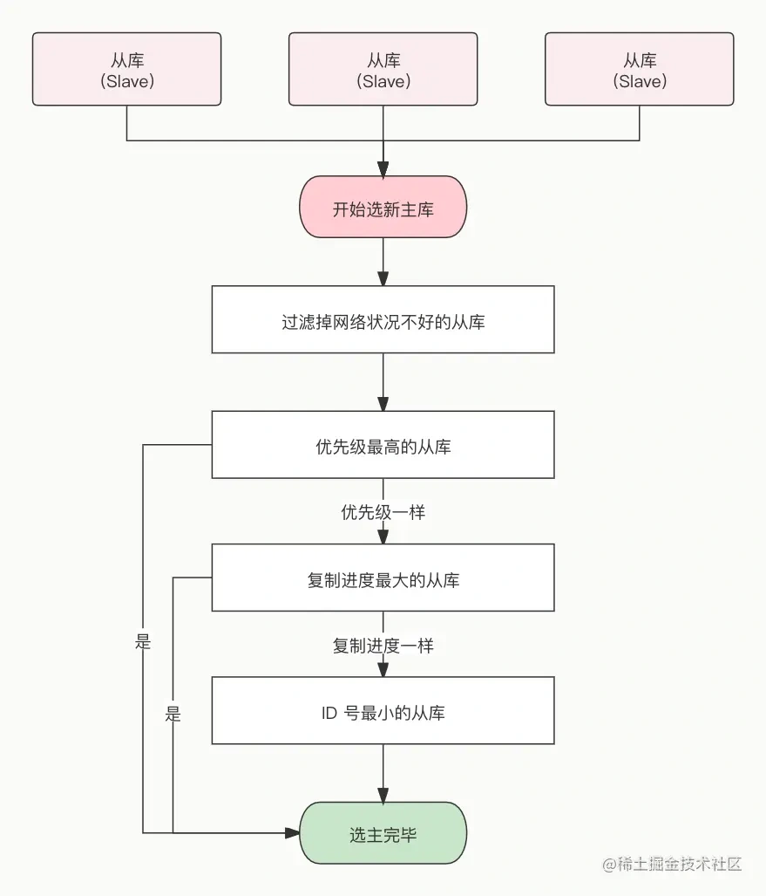

在选举出从节点后，哨兵 leader 向被选中的从节点发送 `SLAVEOF no one` 命令，让这个从节点解除从节点的身份，将其变为新主节点。

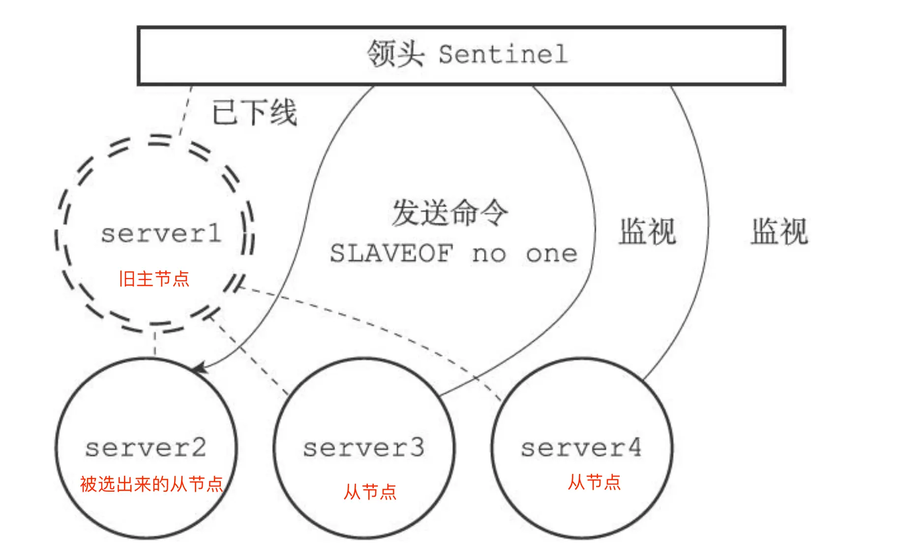

在发送 `SLAVEOF no one` 命令之后，哨兵 leader 会以每秒一次的频率向被升级的从节点发送 `INFO` 命令，并观察命令回复中的角色信息，当被升级节点的角色信息从原来的 slave 变为 master 时，哨兵 leader 就知道被选中的从节点已经顺利升级为主节点了。

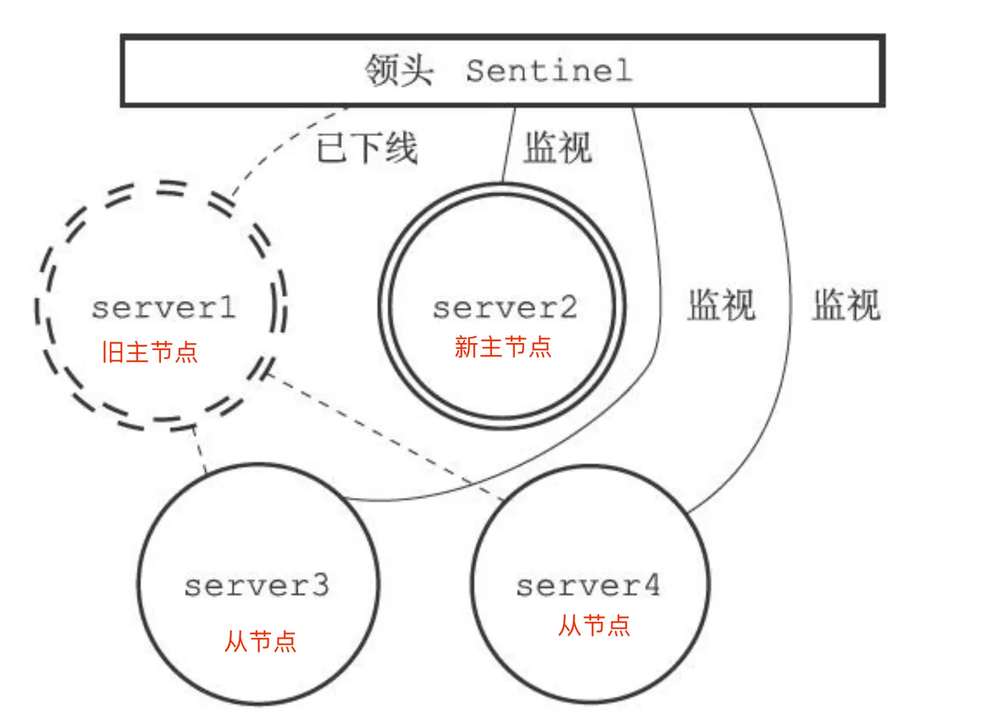

### 步骤二：将从节点指向新主节点

当新主节点出现之后，哨兵 leader 下一步要做的就是，让已下线主节点属下的所有「从节点」指向「新主节点」，这一动作可以通过向「从节点」发送 `SLAVEOF` 命令来实现。

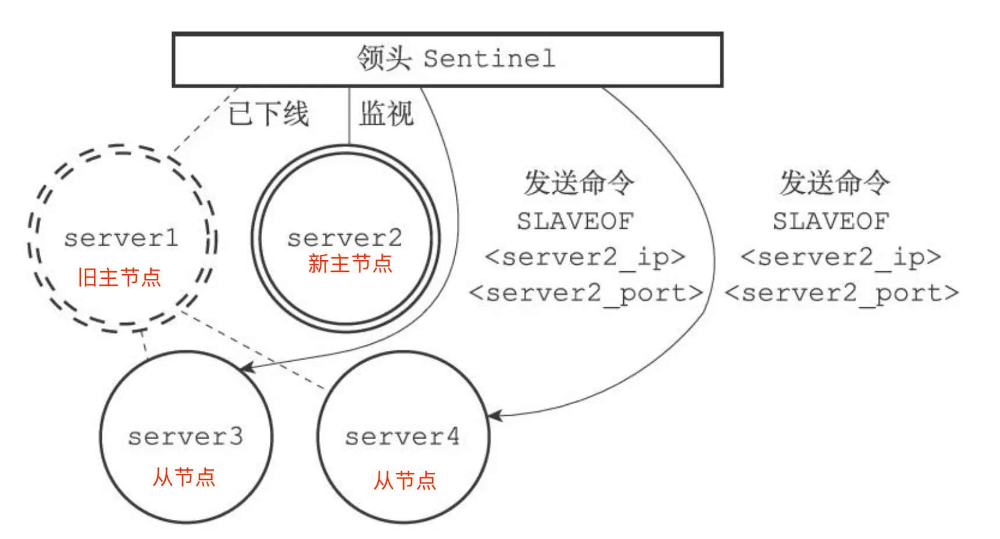

所有从节点指向新主节点后的拓扑图如下：

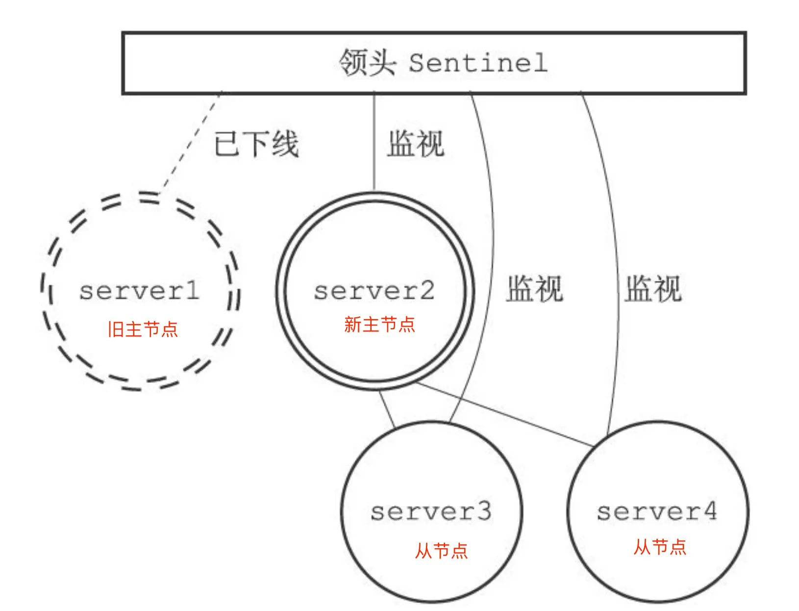

### 步骤三：通知客户端主节点已更换

经过前面一系列的操作后，哨兵集群终于完成主从切换的工作，那么新主节点的信息要如何通知给客户端呢？

这主要**通过 Redis 的发布者/订阅者机制来实现**的。每个哨兵节点提供发布者/订阅者机制，客户端可以从哨兵订阅消息。

#### 哨兵提供的事件频道

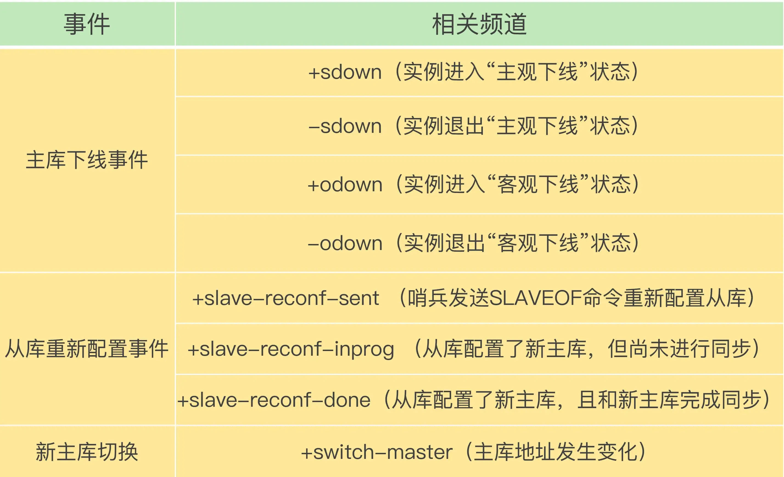

哨兵提供的消息订阅频道有很多，不同频道包含了主从节点切换过程中的不同关键事件：

- `+switch-master`：主节点切换完成
- `+slave`：新从节点连接
- `+failover-start`：故障转移开始
- `+failover-end`：故障转移结束

**客户端通知流程**：
1. 客户端和哨兵建立连接
2. 客户端订阅哨兵提供的频道
3. 主从切换完成后，哨兵向 `+switch-master` 频道发布新主节点的 IP 地址和端口
4. 客户端收到消息，更新连接配置

通过发布者/订阅者机制，客户端不仅可以在主从切换后得到新主节点的连接信息，还可以监控到主从节点切换过程中发生的各个重要事件，有助于了解切换进度。

### 步骤四：将旧主节点变为从节点

故障转移操作最后要做的是，继续监视旧主节点，当旧主节点重新上线时，哨兵集群就会向它发送 `SLAVEOF` 命令，让它成为新主节点的从节点：

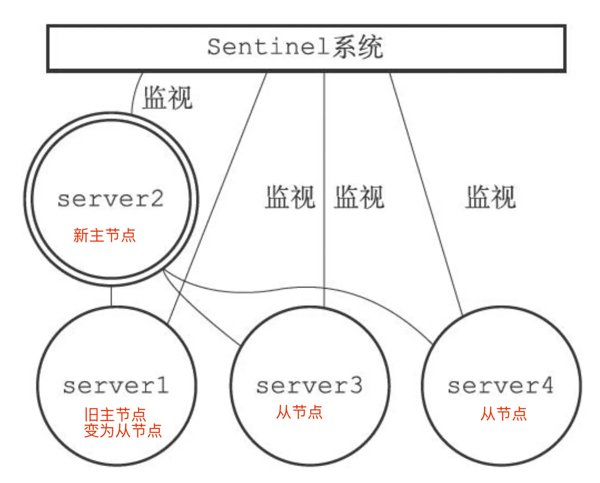

至此，整个主从节点的故障转移的工作结束。

## 哨兵集群的组建机制

### 哨兵自动发现机制

在我第一次搭建哨兵集群的时候，当时觉得很诧异。因为在配置哨兵的信息时，竟然只需要填下面这几个参数，设置主节点名字、主节点的 IP 地址和端口号以及 quorum 值。

```bash
sentinel monitor <master-name> <ip> <redis-port> <quorum> 
```

不需要填其他哨兵节点的信息，它们是如何感知对方的，又是如何组成哨兵集群的？

### 基于发布/订阅的发现机制

**哨兵节点之间是通过 Redis 的发布者/订阅者机制来相互发现的**。

在主从集群中，主节点上有一个名为 `__sentinel__:hello` 的频道，不同哨兵就是通过它来相互发现，实现互相通信的。

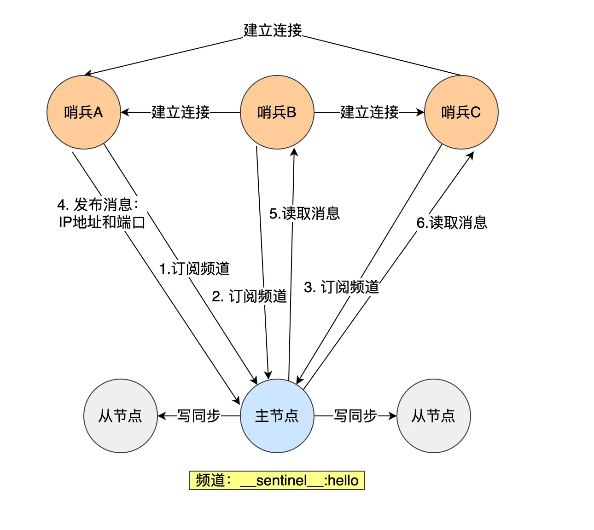

**发现流程**：
1. 哨兵 A 把自己的 IP 地址和端口信息发布到 `__sentinel__:hello` 频道
2. 哨兵 B 和 C 订阅了该频道
3. 哨兵 B 和 C 从频道获取哨兵 A 的连接信息
4. 哨兵 B、C 与哨兵 A 建立网络连接
5. 通过同样方式，所有哨兵互相发现并建立连接

### 从节点信息获取

哨兵集群会对「从节点」的运行状态进行监控，那哨兵集群如何知道「从节点」的信息？

**信息获取流程**：
1. 主节点知道所有「从节点」的信息
2. 哨兵每 10 秒向主节点发送 `INFO` 命令
3. 主节点返回从节点列表信息
4. 哨兵根据从节点连接信息建立连接
5. 在连接上持续监控从节点状态

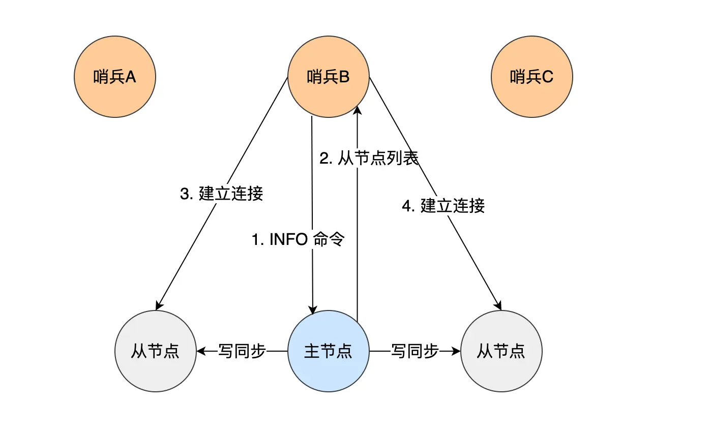

正是通过 Redis 的发布者/订阅者机制，哨兵之间可以相互感知，然后组成集群，同时，哨兵又通过 `INFO` 命令，在主节点里获得了所有从节点连接信息，于是就能和从节点建立连接，并进行监控了。

## 哨兵模式的核心特性总结

### 核心功能

**1. 故障检测**
- 主观下线：单个哨兵的判断
- 客观下线：多个哨兵的共同判断
- 减少误判，提高可靠性

**2. 自动故障转移**
- Leader 选举：确保单点执行故障转移
- 智能选主：基于优先级、复制进度、ID 的选择策略
- 完整的切换流程：从选主到通知客户端

**3. 高可用保障**
- 集群化部署：避免单点故障
- 自动化运维：减少人工干预
- 实时监控：持续健康检查

### 部署建议

**1. 节点数量**
- 最少 3 个哨兵节点
- 推荐奇数个节点（3、5、7）
- 避免网络分区导致的脑裂

**2. 配置参数**
- `quorum` 设置为节点数 / 2 + 1
- `down-after-milliseconds` 根据网络延迟调整
- `failover-timeout` 设置合理的故障转移超时

**3. 网络部署**
- 哨兵节点分布在不同机器/机房
- 保证网络连通性和稳定性
- 考虑客户端到哨兵的网络质量

## 总结

Redis 在 2.8 版本以后提供的**哨兵（Sentinel）机制**，它的作用是实现**主从节点故障转移**。它会监测主节点是否存活，如果发现主节点挂了，它就会选举一个从节点切换为主节点，并且把新主节点的相关信息通知给从节点和客户端。

哨兵一般是以集群的方式部署，至少需要 3 个哨兵节点，哨兵集群主要负责三件事情：**监控、选主、通知**。

### 工作流程总结

**1. 第一轮投票：判断主节点下线**
当哨兵集群中的某个哨兵判定主节点下线（主观下线）后，就会向其他哨兵发起命令，其他哨兵收到这个命令后，就会根据自身和主节点的网络状况，做出赞成投票或者拒绝投票的响应。

当这个哨兵的赞同票数达到哨兵配置文件中的 quorum 配置项设定的值后，这时主节点就会被该哨兵标记为「客观下线」。

**2. 第二轮投票：选出哨兵 leader**
某个哨兵判定主节点客观下线后，该哨兵就会发起投票，告诉其他哨兵，它想成为 leader，想成为 leader 的哨兵节点，要满足两个条件：

- 第一，拿到半数以上的赞成票
- 第二，拿到的票数同时还需要大于等于哨兵配置文件中的 quorum 值

**3. 由哨兵 leader 进行主从故障转移**
选举出了哨兵 leader 后，就可以进行主从故障转移的过程了。该操作包含以下四个步骤：

- **第一步**：在已下线主节点（旧主节点）属下的所有「从节点」里面，挑选出一个从节点，并将其转换为主节点，选择的规则：
  - 过滤掉已经离线的从节点
  - 过滤掉历史网络连接状态不好的从节点
  - 将剩下的从节点，进行三轮考察：优先级、复制进度、ID 号。在每一轮考察过程中，如果找到了一个胜出的从节点，就将其作为新主节点

- **第二步**：让已下线主节点属下的所有「从节点」修改复制目标，修改为复制「新主节点」

- **第三步**：将新主节点的 IP 地址和信息，通过「发布者/订阅者机制」通知给客户端

- **第四步**：继续监视旧主节点，当这个旧主节点重新上线时，将它设置为新主节点的从节点

### 技术原理

哨兵节点通过 Redis 的发布者/订阅者机制，哨兵之间可以相互感知，相互连接，然后组成哨兵集群，同时哨兵又通过 `INFO` 命令，在主节点里获得了所有从节点连接信息，于是就能和从节点建立连接，并进行监控了。

## 参考资料

- 《Redis 核心技术与实战》
- 《Redis 设计与实现》
