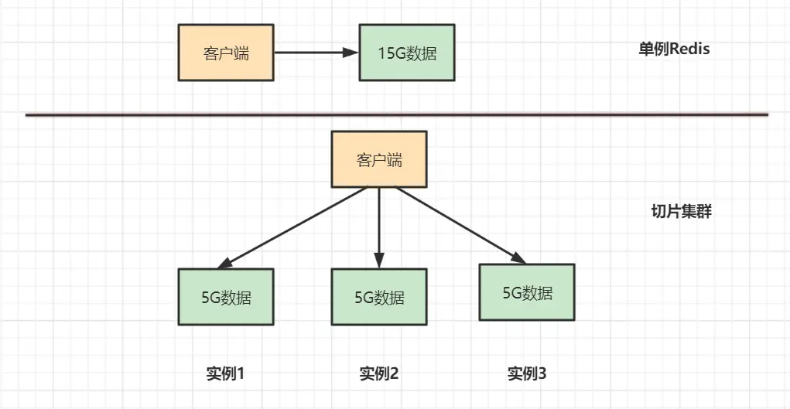
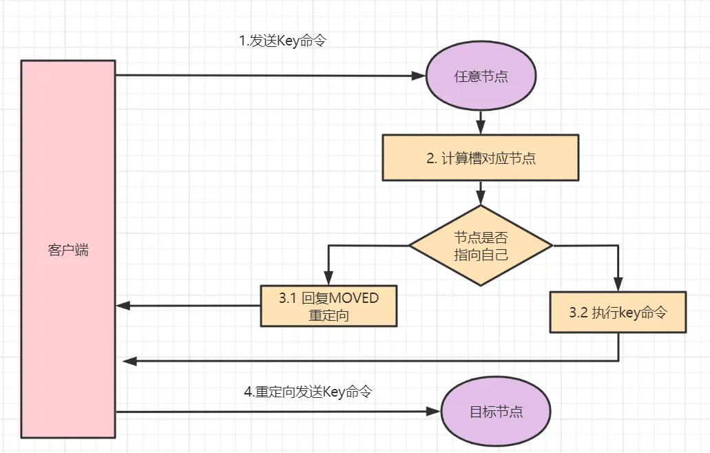
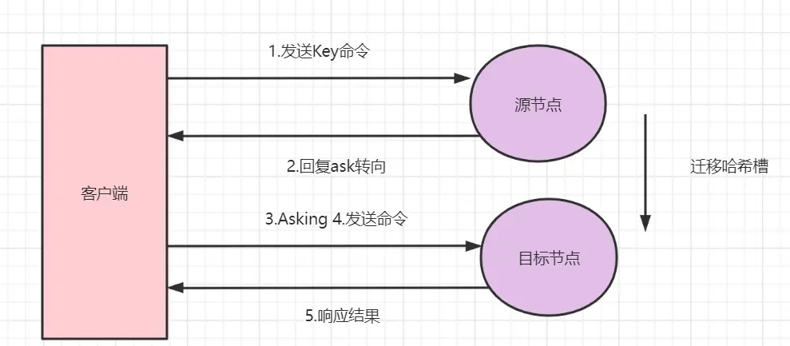
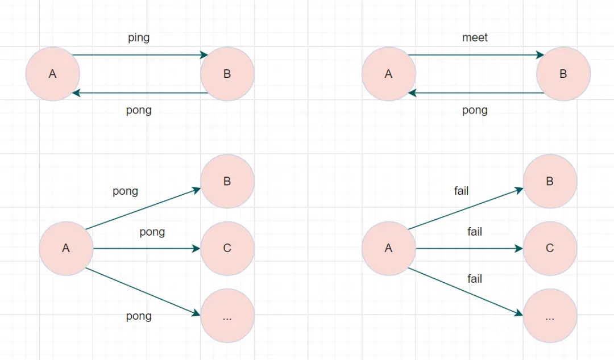
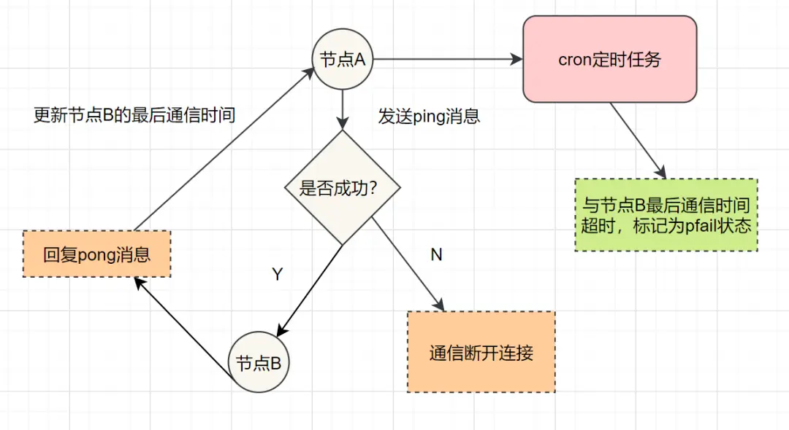
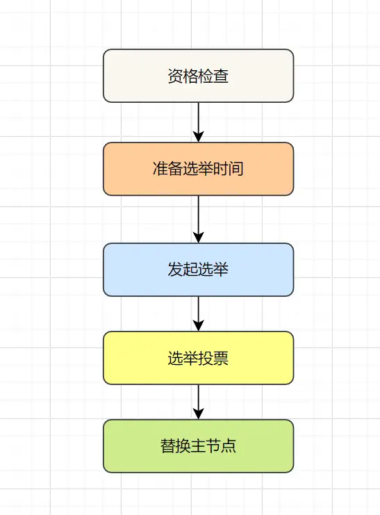
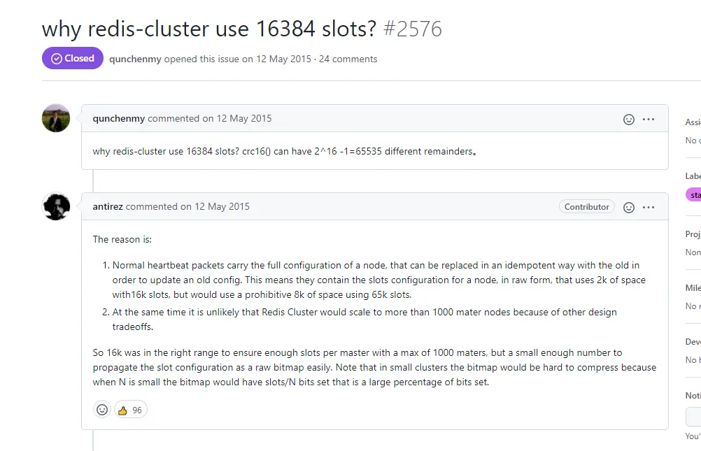
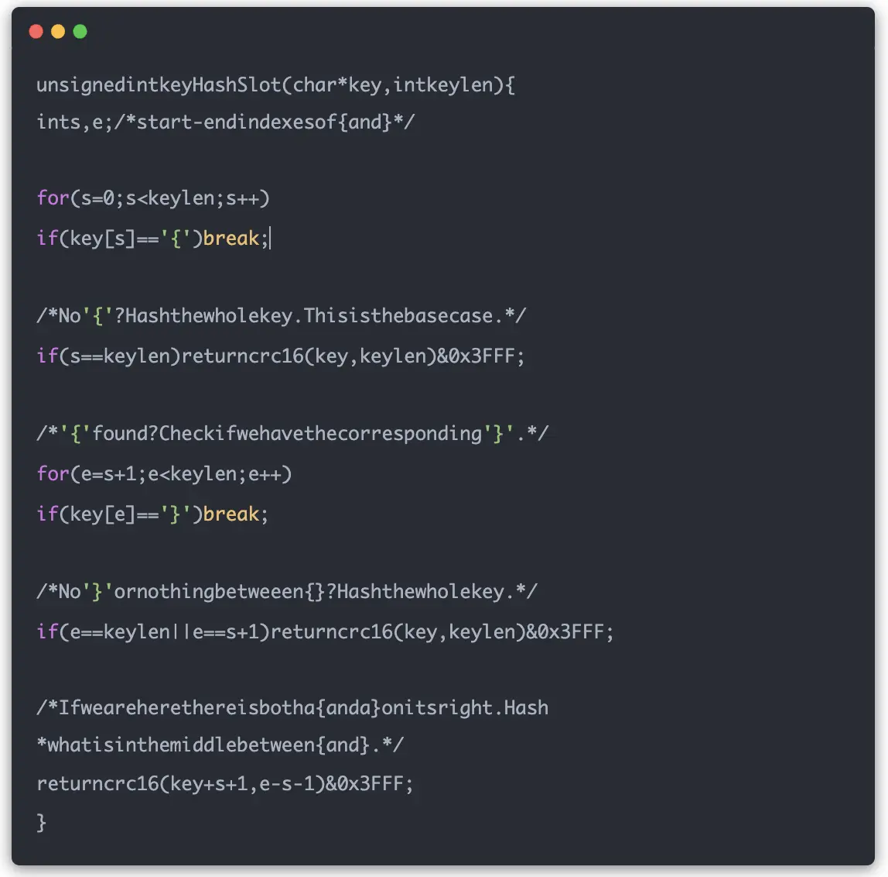

# Redis Cluster 集群详解：架构原理、哈希槽与故障转移

当面试官问："Redis的cluster集群原理，客户端是怎样知道该访问哪个分片的？"时，你是否能够完整回答？本文将从多个维度深入解析Redis Cluster集群的核心机制。

## 概述

Redis Cluster是Redis 3.0版本开始官方提供的一种分布式解决方案，它实现了数据的自动分片、故障转移和线性扩容能力。相比主从和哨兵模式，Cluster解决了单机内存限制和在线扩容的问题。

## 为什么需要Redis Cluster？

### 哨兵模式的局限性

哨兵模式虽然实现了读写分离和自动故障切换，但存在以下问题：

1. **数据冗余**：每个节点存储相同数据，浪费内存资源
2. **扩容困难**：无法在线扩容，扩容需要停机操作
3. **性能瓶颈**：单机内存限制，无法处理超大数据集

### Cluster模式的优势

Redis Cluster通过数据分片技术，将数据分散存储到多个节点：



**对比优势：**
- **数据分片**：每个节点只存储部分数据，充分利用集群资源
- **线性扩容**：支持在线添加/删除节点，实现动态扩容
- **高可用**：内置故障检测和自动故障转移机制
- **性能提升**：分布式架构，突破单机性能限制

## 核心机制：哈希槽分片

### 哈希槽原理

Redis Cluster采用**哈希槽（Hash Slot）**机制实现数据分片：

- **槽位总数**：16384个槽位（0-16383）
- **分配算法**：`slot = CRC16(key) % 16384`
- **槽位分配**：每个主节点负责一部分槽位

### 槽位分配示例

假设集群有3个主节点A、B、C：

```
节点A：负责槽位 0-5460     （5461个槽位）
节点B：负责槽位 5461-10922  （5462个槽位） 
节点C：负责槽位 10923-16383 （5461个槽位）
```

### 客户端路由流程

1. **计算槽位**：客户端根据key计算对应槽位
2. **选择节点**：根据槽位映射找到目标节点
3. **发送请求**：直接向目标节点发送操作命令

## 重定向机制

当客户端访问的数据不在当前节点时，Redis通过重定向机制处理：

### MOVED重定向

**适用场景**：正常情况下的槽位重定向

**处理流程**：



1. 客户端向节点A请求key1的数据
2. 节点A发现key1不属于自己的槽位
3. 返回MOVED错误，包含正确节点的地址
4. 客户端更新槽位映射，直接访问正确节点

**示例**：
```
> GET user:1001
-MOVED 9189 192.168.1.102:6379
```

### ASK重定向

**适用场景**：集群扩容/缩容期间的数据迁移

**处理流程**：



1. 客户端访问源节点，数据可能已迁移
2. 源节点返回ASK重定向到目标节点
3. 客户端向目标节点发送ASKING命令
4. 执行实际的数据操作

**示例**：
```
> GET user:1001
-ASK 9189 192.168.1.103:6379
> ASKING
OK
> GET user:1001
"user_data"
```

### 重定向对比

| 重定向类型 | 触发条件 | 客户端行为 | 持续时间 |
|-----------|----------|------------|----------|
| MOVED | 槽位固定分配不匹配 | 更新槽位映射表 | 永久有效 |
| ASK | 数据迁移过程中 | 临时重定向，不更新映射 | 迁移期间 |

## Gossip通信协议

### 协议概述

Redis Cluster使用**Gossip协议**实现节点间的信息同步，这是一种去中心化的通信机制。



### 消息类型

| 消息类型 | 用途 | 发送时机 |
|---------|------|---------|
| **PING** | 心跳检测 | 每秒向随机节点发送 |
| **PONG** | 心跳响应 | 收到PING/MEET消息时回复 |
| **MEET** | 节点加入 | 新节点加入集群时 |
| **FAIL** | 故障广播 | 检测到节点故障时 |

### 通信机制

**集群总线**：
- 端口：服务端口 + 10000（如6379 → 16379）
- 协议：二进制协议，效率更高
- 频率：每秒随机选择节点进行通信

**信息传播**：
- 每次PING消息携带发送者已知的节点信息
- 接收者更新本地的集群拓扑信息
- 通过多轮传播实现最终一致性

## 故障检测与转移

### 故障检测

#### 主观下线（PFAIL）

**检测条件**：
- 某节点在`cluster-node-timeout`时间内无响应
- 单个节点的判断，可能存在误判

**标记流程**：
```
节点A → PING → 节点B（无响应）
节点A标记节点B为PFAIL状态
```

#### 客观下线（FAIL）

**检测条件**：
- 超过半数主节点认为目标节点不可用
- 集群达成共识，确认节点故障

**确认流程**：



1. 节点A将B标记为PFAIL
2. A通过Gossip将B的PFAIL状态传播
3. 其他节点收到消息，如果也认为B故障，则投票
4. 当故障投票数 > 集群主节点数/2时，B被标记为FAIL

### 故障转移

**转移条件**：
- 主节点被标记为客观下线
- 该主节点至少有一个从节点可用

**转移流程**：



1. **资格检查**：从节点检查自身是否具备替换主节点的条件
2. **准备选举**：计算选举延迟时间，数据越新延迟越短
3. **发起选举**：向所有主节点发送选举请求
4. **投票统计**：收集足够选票（>主节点数/2）后，提升为主节点
5. **更新配置**：广播配置更新，完成故障转移

## 为什么哈希槽是16384？

这是一个经典的面试问题，作者的原始回答提到了几个关键因素：



### 内存优化考虑

**槽位存储**：
```c
unsigned char slots[REDIS_CLUSTER_SLOTS/8];
```

**空间对比**：
- 65536个槽位：65536 ÷ 8 ÷ 1024 = 8KB
- 16384个槽位：16384 ÷ 8 ÷ 1024 = 2KB
- **节省空间**：每个节点节省6KB，100个节点集群节省600KB

### 网络开销考虑

**心跳包大小**：
- Gossip协议需要在心跳包中携带槽位信息
- 16384个槽位使心跳包更小，网络开销更低
- 对于大规模集群，网络效率更重要

### 集群规模考虑

**实际需求**：
- Redis官方建议集群节点数不超过1000
- 16384个槽位对于1000个节点完全够用
- 每个节点平均16个槽位，分配粒度合理

### 位运算优化

**计算优化**：



```c
// 使用位运算替代取模运算
slot = crc16(key) & 0x3FFF;  // 等价于 % 16384
```

**性能优势**：
- 位运算比取模运算效率更高
- 16384 = 2^14，可以使用位运算优化
- 0x3FFF = 16383，即 2^14 - 1

## 最佳实践

### 集群部署建议

1. **节点配置**：
   - 至少3个主节点（保证故障转移投票）
   - 每个主节点配置1-2个从节点
   - 建议奇数个主节点

2. **硬件规划**：
   - 主从节点部署在不同物理机
   - 保证网络延迟低且稳定
   - 合理配置内存和CPU资源

3. **参数调优**：
   ```
   cluster-enabled yes                    # 启用集群模式
   cluster-node-timeout 15000           # 节点超时时间
   cluster-require-full-coverage no     # 允许部分槽位不可用时继续服务
   ```

### 客户端最佳实践

1. **连接管理**：
   - 使用支持集群的客户端库
   - 维护完整的槽位映射表
   - 实现智能重试机制

2. **性能优化**：
   - 批量操作使用pipeline
   - 避免跨槽位的事务操作
   - 合理设计key的分布

## 常见问题与解决方案

### Q1：如何避免数据倾斜？

**问题**：某些节点数据量远超其他节点

**解决方案**：
- 设计均匀分布的key
- 避免使用热点key
- 监控各节点的内存使用情况

### Q2：集群扩容时数据如何迁移？

**迁移流程**：
1. 添加新节点到集群
2. 重新分配槽位给新节点
3. 执行数据迁移操作
4. 更新客户端槽位映射

### Q3：如何处理网络分区？

**防护机制**：
- 设置合理的`cluster-node-timeout`
- 使用`cluster-require-full-coverage`控制服务可用性
- 部署时考虑网络拓扑，避免单点故障

## 总结

Redis Cluster通过哈希槽机制实现了数据的自动分片和负载均衡，通过Gossip协议保证了集群信息的一致性，通过完善的故障检测和转移机制确保了高可用性。理解这些核心机制，不仅能帮助你在面试中胸有成竹，更能在实际项目中合理设计和运维Redis集群。

## 参考资料

- [Redis官方文档 - Redis Cluster](https://redis.io/topics/cluster-tutorial)
- [Redis设计与实现 - 集群](https://redisbook.readthedocs.io/en/latest/feature/cluster.html)
- [Redis源码解析 - Cluster实现](https://github.com/redis/redis/blob/unstable/src/cluster.c)