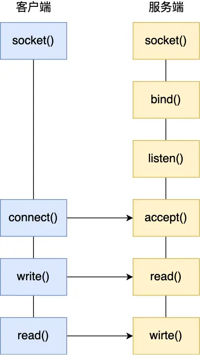
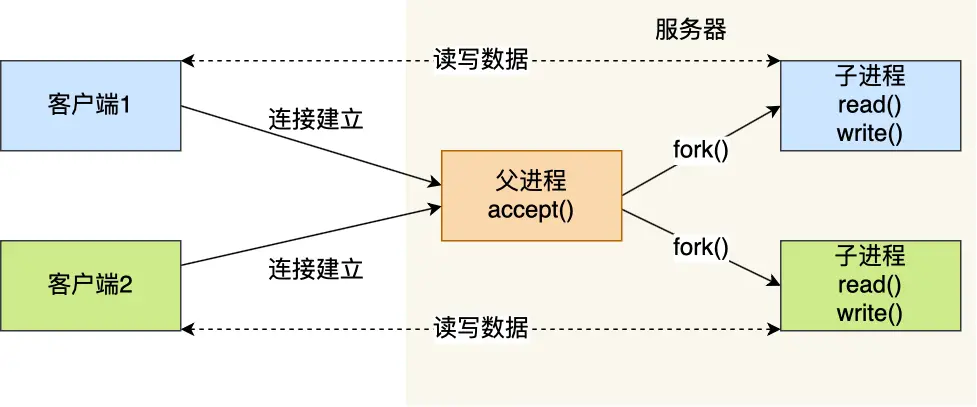
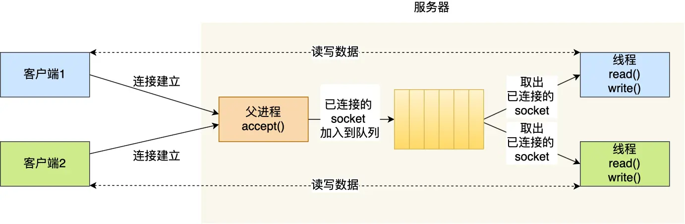
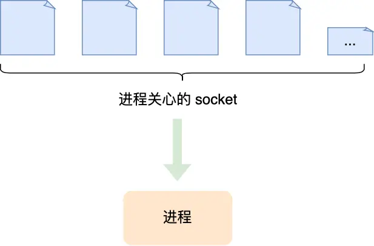
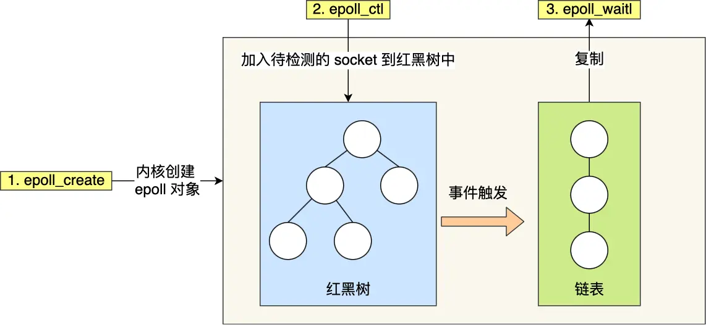

# I/O多路复用技术详解：从select到epoll的演进

## 概述

I/O多路复用是一种高效的网络编程技术，允许单个进程同时监控多个文件描述符的I/O事件。它是解决**C10K问题**（单机同时处理一万个连接）的核心技术，也是现代高性能服务器的基础。

### 为什么需要I/O多路复用？

在传统的阻塞I/O模型中，每个连接都需要一个独立的进程或线程来处理，这种方式在面对大量并发连接时会遇到严重的性能瓶颈：

- **资源消耗巨大**：每个进程/线程都会占用大量内存
- **上下文切换开销**：频繁的进程/线程切换影响性能
- **系统限制**：操作系统对进程/线程数量有限制

---

## 基础概念：Socket网络编程模型

### 最基本的Socket模型

Socket是进程间通信的一种特殊方式，特别之处在于它支持跨主机通信。在Linux系统中，Socket遵循"一切皆文件"的理念，每个Socket都对应一个文件描述符。

**TCP Socket编程的基本流程：**



**服务端流程：**
1. `socket()` - 创建Socket
2. `bind()` - 绑定IP地址和端口
3. `listen()` - 进入监听状态
4. `accept()` - 接受客户端连接
5. `read()/write()` - 数据传输

**客户端流程：**
1. `socket()` - 创建Socket
2. `connect()` - 连接服务器
3. `read()/write()` - 数据传输

### 重要概念：两种Socket

- **监听Socket**：用于监听客户端连接请求
- **已连接Socket**：用于与特定客户端进行数据传输

### TCP连接队列机制

服务器内核为每个Socket维护两个队列：

- **半连接队列**：存储未完成三次握手的连接（SYN_RCVD状态）
- **全连接队列**：存储已完成三次握手的连接（ESTABLISHED状态）

---

## 服务器并发模型的演进

### 理论最大连接数

TCP连接由四元组唯一确定：`(本机IP, 本机端口, 对端IP, 对端端口)`

**理论最大连接数 = 客户端IP数 × 客户端端口数**

对于IPv4：**2^32 × 2^16 = 2^48** 个连接

### 实际限制因素

1. **文件描述符限制**：每个连接占用一个文件描述符
2. **系统内存限制**：每个连接在内核中都有对应的数据结构

### C10K问题

**C10K问题**：单机同时处理10,000个并发连接的挑战

**硬件要求估算：**
- 内存：每个连接 < 200KB → 10K连接需要约2GB内存
- 带宽：每个连接 < 100Kbit → 10K连接需要约1Gbps带宽

---

## 传统并发模型及其局限

### 多进程模型

**工作原理：**
- 主进程监听连接
- 每个客户端连接fork一个子进程处理



**优点：**
- 进程隔离，稳定性好
- 实现简单

**缺点：**
- 内存开销大（每个进程独立地址空间）
- 上下文切换开销重
- 进程创建/销毁成本高
- 易产生僵尸进程

### 多线程模型

**改进方案：**
- 使用线程替代进程
- 引入线程池避免频繁创建/销毁



**优点：**
- 相比进程，开销更小
- 共享内存空间，通信方便

**缺点：**
- 仍然无法解决C10K问题
- 线程安全问题
- 上下文切换仍有开销

---

## I/O多路复用技术核心

### 基本思想

**时分多路复用**：一个进程在极短时间内轮流处理多个连接的I/O事件，从宏观上看实现了"并发"处理。



### 核心优势

- **资源利用率高**：单进程处理多连接
- **减少上下文切换**：避免大量进程/线程切换
- **内存友好**：显著降低内存占用

---

## select/poll详解

### select实现机制

**工作流程：**
1. 将文件描述符集合从用户态**拷贝**到内核态
2. 内核**遍历**文件描述符集合，检查I/O事件
3. 将结果从内核态**拷贝**回用户态
4. 用户态再次**遍历**找到就绪的文件描述符

**核心问题：**
- **2次拷贝**：用户态 ↔ 内核态
- **2次遍历**：内核态 + 用户态
- **文件描述符数量限制**：默认最大1024个

### poll改进

**主要改进：**
- 使用动态数组替代固定长度BitMap
- 突破文件描述符数量限制

**本质问题未解决：**
- 仍然需要拷贝和遍历
- 时间复杂度仍为O(n)

### 性能分析

| 特性 | select | poll |
|------|--------|------|
| 文件描述符限制 | 1024 | 无硬编码限制 |
| 数据结构 | BitMap | 动态数组 |
| 时间复杂度 | O(n) | O(n) |
| 内核拷贝 | 需要 | 需要 |
| 遍历次数 | 2次 | 2次 |

---

## epoll革命性改进

### 核心创新点

**第一点：红黑树管理文件描述符**
- 使用红黑树存储待监控的文件描述符
- 增删查时间复杂度：O(log n)
- 避免每次传入整个集合，减少拷贝

**第二点：事件驱动机制**
- 维护就绪事件链表
- 通过回调函数更新就绪列表
- 只返回有事件的文件描述符



### epoll接口详解

```c
// 创建epoll实例
int epoll_create(int size);

// 控制epoll实例
int epoll_ctl(int epfd, int op, int fd, struct epoll_event *event);

// 等待事件
int epoll_wait(int epfd, struct epoll_event *events, int maxevents, int timeout);
```

### 触发模式对比

#### 水平触发（Level Triggered, LT）
- **特点**：只要满足条件就持续触发
- **行为**：数据可读时会不断通知，直到数据被读完
- **优点**：编程简单，不易出错
- **缺点**：可能产生多余的系统调用

#### 边缘触发（Edge Triggered, ET）
- **特点**：只在状态变化时触发一次
- **行为**：数据到达时只通知一次，必须一次性读完
- **优点**：减少系统调用次数，效率更高
- **缺点**：编程复杂，必须配合非阻塞I/O使用

**实际应用建议：**
- 边缘触发 + 非阻塞I/O + 循环读写
- 检查EAGAIN/EWOULDBLOCK错误

---

## 性能对比与选择指南

### 综合性能对比

| 特性 | select | poll | epoll |
|------|--------|------|-------|
| 性能 | O(n) | O(n) | O(1) |
| 连接数限制 | 1024 | 无限制 | 无限制 |
| 内存拷贝 | 每次全量 | 每次全量 | 增量 |
| 事件复杂度 | 线性扫描 | 线性扫描 | 事件驱动 |
| 跨平台性 | 最好 | 较好 | Linux专有 |

### 应用场景选择

**select适用场景：**
- 连接数少（< 100）
- 跨平台兼容性要求高
- 临时性/简单应用

**poll适用场景：**
- 连接数中等（< 1000）
- 需要突破select的1024限制
- 不要求最高性能

**epoll适用场景：**
- 高并发服务器（> 1000连接）
- 对性能要求极高
- Linux平台专用应用

---

## 常见面试问题与解答

### Q1: 为什么epoll比select/poll性能更好？

**A:** 主要有两个方面的改进：

1. **数据结构优化**：
   - select/poll使用线性结构，需要O(n)遍历
   - epoll使用红黑树，增删查为O(log n)

2. **事件通知机制**：
   - select/poll采用轮询方式，每次都要遍历全部文件描述符
   - epoll采用事件驱动，只返回活跃的文件描述符

### Q2: epoll的ET和LT模式有什么区别？

**A:** 
- **LT（水平触发）**：只要有数据就持续通知，类似"快递箱反复发短信"
- **ET（边缘触发）**：只在数据到达瞬间通知一次，类似"快递箱只发一次短信"

ET模式效率更高但编程更复杂，必须配合非阻塞I/O使用。

### Q3: I/O多路复用是否一定要配合非阻塞I/O？

**A:** 强烈建议配合使用，原因：
- 多路复用返回的"就绪"事件可能是假的
- 使用阻塞I/O可能导致程序意外阻塞
- 非阻塞I/O能够及时处理EAGAIN错误

### Q4: epoll是否使用了共享内存？

**A:** **错误的常见误解！** epoll并没有使用共享内存。查看内核源码可以发现，`epoll_wait`中调用了`__put_user`函数，这明确表明数据是从内核拷贝到用户空间的。

### Q5: 如何选择合适的I/O多路复用技术？

**A:** 选择依据：
- **连接数量**：少量用select，中等用poll，大量用epoll
- **平台兼容性**：跨平台选select/poll，Linux专用选epoll  
- **性能要求**：高性能选epoll，一般需求可用poll
- **开发复杂度**：简单应用用select，复杂应用用epoll

---

## 最佳实践与优化建议

### 1. 合理设置超时时间
```c
// 避免无限阻塞，设置合理超时
int timeout = 1000; // 1秒超时
epoll_wait(epfd, events, MAX_EVENTS, timeout);
```

### 2. 边缘触发模式最佳实践
```c
// ET模式必须循环读取直到EAGAIN
while (1) {
    ssize_t n = read(fd, buffer, sizeof(buffer));
    if (n == -1) {
        if (errno == EAGAIN || errno == EWOULDBLOCK) {
            break; // 数据读完
        }
        // 处理其他错误
    }
    // 处理读取的数据
}
```

### 3. 错误处理
```c
// 检查spurious wakeup
if (epoll_wait(...) > 0) {
    // 验证文件描述符确实可读/可写
    if (fcntl(fd, F_GETFL) == -1) {
        // 文件描述符已关闭
        continue;
    }
}
```

### 4. 资源管理
- 及时关闭不再使用的文件描述符
- 使用EPOLL_CTL_DEL移除监控
- 避免文件描述符泄漏

---

## 相关技术延伸

### 与异步I/O的关系
- I/O多路复用仍属于同步I/O
- 真正的异步I/O：AIO、io_uring

### 现代框架应用
- **Nginx**：基于epoll的事件驱动
- **Redis**：事件循环 + epoll
- **Node.js**：libuv事件循环

### 性能调优要点
- 合理设置文件描述符限制
- 优化内核参数
- 使用CPU亲和性绑定
- 考虑NUMA架构影响

---

## 总结

I/O多路复用技术经历了从select到poll再到epoll的演进过程，每一步都在解决前一代技术的性能瓶颈。epoll以其事件驱动和红黑树管理的创新设计，成功解决了C10K问题，为现代高性能服务器奠定了基础。

**关键记忆点：**
- select/poll：线性遍历，O(n)复杂度，有拷贝开销
- epoll：事件驱动，O(1)复杂度，减少拷贝
- ET模式配合非阻塞I/O实现最优性能
- 选择标准：连接数、平台、性能需求
