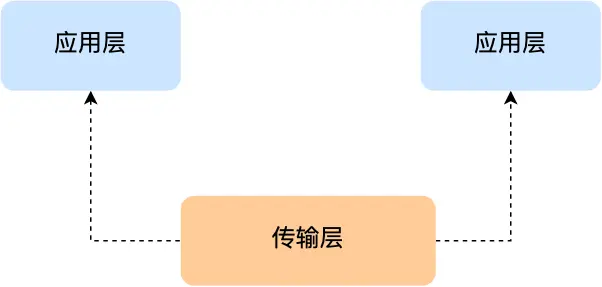
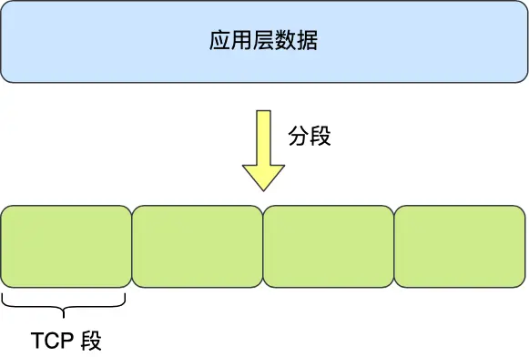
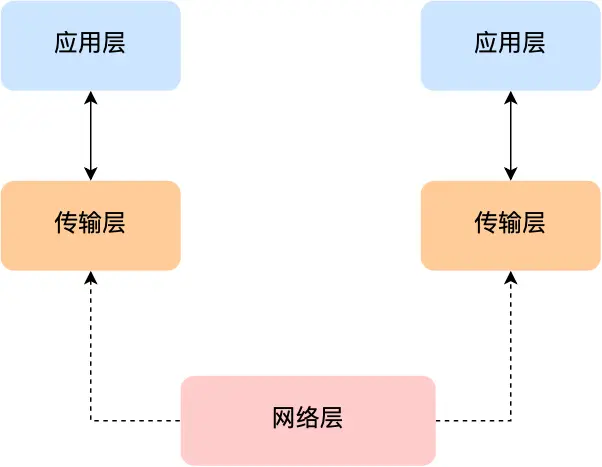
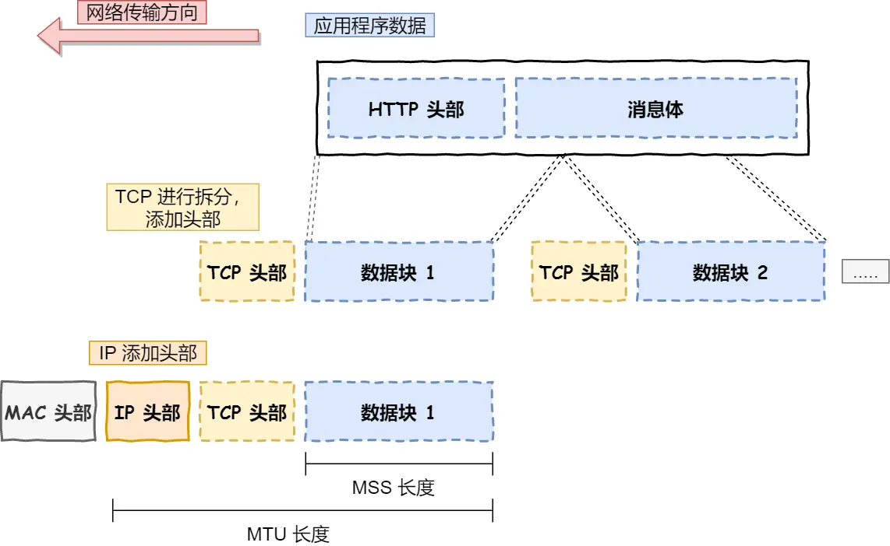
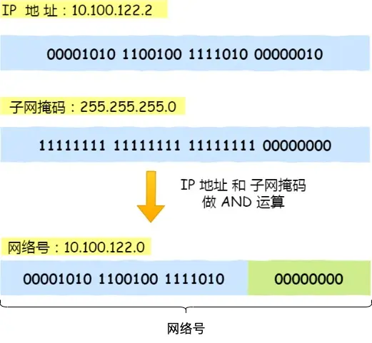
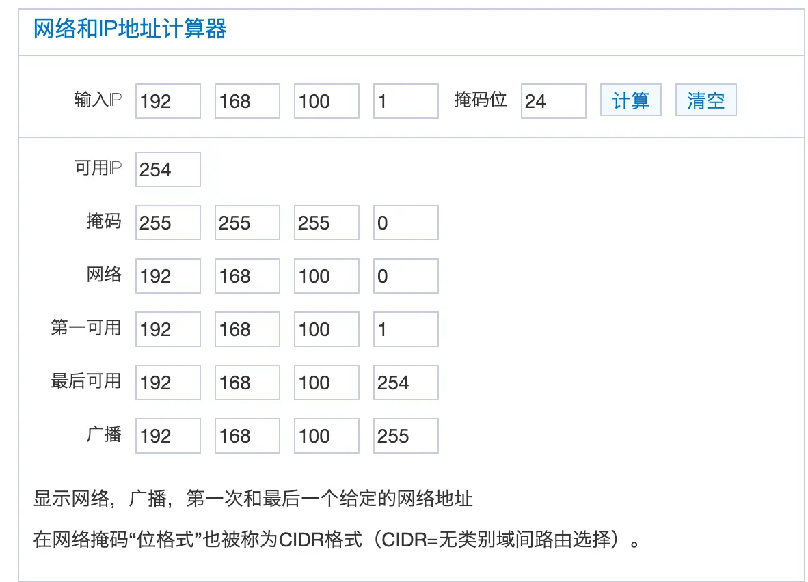
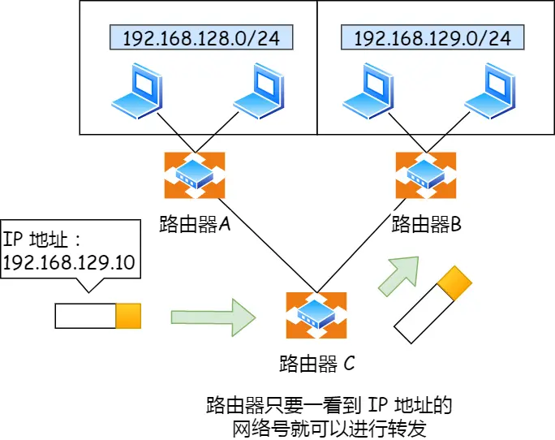
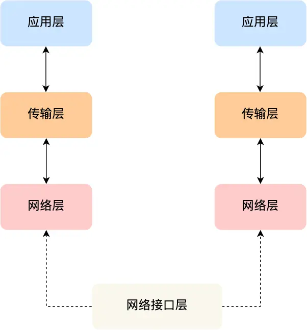
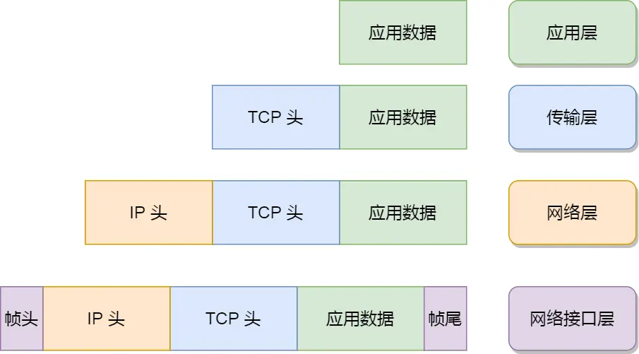
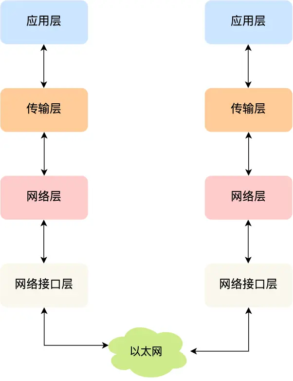

# TCP/IP 网络模型的四层结构详解

## 概述

为什么要有 TCP/IP 网络模型？

对于同一台设备上的进程间通信，有很多种方式，比如有管道、消息队列、共享内存、信号等方式，而对于不同设备上的进程间通信，就需要网络通信。由于设备的多样性（不同厂商、不同操作系统、不同硬件架构），为了实现设备间的互联互通，就协商出了一套**通用的网络协议标准**。

这个网络协议采用**分层设计**的理念，每一层都有明确的职责和功能，层与层之间通过标准接口进行通信。这种设计方式的优势包括：
- **模块化**：每层可以独立开发和维护
- **可扩展性**：可以在不影响其他层的情况下升级某一层
- **标准化**：不同厂商的设备可以互操作
- **复杂性管理**：将复杂的网络通信问题分解为多个简单的子问题

接下来根据「TCP/IP 网络模型」分别对每一层进行详细介绍。

## 应用层（Application Layer）

### 基本概念

最上层的，也是我们能直接接触到的就是**应用层**。应用层是网络协议栈的最顶层，**直接为用户提供网络服务**。我们电脑或手机上使用的所有网络应用软件都是在应用层实现的。

### 主要协议和功能

应用层包含了众多的协议，每个协议都为特定的应用场景服务：

| 协议 | 端口 | 功能 | 应用场景 |
|------|------|------|----------|
| **HTTP/HTTPS** | 80/443 | 超文本传输协议 | 网页浏览、API调用 |
| **FTP** | 20/21 | 文件传输协议 | 文件上传下载 |
| **SMTP** | 25 | 简单邮件传输协议 | 邮件发送 |
| **POP3/IMAP** | 110/143 | 邮件接收协议 | 邮件接收 |
| **DNS** | 53 | 域名解析协议 | 域名到IP地址转换 |
| **Telnet** | 23 | 远程登录协议 | 远程终端访问 |
| **SSH** | 22 | 安全外壳协议 | 安全的远程登录 |

### 工作原理

当两个不同设备的应用需要通信时，应用层会：
1. **封装应用数据**：将用户数据按照特定协议格式进行封装
2. **调用传输层服务**：通过系统调用（如socket API）将数据传递给传输层
3. **处理应用逻辑**：专注于业务逻辑，无需关心底层传输细节

**实际例子**：当你在浏览器中访问 `https://www.example.com` 时：
1. 应用层的HTTP协议构造请求报文
2. 通过socket接口调用传输层的TCP服务
3. TCP负责可靠传输，应用层无需关心数据如何到达服务器

### 运行环境

应用层工作在操作系统的**用户态**（User Space），而传输层及以下各层工作在**内核态**（Kernel Space）。这种设计的好处是：
- **安全性**：用户程序无法直接访问内核，提高系统安全性
- **稳定性**：应用程序崩溃不会影响系统内核
- **灵活性**：用户可以自由开发应用程序

## 传输层（Transport Layer）

### 基本概念

**传输层**是应用层和网络层之间的桥梁，为应用层提供**端到端的数据传输服务**。传输层的核心作用是实现**进程到进程**的通信。



### TCP协议详解

**TCP**（**Transmission Control Protocol，传输控制协议**）是一个面向连接的、可靠的传输协议。

#### TCP的关键特性：

1. **面向连接**：通信前必须建立连接（三次握手）
2. **可靠传输**：保证数据按序、无重复、无丢失地到达
3. **流量控制**：防止发送方发送速度过快导致接收方缓冲区溢出
4. **拥塞控制**：根据网络状况调整发送速率，避免网络拥塞
5. **全双工通信**：双方可以同时发送和接收数据

#### TCP的工作机制：

**数据分段**：当应用层数据超过 **MSS（Maximum Segment Size，最大报文段长度）** 时，TCP会将数据分割成多个段：



- **MSS通常为1460字节**（以太网MTU 1500字节 - IP头部20字节 - TCP头部20字节）
- 每个TCP段都有独立的序列号，便于接收方重新组装
- 如果某个段丢失，只需重传该段，而不是整个数据

**可靠性保障机制**：
- **序列号和确认号**：每个字节都有唯一的序列号
- **超时重传**：发送方设置重传定时器，超时未收到ACK则重传
- **快速重传**：收到3个重复ACK时立即重传
- **滑动窗口**：提高传输效率，允许发送多个未确认的段

### UDP协议详解

（**UDPUser Datagram Protocol，用户数据报协议**）是一个无连接的、不可靠的传输协议。

#### UDP的特点：

1. **简单高效**：头部只有8字节，开销小
2. **无连接**：发送数据前无需建立连接
3. **不可靠**：不保证数据到达、顺序和完整性
4. **实时性好**：无需等待确认，传输延迟低

#### UDP的应用场景：

- **实时音视频**：如直播、视频通话（对延迟敏感，可接受少量丢包）
- **DNS查询**：请求数据小，重传成本低
- **DHCP**：网络配置协议，简单请求-响应模式
- **在线游戏**：对实时性要求高，可通过应用层补偿丢包

### 端口号机制

传输层使用**端口号**来区分不同的应用进程：

#### 端口号分类：
- **知名端口（0-1023）**：由IANA分配给标准服务
- **注册端口（1024-49151）**：注册给特定应用
- **动态端口（49152-65535）**：操作系统动态分配给客户端

#### 端口号工作原理：
当数据到达目标主机时，传输层根据目标端口号将数据递交给相应的应用进程。例如：
- Web服务器监听80端口
- 客户端浏览器使用动态端口（如50123）
- 数据包中同时包含源端口和目标端口，确保双向通信

## 网络层（Internet Layer）

### 基本概念

传输层并不负责数据在网络中的实际传输路径选择。实际网络环境错综复杂，中间有各种各样的路由器、交换机和线路。**网络层**的职责就是在这个复杂的网络中为数据包寻找最佳路径，实现**主机到主机**的通信。



### IP协议详解

**IP协议**（**Internet Protocol**）是网络层的核心协议，提供无连接的数据报服务。

#### IP报文结构：

IP协议将传输层的数据作为载荷，加上IP头部形成IP数据报：



**IP头部关键字段**：
- **版本**：IP协议版本（IPv4为4，IPv6为6）
- **头部长度**：IP头部长度（最小20字节）
- **总长度**：整个IP数据报长度（最大65535字节）
- **标识、标志、片偏移**：用于数据报分片和重组
- **生存时间（TTL）**：防止数据报在网络中无限循环
- **协议**：指示上层协议类型（TCP=6，UDP=17）
- **源IP地址和目标IP地址**：标识发送方和接收方

#### IP分片机制：

当IP数据报大小超过链路的**MTU**（**Maximum Transmission Unit**）时，需要进行分片：
- **以太网MTU通常为1500字节**
- 大的IP数据报被分割成多个小片段
- 每个片段都有独立的IP头部
- 目标主机负责重新组装所有片段

### IP地址和子网

#### IP地址结构：

以IPv4为例，IP地址是32位的二进制数，通常用点分十进制表示（如192.168.1.1）。

IP地址分为两部分：
- **网络号**：标识子网
- **主机号**：标识子网内的具体主机

#### 子网掩码计算：

子网掩码用于区分网络号和主机号。例如：

**示例**：IP地址 10.100.122.2，子网掩码 255.255.255.0（/24）



**计算过程**：
1. **网络地址计算**：IP地址 AND 子网掩码
   - 10.100.122.2 AND 255.255.255.0 = 10.100.122.0
2. **主机地址计算**：IP地址 AND (NOT 子网掩码)
   - 10.100.122.2 AND 0.0.0.255 = 0.0.0.2



#### 地址分类：

| 类别 | 地址范围 | 默认子网掩码 | 网络数量 | 主机数量 |
|------|----------|-------------|----------|----------|
| A类 | 1.0.0.0-126.255.255.255 | 255.0.0.0 (/8) | 126 | 16,777,214 |
| B类 | 128.0.0.0-191.255.255.255 | 255.255.0.0 (/16) | 16,384 | 65,534 |
| C类 | 192.0.0.0-223.255.255.255 | 255.255.255.0 (/24) | 2,097,152 | 254 |

### 路由机制

#### 路由基本概念：

路由是指数据包在网络中从源主机到目标主机所经过的路径选择过程。

**路由 vs 寻址**：
- **寻址**：确定目标在哪里（类似于导航确定目的地）
- **路由**：选择到达目标的最佳路径（类似于选择行驶路线）

#### 路由表：

每个路由器维护一个路由表，包含以下信息：
- **目标网络**：要到达的网络地址
- **下一跳**：数据包应该发送给哪个路由器
- **接口**：从哪个网络接口发送
- **度量值**：路径的代价（跳数、带宽、延迟等）

#### 路由算法：

**静态路由**：
- 管理员手动配置路由表
- 适用于小型、拓扑稳定的网络

**动态路由**：
- 路由器自动学习和更新路由信息
- 常见协议：RIP、OSPF、BGP



**路由决策过程**：
1. 查看目标IP地址
2. 在路由表中查找最匹配的网络条目（最长前缀匹配）
3. 将数据包转发给下一跳路由器
4. 重复此过程直到到达目标网络

## 网络接口层（Link Layer）

### 基本概念

**网络接口层**（也称数据链路层）是TCP/IP模型的最底层，负责在物理网络上传输数据帧。这一层直接与硬件交互，处理比特流在物理介质上的传输。



### 以太网技术

#### 什么是以太网？

以太网是目前最广泛使用的局域网技术。以太网的组成部分包括：
- **网络接口卡（NIC）**：电脑上的以太网接口、Wi-Fi接口
- **网络设备**：交换机、路由器上的千兆、万兆以太网口
- **传输介质**：网线（双绞线）、光纤等
- **协议标准**：IEEE 802.3标准

以太网是一种在「局域网」内连接附近设备的技术，使设备之间可以进行通讯。

#### 以太网的发展：

| 标准 | 速率 | 介质 | 最大距离 |
|------|------|------|----------|
| 10Base-T | 10 Mbps | 双绞线 | 100m |
| 100Base-TX | 100 Mbps | 双绞线 | 100m |
| 1000Base-T | 1 Gbps | 双绞线 | 100m |
| 10GBase-T | 10 Gbps | 双绞线 | 100m |

### MAC地址机制

#### MAC地址结构：

**MAC（Media Access Control）地址**是网络接口的硬件地址，长度为48位（6字节），通常用十六进制表示：
- **格式**：XX:XX:XX:XX:XX:XX（如 00:1B:44:11:3A:B7）
- **全球唯一**：由IEEE统一分配，理论上每个网卡都有唯一的MAC地址
- **厂商标识**：前3字节是厂商标识（OUI，Organizationally Unique Identifier）

#### MAC地址 vs IP地址：

| 特性 | MAC地址 | IP地址 |
|------|---------|--------|
| **作用范围** | 本地链路（局域网） | 全球互联网 |
| **分配方式** | 硬件固化，全球唯一 | 网络管理员分配，可变 |
| **地址结构** | 平面地址，无层次性 | 层次地址，有网络号和主机号 |
| **路由支持** | 不支持路由 | 支持路由 |

#### 为什么需要MAC地址？

虽然IP地址可以标识网络中的主机，但在同一个局域网内，设备之间的直接通信必须使用MAC地址，原因包括：

1. **局域网工作机制**：以太网交换机工作在数据链路层，只能识别MAC地址
2. **ARP协议**：将IP地址解析为MAC地址，实现IP层到链路层的映射
3. **帧转发**：同一网络内的数据传输基于MAC地址进行帧转发

### ARP协议

#### ARP工作原理：

**ARP（Address Resolution Protocol，地址解析协议）**用于将IP地址解析为MAC地址。

**ARP工作过程**：
1. **发送ARP请求**：主机A要与主机B通信，但只知道B的IP地址
2. **广播查询**：A在局域网内广播ARP请求"谁有IP地址X？"
3. **目标响应**：拥有该IP地址的主机B回复自己的MAC地址
4. **缓存记录**：A将IP-MAC映射关系存储在ARP缓存表中
5. **发送数据**：A使用获得的MAC地址构造以太网帧并发送

#### ARP缓存表：

操作系统维护ARP缓存表，避免重复查询：
```bash
# 查看ARP缓存表
arp -a
# 输出示例：
192.168.1.1 (192.168.1.1) at 00:1a:2b:3c:4d:5e [ether] on eth0
192.168.1.100 (192.168.1.100) at 00:11:22:33:44:55 [ether] on eth0
```

### 数据帧结构

#### 以太网帧格式：

以太网帧的基本结构如下：

| 前导符 | 目标MAC | 源MAC | 类型/长度 | 数据 | FCS |
|--------|---------|-------|----------|------|-----|
| 8字节 | 6字节 | 6字节 | 2字节 | 46-1500字节 | 4字节 |

**字段说明**：
- **前导符**：用于同步，包含帧起始定界符
- **目标MAC地址**：接收方的MAC地址
- **源MAC地址**：发送方的MAC地址
- **类型/长度**：指示上层协议类型（如0x0800表示IPv4）
- **数据**：来自网络层的IP数据报
- **FCS**：帧校验序列，用于错误检测

### 网络接口层的主要功能

1. **成帧**：将网络层的IP数据报封装成帧
2. **物理寻址**：使用MAC地址在局域网内定位设备
3. **错误检测**：通过校验和检测传输错误
4. **流量控制**：控制帧的发送速率
5. **介质访问控制**：管理多个设备对共享介质的访问

## 数据封装与传输过程

### 发送过程（数据封装）

当应用程序发送数据时，数据会经历以下封装过程：

1. **应用层**：产生应用数据（如HTTP请求）
2. **传输层**：添加TCP/UDP头部，形成段（Segment）
3. **网络层**：添加IP头部，形成数据报（Packet）
4. **网络接口层**：添加以太网头部和尾部，形成帧（Frame）



### 接收过程（数据解封装）

当目标主机接收到数据时，会进行相反的解封装过程：

1. **网络接口层**：检查帧校验和，移除以太网头部和尾部
2. **网络层**：检查IP头部，确认是否为本机数据，移除IP头部
3. **传输层**：根据端口号找到目标进程，移除TCP/UDP头部
4. **应用层**：接收到纯净的应用数据

### 实际传输示例

**场景**：用户在浏览器中访问 `http://www.example.com`

**详细过程**：

1. **DNS解析**：
   - 浏览器发送DNS查询获取 www.example.com 的IP地址
   - DNS服务器返回IP地址（如 93.184.216.34）

2. **建立TCP连接**：
   - 浏览器向目标IP的80端口发起TCP连接
   - 进行三次握手建立连接

3. **发送HTTP请求**：
   - 应用层：构造HTTP GET请求
   - 传输层：添加TCP头部（源端口：动态分配，目标端口：80）
   - 网络层：添加IP头部（源IP：本机IP，目标IP：93.184.216.34）
   - 网络接口层：添加以太网头部（目标MAC：网关MAC地址）

4. **路由转发**：
   - 数据帧首先发送到本地网关
   - 路由器根据路由表逐跳转发数据包
   - 每一跳都会重新封装链路层头部

5. **服务器响应**：
   - Web服务器接收到请求，处理后返回HTML内容
   - 响应数据经过相同的封装和路由过程返回给客户端

## 总结

### TCP/IP四层模型概览

TCP/IP网络模型从上到下分为四层，每层都有明确的职责：



### 各层的核心职责

1. **应用层**：
   - 为用户提供网络应用服务
   - 处理应用协议（HTTP、FTP、SMTP等）
   - 工作在用户态

2. **传输层**：
   - 提供端到端的数据传输服务
   - 实现进程间通信（端口号机制）
   - 提供可靠性保障（TCP）或高效传输（UDP）

3. **网络层**：
   - 实现主机间的数据传输
   - 提供路由和寻址功能
   - 处理数据包的跨网络传输

4. **网络接口层**：
   - 处理物理网络上的数据传输
   - 实现帧的封装和解封装
   - 提供硬件寻址（MAC地址）

### 数据传输单位

| 层次 | 传输单位 | 主要内容 |
|------|----------|----------|
| 应用层 | 消息/报文（Message） | 应用数据 |
| 传输层 | 段（Segment） | TCP/UDP头部 + 应用数据 |
| 网络层 | 数据报/包（Packet） | IP头部 + 段 |
| 网络接口层 | 帧（Frame） | 以太网头部 + 数据报 + 校验 |

### 设计优势

TCP/IP分层设计的核心优势：

1. **模块化设计**：各层功能独立，便于开发和维护
2. **标准化接口**：层间通过标准接口通信，保证互操作性
3. **可扩展性**：可以独立升级某一层而不影响其他层
4. **复杂性管理**：将复杂问题分解为简单的子问题
5. **厂商中立**：不同厂商的设备可以互联互通

这种分层设计使得互联网能够成为一个开放、可扩展、可互操作的全球网络基础设施，为现代信息社会的发展奠定了坚实的技术基础。
