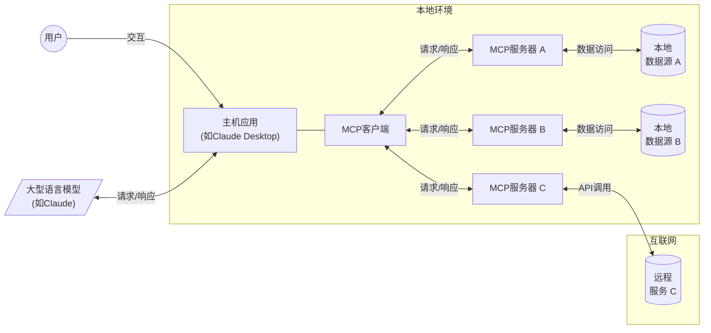
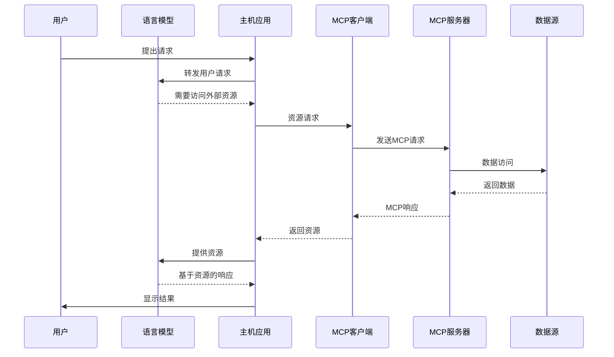
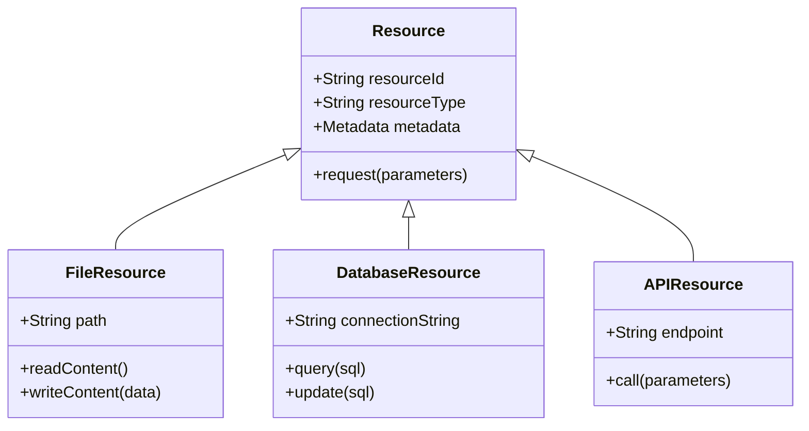
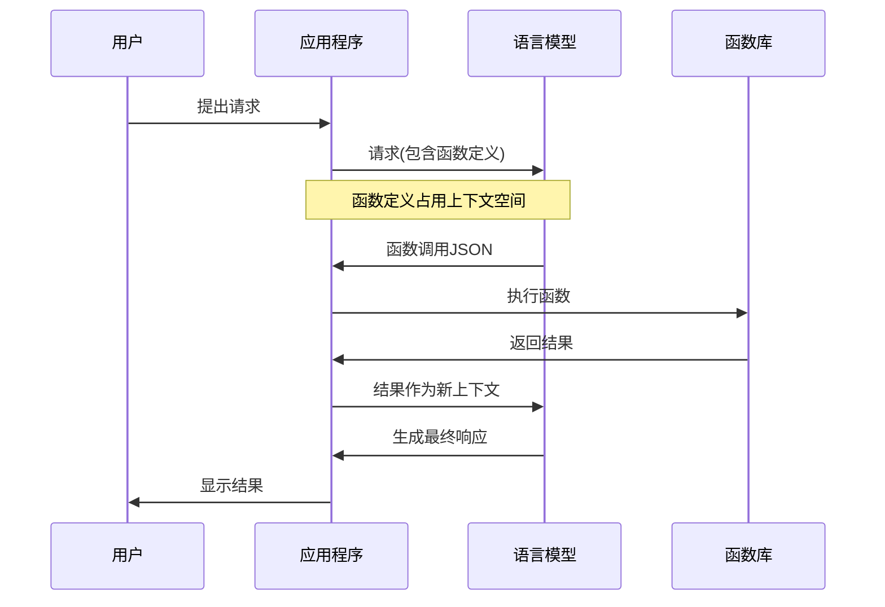
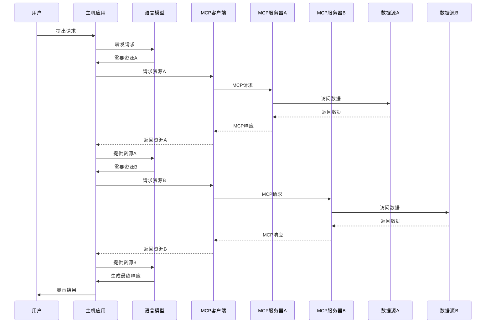
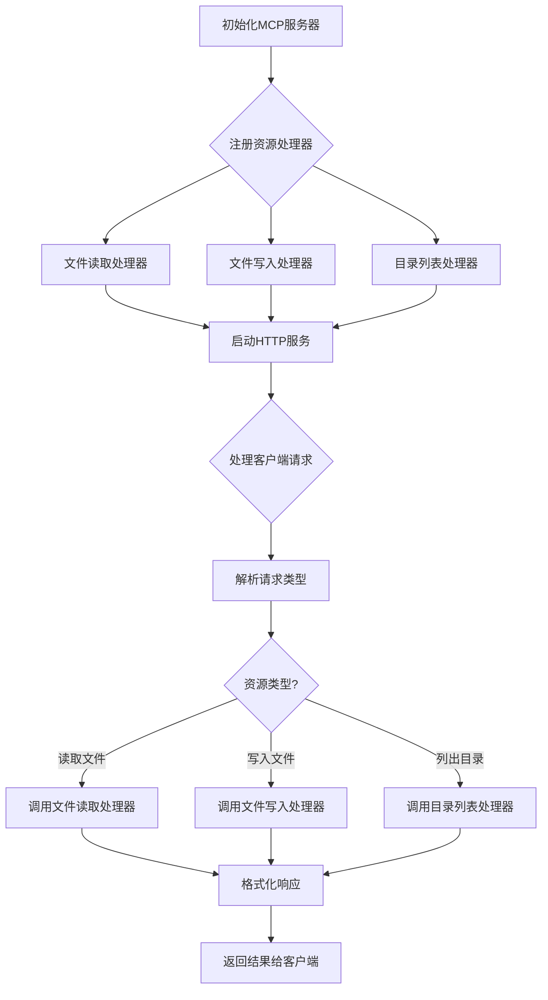

# Model Context Protocol (MCP) 介绍

## 为什么我们需要MCP

当今的大型语言模型(LLM)虽然功能强大，但在与外部世界交互时仍面临诸多挑战：

- **上下文窗口限制**：模型能接收的信息量有限，导致处理大型代码库或数据集困难
- **数据隐私问题**：敏感数据需要发送到云端处理，增加了隐私和安全风险
- **工具集成碎片化**：每个LLM提供商有不同的工具集成方式，导致开发者需维护多套代码
- **本地资源访问受限**：很难让LLM安全地访问本地文件系统、数据库或应用程序
- **多系统协作困难**：让LLM与多个不同服务协同工作缺乏统一标准

Model Context Protocol (MCP)正是为解决这些问题而诞生的技术标准，它提供了一种统一、安全、灵活的方式，让语言模型能够与各种外部系统和资源进行交互。

## MCP是什么

Model Context Protocol (MCP) 是一种用于构建LLM（大型语言模型）应用程序的客户端-服务器架构协议，它允许AI模型与外部数据源和工具进行交互。

> **名词解释**：
> - **客户端-服务器架构**：一种计算模型，其中一个程序(客户端)请求服务，另一个程序(服务器)提供服务。就像餐厅中顾客(客户端)点餐，厨房(服务器)准备食物。
> - **协议**：一套规则，定义了系统间如何交换信息。类似于人们交流的语言和礼仪规范。
> - **API(应用程序接口)**：软件组件之间的连接点，允许不同程序相互通信。就像电源插座是电器与电网的接口。

MCP的核心思想是通过标准化的协议，让语言模型能够安全、灵活地访问各种本地和远程资源。这不仅仅是一个简单的API或函数调用系统，而是一个完整的架构模式，具有以下核心特征：

1. **协议驱动**: MCP 定义了客户端和服务器之间通信的标准协议，使不同组件能够无缝协作
2. **资源抽象**: 将各种数据源、工具和服务抽象为统一的资源接口
3. **分布式设计**: 支持多个服务器并行提供不同功能，实现功能解耦
4. **安全隔离**: 明确的安全边界，数据保持在服务器端，只有结果返回给客户端
5. **可组合性**: 不同MCP服务器可以组合使用，形成复杂的工作流

## 日常使用场景：MCP如何改变我们使用AI的方式

### 场景一：本地文档助手

**问题**：王先生有大量存储在本地电脑上的工作文档，他想让AI助手帮忙整理和总结，但又担心文档内容上传到云端会有安全风险。

**MCP解决方案**：
1. 王先生在电脑上安装了支持MCP的Claude Desktop应用和文件系统MCP服务器
2. 当他询问"帮我总结所有2025年第一季度的会议记录"时
3. Claude会通过MCP服务器安全地搜索本地文件系统
4. 文档内容不会离开王先生的电脑，只有搜索结果返回给Claude
5. Claude根据获取的会议内容生成总结报告

这一过程对王先生来说完全透明，他只需正常与AI交谈，但所有数据处理都在本地完成，保证了信息安全。

### 场景二：代码开发助手

**问题**：张女士是一名软件开发人员，使用AI助手编写代码，但发现AI无法访问她的本地代码库、运行测试或执行Git操作。

**MCP解决方案**：
1. 张女士在IDE中使用支持MCP的AI编码助手
2. IDE运行多个MCP服务器，分别处理代码访问、测试运行和版本控制
3. 当张女士要求"根据单元测试结果修复这个bug"时
4. AI通过代码访问MCP服务器读取相关文件
5. 通过测试MCP服务器运行测试并获取结果
6. 分析问题并生成修复方案
7. 通过Git MCP服务器创建修复分支和提交更改

整个过程在张女士的本地环境完成，无需将完整代码库上传到云端，同时AI助手能够与她的开发工具流完美集成。

## 详细协议结构

MCP协议主要包含以下关键组件：

- **连接管理**: 建立和维护客户端与服务器之间的连接
- **资源发现**: 允许客户端发现服务器提供的资源和功能
- **资源请求**: 客户端向服务器请求特定资源
- **资源响应**: 服务器处理请求并返回结果
- **元数据交换**: 交换有关资源和功能的元数据
- **安全机制**: 保护传输中的数据并验证请求的合法性

## 基本原理与架构

MCP采用客户端-服务器架构，其中：

- **MCP主机（Hosts）**：如Claude Desktop、IDE或AI工具，希望通过MCP访问数据的程序
- **MCP客户端（Clients）**：维护与服务器1:1连接的协议客户端，负责发送请求和接收响应
- **MCP服务器（Servers）**：通过标准化的Model Context Protocol公开特定功能的轻量级程序，负责处理请求并返回结果
- **本地数据源**：MCP服务器可以安全访问的计算机文件、数据库和服务
- **远程服务**：MCP服务器可以连接的外部系统（如通过API）

这种架构可以通过以下Mermaid图表表示：

## MCP通信流程

MCP通信过程是如何实现LLM与各种资源交互的关键。以下是一个典型的MCP通信流程：

## 资源接口设计

MCP定义了一套资源接口，使客户端能够统一访问各种不同类型的资源：

## MCP与Function Call的区别

MCP和Function Call都是扩展LLM能力的技术，但它们在设计和实现上存在显著差异：

### Function Call

Function Call（函数调用）是一种让LLM能够调用预定义函数的能力，主要特点：

- 通常在单一环境中运行
- 函数定义必须嵌入到模型的上下文中，占用token空间
- 典型的实现是在LLM生成函数调用JSON后，由应用程序执行相应函数
- 安全边界通常由应用程序自身定义
- 通常需要为每个LLM提供商实现不同的集成方式

### MCP

MCP则提供了一个更加分布式、标准化的架构：

- 采用客户端-服务器架构，明确分离责任
- 多个专用服务器可以并行提供不同功能，支持横向扩展
- 通过标准协议实现互操作性，与LLM提供商无关
- 明确的安全边界，数据保持在服务器端
- 可以跨应用程序和环境重用，提高代码复用性
- 资源动态发现，无需预先定义所有功能

## MCP的优势

MCP相比传统Function Call和其他工具集成方法有以下优势：

1. **灵活性**：可以轻松切换LLM提供商和供应商，无需重写集成
2. **安全性**：数据保持在您的基础设施内，明确的安全边界
3. **可扩展性**：可以根据需要连接多个专用服务器，支持复杂功能
4. **互操作性**：标准化协议确保不同系统间的兼容，避免供应商锁定
5. **本地计算**：可以在本地环境中执行计算，无需将敏感数据发送到云端
6. **分布式架构**：不同服务可以在不同位置运行，提高系统弹性和可用性
7. **动态发现**：客户端可以动态发现服务器提供的资源，无需硬编码
8. **隔离性**：不同服务器之间相互隔离，一个服务器的问题不会影响其他服务器

## 实际应用场景

MCP可以应用于多种场景：

- **开发环境集成**：在IDE中通过MCP访问本地代码库、运行测试、执行版本控制操作
- **数据分析**：安全访问和处理本地数据库或文件系统中的数据，执行复杂分析
- **企业应用**：与内部系统安全集成，访问企业知识库、CRM系统、ERP系统等
- **个人助手**：访问个人文件和应用程序，同时保持数据隐私，如日历、邮件、笔记
- **混合云部署**：在本地和云端之间无缝集成资源，实现数据和功能的最佳分配
- **多模型协作**：允许多个不同的LLM通过相同的接口访问相同的资源，实现模型协作

## MCP实现示例

以下是一个简化的MCP服务器实现示例，展示了如何创建一个提供文件系统访问的MCP服务器：

## MCP的发展现状

MCP是一项相对新兴的技术标准，目前正处于快速发展阶段：

- **提出与标准化**：由Anthropic公司于2023年底提出并开始标准化
- **当前版本**：最新的MCP规范版本为2025-03-26，提供了完整的协议定义

### 支持MCP的平台和工具

目前已有多个平台和工具支持MCP：

- **Claude Desktop**：Anthropic的桌面应用是首个广泛支持MCP的平台，允许用户连接各种MCP服务器
- **各类IDE插件**：如Visual Studio Code和JetBrains系列IDE的插件开始支持MCP，提供代码编辑助手功能
- **开发工具包**：提供了Python、TypeScript、Java等多种语言的SDK，方便开发者构建MCP服务器
- **样例实现**：官方提供了文件系统、数据库连接、API调用等多种MCP服务器示例实现

### 社区与生态系统

MCP正在形成活跃的开发者社区：

- **GitHub组织**：ModelContextProtocol组织托管了官方规范和SDK代码
- **开源贡献**：社区开发者积极贡献各种MCP服务器实现和客户端集成
- **商业应用**：一些企业开始开发基于MCP的商业产品和服务，尤其是在企业AI和数据分析领域

虽然MCP仍在发展中，但其已经显示出成为AI系统与外部世界交互的重要标准的潜力。随着更多平台和工具加入支持，MCP的生态系统有望在未来几年内迅速扩大。

## 结论

Model Context Protocol (MCP) 代表了LLM工具集成的一种新方向，它通过标准化、分布式架构解决了许多传统方法的限制。通过将功能拆分到专用服务器，同时保持统一的协议接口，MCP为构建更强大、更安全、更灵活的AI应用程序提供了坚实的基础。

MCP的出现标志着AI工具集成从简单的函数调用向成熟的分布式系统架构演进，为构建下一代AI应用提供了更完善的基础设施支持。随着LLM继续融入各种应用程序和工作流程，MCP这样的标准将变得越来越重要，它使开发人员能够在保持数据安全的同时，充分发挥语言模型的潜力。
