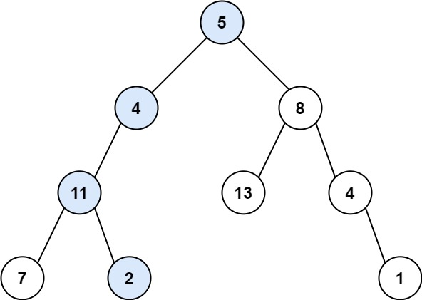
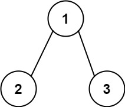

## 问题描述

给你二叉树的根节点 `root` 和一个表示目标和的整数 `targetSum`，判断该树中是否存在 **根节点到叶子节点** 的路径，这条路径上所有节点值相加等于目标和 `targetSum`。

**叶子节点** 是指没有子节点的节点。

### 示例

**示例 1：**

```
输入：root = [5,4,8,11,null,13,4,7,2,null,null,null,1], targetSum = 22
输出：true
路径：5 → 4 → 11 → 2，和为 22
```



**示例 2：**

```
输入：root = [1,2,3], targetSum = 5
输出：false
解释：树中存在两条根节点到叶子节点的路径：
(1 → 2): 和为 3
(1 → 3): 和为 4
不存在和为 5 的根节点到叶子节点的路径。
```



**示例 3：**

```
输入：root = [], targetSum = 0
输出：false
解释：由于树是空的，所以不存在根节点到叶子节点的路径。
```

### 约束条件

- 树中节点的数目在范围 `[0, 5000]` 内
- `-1000 <= Node.val <= 1000`
- `-1000 <= targetSum <= 1000`

## 解题思路

这道题的核心思想是使用 **递归** 和 **深度优先搜索（DFS）** 来遍历二叉树的所有从根节点到叶子节点的路径。

### 核心思路分析

1. **递归结构**：对于每个节点，我们需要判断是否存在一条从该节点到叶子节点的路径，使得路径和等于剩余的目标值。

2. **状态转移**：每当我们访问一个节点时，将目标和减去当前节点的值，然后递归地在左右子树中寻找剩余目标和的路径。

3. **边界条件**：

   - 如果节点为空，返回 `false`
   - 如果节点是叶子节点且节点值等于剩余目标和，返回 `true`

4. **递归逻辑**：对于非叶子节点，只要左子树或右子树中存在满足条件的路径，就返回 `true`。

### 算法步骤

1. **空树处理**：如果根节点为空，直接返回 `false`
2. **叶子节点判断**：如果当前节点是叶子节点，检查其值是否等于剩余的目标和
3. **递归搜索**：对于非叶子节点，递归搜索左右子树，目标和更新为 `targetSum - root.Val`
4. **结果合并**：只要左子树或右子树中有一条路径满足条件，就返回 `true`

## 实现细节

让我们逐步分析代码实现：

### Go 语言实现

```go
func hasPathSum(root *TreeNode, targetSum int) bool {
    // 边界条件：空树没有路径
    if root == nil {
        return false
    }

    // 叶子节点：检查当前节点值是否等于剩余目标和
    if root.Left == nil && root.Right == nil && root.Val == targetSum {
        return true
    }

    // 递归搜索左右子树，目标和减去当前节点值
    return hasPathSum(root.Left, targetSum-root.Val) ||
           hasPathSum(root.Right, targetSum-root.Val)
}
```

### 代码关键点解析

1. **空节点处理**：

   ```go
   if root == nil {
       return false
   }
   ```

   当遍历到空节点时，说明这条路径无法到达叶子节点，返回 `false`。

2. **叶子节点判断**：

   ```go
   if root.Left == nil && root.Right == nil && root.Val == targetSum {
       return true
   }
   ```

   只有当节点是叶子节点（左右子树都为空）且节点值等于剩余目标和时，才找到了满足条件的路径。

3. **递归搜索**：
   ```go
   return hasPathSum(root.Left, targetSum-root.Val) ||
          hasPathSum(root.Right, targetSum-root.Val)
   ```
   递归地在左右子树中寻找路径，目标和更新为 `targetSum - root.Val`。使用逻辑或操作符，只要有一条路径满足条件就返回 `true`。

## 算法执行过程示例

以示例 1 为例，让我们跟踪算法的执行过程：

```
树结构：     5     targetSum = 22
           / \
          4   8
         /   / \
        11  13  4
       / \      \
      7   2      1

执行过程：
1. hasPathSum(5, 22)
   - 不是叶子节点，递归调用子树
   - hasPathSum(4, 17) || hasPathSum(8, 14)

2. hasPathSum(4, 17)
   - 不是叶子节点，递归调用
   - hasPathSum(11, 13) || hasPathSum(null, 13)

3. hasPathSum(11, 13)
   - 不是叶子节点，递归调用
   - hasPathSum(7, 6) || hasPathSum(2, 11)

4. hasPathSum(7, 6)
   - 是叶子节点，但 7 ≠ 6，返回 false

5. hasPathSum(2, 11)
   - 是叶子节点，但 2 ≠ 11，返回 false

6. hasPathSum(null, 13) 返回 false

7. 继续搜索右子树...

最终在路径 5→4→11→2 找到和为 22 的路径。
```

## 复杂度分析

### 时间复杂度：$O(n)$

其中 $n$ 是二叉树中的节点数。在最坏情况下，我们需要访问树中的每个节点一次来寻找满足条件的路径。

### 空间复杂度：$O(h)$

其中 $h$ 是树的高度。空间复杂度主要来自递归调用栈的深度：

- 最好情况（平衡树）：$O(\log n)$
- 最坏情况（退化为链表）：$O(n)$

## 相关变题与扩展

1. **路径总和 II（LeetCode 113）**：返回所有满足条件的路径
2. **路径总和 III（LeetCode 437）**：路径不必从根节点开始或在叶子节点结束
3. **二叉树的最大路径和（LeetCode 124）**：寻找任意路径的最大和

## 关键收获

1. **递归思维**：将复杂问题分解为相同结构的子问题
2. **状态传递**：通过参数传递当前状态（剩余目标和）
3. **边界条件**：正确处理空节点和叶子节点的情况
4. **逻辑操作**：合理使用逻辑或操作符进行结果合并

这道题是二叉树递归问题的经典代表，掌握了这种思路后，可以轻松解决很多类似的树形结构问题。重点是理解递归的本质：**将大问题分解为结构相同的小问题，通过解决小问题来解决大问题**。
