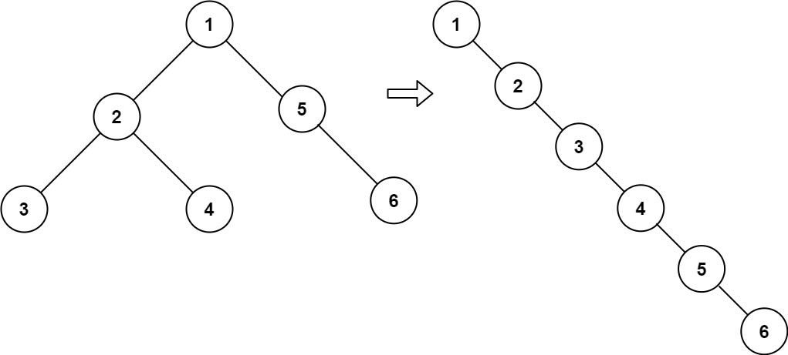

## 修订记录

| 版本 | 修订时间 | 修订内容 |
|------|----------|----------|
| v1.0 | 2025-04-29 20:08:43 | 初始版本，包含错误解法分析和修正解法 |
| v2.0 | 2025-06-15 13:11:33 | 添加进一步优化版本，完善解法对比和学习总结 |

---

## 问题描述

给你二叉树的根结点 root ，请你将它展开为一个单链表：

- 展开后的单链表应该同样使用 TreeNode ，其中 right 子指针指向链表中下一个结点，而左子指针始终为 null 。
- 展开后的单链表应该与二叉树 先序遍历 顺序相同。

**示例 1：**



```
输入：root = [1,2,5,3,4,null,6]
输出：[1,null,2,null,3,null,4,null,5,null,6]
```

**示例 2：**
```
输入：root = []
输出：[]
```

**示例 3：**
```
输入：root = [0]
输出：[0]
```

**提示：**
- 树中结点数在范围 [0, 2000] 内
- -100 <= Node.val <= 100

## 错误解法与分析

我的初始解法是：

```go
// 传入参数为一颗子树的根节点，返回值为处理完后这颗子树的最后一个节点
func dfsFlatten(node *TreeNode) *TreeNode {
    if node == nil {
        return nil
    }
    
    leftEnd := dfsFlatten(node.Left)
    rightEnd := dfsFlatten(node.Right)
    
    if leftEnd != nil {
        leftEnd.Right = node.Right
        node.Right = node.Left
    }
    
    if rightEnd == nil {
        return node  // ❌ 错误点：当右子树为空时，应该返回leftEnd而不是node
    }
    
    return rightEnd
}
```

这个解法在某些测试用例中失败了，主要有以下几个错误：

### 错误原因分析

1. **没有设置 `node.Left = nil`**  
    题目明确要求展开后的单链表**左子指针始终为 `null`**。在我的错误代码中，当处理完左子树后（`leftEnd := dfsFlatten(node.Left)`），并且 `leftEnd != nil` 时，我执行了 `node.Right = node.Left`，将原来的左子树挂载到了右子树的位置。但是，我**忘记了将 `node.Left` 设置为 `nil`**。这导致原本的左子树引用依然存在，不满足题目要求的链表结构。正确的做法是在 `node.Right = node.Left` 之后，紧接着执行 `node.Left = nil`，彻底断开左子树的连接。

2. **缺少对叶子节点的特殊处理（优化缺失）**  
    虽然这不算一个导致结果错误的 bug，但它是一个重要的**优化点**。叶子节点（`node.Left == nil && node.Right == nil`）是递归的最小单元，它们自身就是展开后的链表的末尾节点。在错误代码中，即使遇到叶子节点，仍然会继续递归调用 `dfsFlatten(nil)` 两次，然后才返回。正确的解法中增加了 `if node.Left == nil && node.Right == nil { return node }` 的判断，可以直接返回叶子节点本身，避免了不必要的递归调用，提高了效率。

3. **返回值逻辑错误 (`rightEnd == nil` 的情况)**  
    这是最关键的逻辑错误。`dfsFlatten` 函数的定义是：传入一个子树的根节点 `node`，将其原地展开为链表，并返回这个**展开后链表的最后一个节点**。
    - 当 `rightEnd == nil` 时，意味着当前节点 `node` 没有右子树（或者右子树递归展开后返回 `nil`）。
    - 在这种情况下，如果 `leftEnd != nil`（即存在左子树且已展开），那么根据先序遍历的顺序，`node` 之后应该连接的是展开后的左子树。因此，整个以 `node` 为根的展开链表的最后一个节点，就应该是其左子树展开后的最后一个节点，即 `leftEnd`。
    - 我的错误代码中返回了 `node`。这在只有左子树的情况下是错误的，因为 `node` 并不是展开后链表的最后一个节点。
    - 如果 `leftEnd == nil`（左右子树都为空），此时 `node` 本身就是最后一个节点。看起来返回 `node` 似乎是对的。但是，这种情况其实已经被第 2 点提到的叶子节点判断覆盖了（在正确解法中）。在错误解法中，由于缺少叶子节点判断，即使左右子树都为空，也会执行到这里，并错误地返回 `node`，但这恰好在“叶子节点”这个特定场景下得到了“正确”的结果，掩盖了逻辑本身的缺陷。正确的逻辑应该是，当 `rightEnd == nil` 时，无论 `leftEnd` 是否为 `nil`，都应该返回 `leftEnd`（因为如果 `leftEnd` 为 `nil`，返回 `nil` 也是符合逻辑的，虽然会被叶子节点优化覆盖）。

#### 示例追踪

让我们用一个具体的例子 `[1, 2, null, 3, 4]` 来追踪错误代码的执行：

```
    1
   /
  2
 / \
3   4
```

期望输出: `1 -> 2 -> 3 -> 4` (所有左指针为 nil)

**错误代码追踪:**

1. `dfsFlatten(1)`
   - `dfsFlatten(2)`
     - `dfsFlatten(3)`: (叶子) -> **错误返回 node 3**
     - `dfsFlatten(4)`: (叶子) -> **错误返回 node 4**
     - 处理 node 2:
       - `leftEnd = 3`, `rightEnd = 4`
       - `3.Right = 2.Right` (node 2 原右子节点 4) => `3.Right = 4`
       - `2.Right = 2.Left` (node 2 原左子节点 3) => `2.Right = 3`
       - **遗漏 `2.Left = nil`**
       - 返回 `rightEnd` (node 4)
   - `leftEnd = 4` (来自 `dfsFlatten(2)`)
   - `dfsFlatten(nil)` (node 1 的右子节点) -> 返回 `nil`
   - `rightEnd = nil`
   - 处理 node 1:
     - `leftEnd = 4`, `rightEnd = nil`
     - `4.Right = 1.Right` (nil) => `4.Right = nil`
     - `1.Right = 1.Left` (node 2) => `1.Right = 2`
     - **遗漏 `1.Left = nil`**
     - `rightEnd == nil` -> **错误返回 `node` (node 1)**

**最终结果:** 函数返回 `node 1`，但链表结构是错误的：`1` 的 `Left` 仍然指向 `2`，`2` 的 `Left` 仍然指向 `3`。此外，由于返回值错误，如果上层还有调用，也会基于错误的末尾节点信息继续拼接，导致链表结构混乱。

## 正确解法

经过分析，我改进的解法是：

```go
func dfsFlatten(node *TreeNode) *TreeNode {
    if node == nil {
        return nil
    }
    
    if node.Left == nil && node.Right == nil {
        return node
    }
    
    leftEnd := dfsFlatten(node.Left)
    rightEnd := dfsFlatten(node.Right)
    
    if leftEnd != nil {
        leftEnd.Right = node.Right
        node.Right = node.Left
        node.Left = nil  // 确保左指针设为null
    }
    
    if rightEnd == nil {
        return leftEnd  // 如果右子树为空，返回leftEnd
    }
    
    return rightEnd
}
```

### 为什么这个解法可以工作

1. **正确处理左子指针**：将 `node.Left = nil` 确保了展开后的链表左子指针始终为null。

2. **叶子节点优化**：添加了对叶子节点的判断，可以提前返回，减少不必要的处理。

3. **返回值逻辑正确**：
   - 当右子树存在时，返回右子树展开后的末尾节点
   - 当右子树为空时，返回左子树展开后的末尾节点
   - 当左右子树都为空时，返回节点本身

## 进一步优化版本 <span style="color: #ff6b6b; font-size: 0.8em;">[v2.0 新增]</span>

在深入理解问题后，我们可以写出一个更清晰的优化版本：

```go
func flatten(root *TreeNode) {
    var dfs func(root *TreeNode) *TreeNode
    dfs = func(root *TreeNode) *TreeNode {
        // 空节点或叶子节点直接返回
        if root == nil || (root.Left == nil && root.Right == nil) {
            return root
        }
        
        // 保存原始右子树
        tmpRight := root.Right
        
        // 先处理左子树
        leftLast := dfs(root.Left)
        
        // 如果左子树存在，进行连接操作
        if leftLast != nil {
            leftLast.Right = root.Right    // 左子树的末尾连接到原右子树
            root.Right = root.Left         // 左子树移到右边
            root.Left = nil                // 清空左子树
        }
        
        // 如果原来没有右子树，返回左子树的末尾
        if tmpRight == nil {
            return leftLast
        }
        
        // 处理原右子树，返回其末尾节点
        return dfs(tmpRight)
    }
    
    dfs(root)
}
```

### 优化版本的核心思想

1. **分离处理**：先处理左子树，完成左子树的连接操作，再处理右子树
2. **保存引用**：使用 `tmpRight` 保存原始右子树，避免在连接过程中丢失引用
3. **清晰的逻辑流程**：
   - 处理左子树得到 `leftLast`
   - 如果左子树存在，执行连接操作
   - 根据是否有原右子树决定返回值

### 与之前解法的对比

| 方面 | 初始错误解法 | 修正解法 | 优化版本 |
|------|-------------|----------|----------|
| 左右子树处理 | 同时处理 | 同时处理 | 分离处理 |
| 右子树引用 | 直接使用 | 直接使用 | 提前保存 |
| 代码可读性 | 较差 | 良好 | 更好 |
| 逻辑清晰度 | 混乱 | 清晰 | 非常清晰 |

### 执行过程示例

以树 `[1,2,5,3,4,null,6]` 为例：

```
    1
   / \
  2   5
 / \   \
3   4   6
```

**优化版本执行流程：**

1. `dfs(1)`:
   - `tmpRight = 5`
   - `leftLast = dfs(2)` 返回节点4
   - 连接：`4.Right = 5`, `1.Right = 2`, `1.Left = nil`
   - `tmpRight != nil`，返回 `dfs(5)` 的结果

2. `dfs(2)`:
   - `tmpRight = null`
   - `leftLast = dfs(3)` 返回节点3
   - 连接：`3.Right = null`, `2.Right = 3`, `2.Left = nil`
   - `tmpRight == nil`，返回 `leftLast` (节点3)
   - 但还要处理右子树4，最终返回节点4

这个优化版本的逻辑更加直观，代码也更容易理解和维护。

## 学习总结

1. **细节很重要**：在树和链表相关问题中，指针操作的细节非常重要，漏掉一步可能导致整个结构错误。

2. **返回值的含义要明确**：在递归函数中，返回值的含义必须清晰且一致。我最初混淆了返回值的含义，导致了逻辑错误。

3. **多思考边界情况**：叶子节点、空节点等边界情况需要特别注意。

4. **前序思考**：在编写递归函数前，应该先明确函数参数和返回值的具体含义，并确保整个递归过程中这个含义保持一致。

5. **分离复杂逻辑**：当处理逻辑较复杂时，可以考虑分离处理，如优化版本中先处理左子树再处理右子树的方式。

6. **保护重要引用**：在进行指针操作时，要注意保护可能被修改的重要引用，避免在操作过程中丢失。 