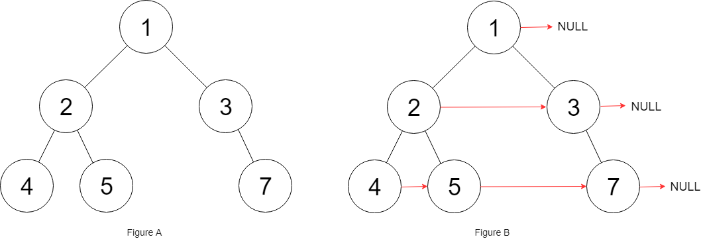

## 问题描述

给定一个二叉树，填充它的每个 `next` 指针，让这个指针指向其下一个右侧节点。如果找不到下一个右侧节点，则将 `next` 指针设置为 `NULL`。

初始状态下，所有 `next` 指针都被设置为 `NULL`。

**注意：** 这道题与第 116 题的区别在于，这里的二叉树不一定是完美二叉树。

### 示例

```
输入：root = [1,2,3,4,5,null,7]
输出：[1,#,2,3,#,4,5,7,#]

     1 → NULL
   /  \
  2 → 3 → NULL
 / \    \
4→ 5 → 7 → NULL
```



**约束条件：**
- 树中节点的数量在 `[0, 6000]` 范围内
- `-100 <= Node.val <= 100`

## 解题思路

这道题的核心是要为每一层的节点建立从左到右的连接关系。我们需要处理的是一个**非完美二叉树**，这意味着每层的节点数可能不同，某些节点可能没有左子树或右子树。

**关键洞察：** 我们需要按层处理节点，将同一层的节点从左到右连接起来。

让我详细介绍三种不同的解法：

## 解法一：哈希表 + 深度优先搜索（DFS）

### 核心思想

使用哈希表记录每一层最右侧的节点，通过 DFS 遍历时，如果当前层已经有节点了，就将该节点的 `next` 指针指向当前节点，然后更新当前层的最右侧节点。

### 实现细节

```go
/**
 * Definition for a Node.
 */
type Node struct {
    Val int
    Left *Node
    Right *Node
    Next *Node
}

func connect(root *Node) *Node {
    if root == nil {
        return nil
    }
    
    // 哈希表记录每一层的最右侧节点
    levelMap := make(map[int]*Node)
    
    // 深度优先搜索遍历
    dfs(root, 0, levelMap)
    
    return root
}

func dfs(node *Node, level int, levelMap map[int]*Node) {
    if node == nil {
        return
    }
    
    // 如果当前层已经有节点了，将前一个节点的 next 指向当前节点
    if prevNode, exists := levelMap[level]; exists {
        prevNode.Next = node
    }
    
    // 更新当前层的最右侧节点
    levelMap[level] = node
    
    // 先遍历左子树，再遍历右子树（保证从左到右的顺序）
    dfs(node.Left, level+1, levelMap)
    dfs(node.Right, level+1, levelMap)
}
```

### 执行过程分析

以示例树为例：
```
     1
   /  \
  2    3
 / \    \
4   5    7
```

1. **Level 0**: 处理节点 1，`levelMap[0] = 1`
2. **Level 1**: 处理节点 2，`levelMap[1] = 2`；处理节点 3，`2.next = 3`，`levelMap[1] = 3`
3. **Level 2**: 处理节点 4，`levelMap[2] = 4`；处理节点 5，`4.next = 5`，`levelMap[2] = 5`；处理节点 7，`5.next = 7`，`levelMap[2] = 7`

## 解法二：广度优先搜索（BFS）+ 层序遍历

### 核心思想

使用队列进行层序遍历，逐层处理节点。对于每一层，我们知道该层的节点数量，可以将同一层的节点依次连接起来。

### 实现细节

```go
func connectBFS(root *Node) *Node {
    if root == nil {
        return nil
    }
    
    // 使用队列进行层序遍历
    queue := []*Node{root}
    
    for len(queue) > 0 {
        size := len(queue) // 当前层的节点数量
        
        // 处理当前层的所有节点
        for i := 0; i < size; i++ {
            node := queue[0]
            queue = queue[1:] // 出队
            
            // 如果不是当前层的最后一个节点，连接到下一个节点
            if i < size-1 {
                node.Next = queue[0]
            }
            
            // 将子节点加入队列
            if node.Left != nil {
                queue = append(queue, node.Left)
            }
            if node.Right != nil {
                queue = append(queue, node.Right)
            }
        }
    }
    
    return root
}
```

### 执行过程分析

```
初始: queue = [1]

第一轮 (Level 0):
- size = 1
- 处理节点 1，queue = [2, 3]

第二轮 (Level 1):
- size = 2
- 处理节点 2，2.next = 3，queue = [3, 4, 5]
- 处理节点 3，queue = [4, 5, 7]

第三轮 (Level 2):
- size = 3
- 处理节点 4，4.next = 5，queue = [5, 7]
- 处理节点 5，5.next = 7，queue = [7]
- 处理节点 7，queue = []
```

## 解法三：O(1) 空间复杂度优化

### 核心思想

利用已经建立的 `next` 指针来遍历下一层，不使用额外的数据结构。我们维护两个指针：
- `levelStart`: 当前层的起始节点
- `prev`: 下一层的前一个节点

### 实现细节

```go
func connectOptimized(root *Node) *Node {
    if root == nil {
        return nil
    }
    
    // levelStart 指向当前层的起始节点
    levelStart := root
    
    for levelStart != nil {
        var prev *Node     // 下一层的前一个节点
        var nextStart *Node // 下一层的起始节点
        
        // 遍历当前层的所有节点
        for node := levelStart; node != nil; node = node.Next {
            // 处理左子节点
            if node.Left != nil {
                if prev != nil {
                    prev.Next = node.Left
                } else {
                    nextStart = node.Left // 记录下一层的起始节点
                }
                prev = node.Left
            }
            
            // 处理右子节点
            if node.Right != nil {
                if prev != nil {
                    prev.Next = node.Right
                } else {
                    nextStart = node.Right // 记录下一层的起始节点
                }
                prev = node.Right
            }
        }
        
        // 移动到下一层
        levelStart = nextStart
    }
    
    return root
}
```

## 方法比较

| 方面       | 哈希表 DFS | 队列 BFS | O(1) 空间优化 |
| ---- | ---- | ----- | ---- |
| 时间复杂度 | O(n) | O(n) | O(n) |
| 空间复杂度 | O(n) | O(n) | O(1) |
| 优点       | 实现简单，易理解 | 层次清晰，符合直觉 | 空间效率最高 |
| 缺点       | 需要额外哈希表 | 需要队列存储 | 实现复杂，理解难度大 |
| 推荐度     | ★★★☆☆ | ★★★★☆ | ★★★★★ |

## 复杂度分析

### 时间复杂度
所有三种方法的时间复杂度都是 **O(n)**，其中 n 是树中节点的数量。我们需要访问每个节点恰好一次。

### 空间复杂度
- **哈希表 DFS**: O(n)，最坏情况下哈希表需要存储所有层的信息
- **队列 BFS**: O(n)，最坏情况下队列需要存储最底层的所有节点
- **O(1) 优化**: O(1)，只使用常数额外空间

## 关键收获

1. **层序遍历的两种实现方式**：队列 BFS 和利用已建立的 next 指针
2. **空间优化技巧**：利用问题的特殊性质（next 指针）来避免使用额外数据结构
3. **DFS vs BFS**：对于树的层次处理，BFS 通常更直观，但 DFS 配合哈希表也能解决
4. **常见陷阱**：
   - 忘记处理空节点的情况
   - 在 O(1) 解法中，容易搞混当前层和下一层的指针关系
   - DFS 时要注意遍历顺序（先左后右）

这道题是一个很好的练习，展示了如何用不同的思路解决同一个问题，以及如何在保持正确性的前提下优化空间复杂度。 