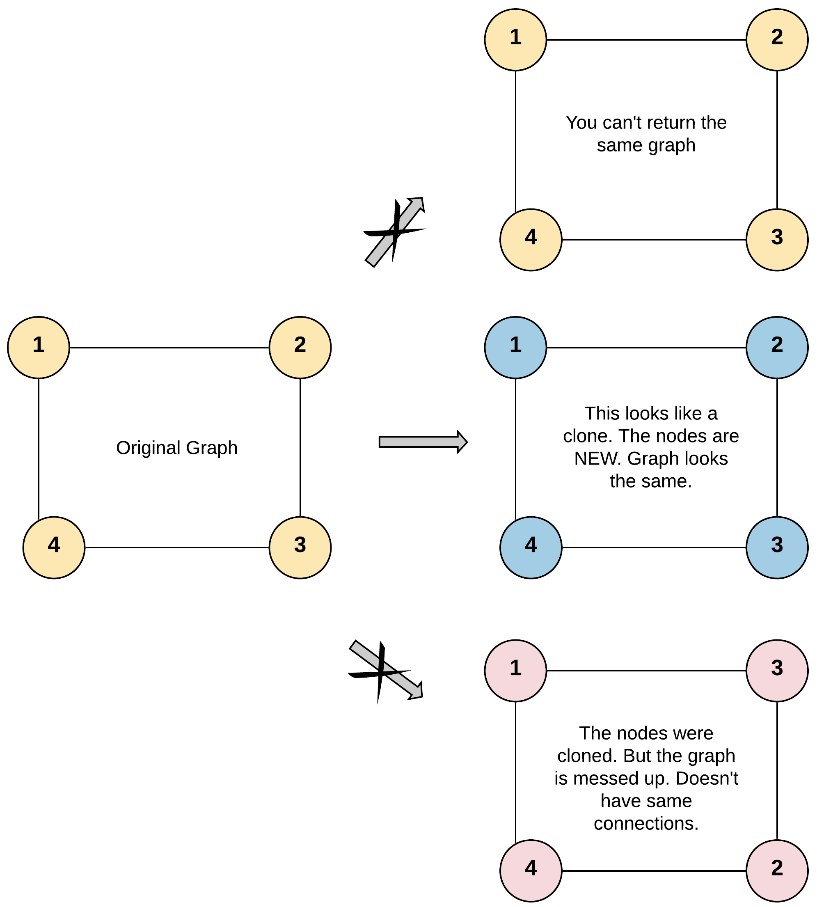
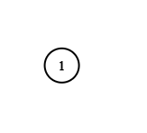

## 问题描述

给你无向**连通**图中一个节点的引用，请你返回该图的**深拷贝**（克隆）。

图中的每个节点都包含它的值 `val`（`int`） 和其邻居的列表（`list[Node]`）。

```
class Node {
    public int val;
    public List<Node> neighbors;
}
```

### 测试用例格式

简单起见，每个节点的值都和它的索引相同。例如，第一个节点值为 1（`val = 1`），第二个节点值为 2（`val = 2`），以此类推。该图在测试用例中使用邻接列表表示。

**邻接列表**是用于表示有限图的无序列表的集合。每个列表都描述了图中节点的邻居集。

给定节点将始终是图中的第一个节点（值为 1）。你必须将**给定节点的拷贝**作为对克隆图的引用返回。

### 示例

**示例 1：**
```
输入：adjList = [[2,4],[1,3],[2,4],[1,3]]
输出：[[2,4],[1,3],[2,4],[1,3]]
解释：
图中有 4 个节点。
节点 1 的值是 1，它有两个邻居：节点 2 和节点 4 。
节点 2 的值是 2，它有两个邻居：节点 1 和节点 3 。
节点 3 的值是 3，它有两个邻居：节点 2 和节点 4 。
节点 4 的值是 4，它有两个邻居：节点 1 和节点 3 。
```



**示例 2：**
```
输入：adjList = [[]]
输出：[[]]
解释：输入包含一个空列表。该图仅仅只有一个值为 1 的节点，它没有任何邻居。
```


**示例 3：**
```
输入：adjList = []
输出：[]
解释：这个图是空的，它不含任何节点。
```

### 约束条件

- 节点数不超过 100
- `1 <= Node.val <= 100`
- 每个节点值 `Node.val` 都是唯一的
- 无向图
- 图是连通的，你可以从给定节点访问到所有节点

## 解题思路

这是一个**图的深拷贝**问题，核心挑战在于处理图中的**环形引用**。如果直接递归复制，会陷入无限循环。

### 核心思路

**使用深度优先搜索（DFS）+ 哈希表**来解决：

1. **哈希表记录映射关系**：用 `visited` 哈希表记录原节点到克隆节点的映射关系
2. **避免重复访问**：如果节点已经被访问过，直接返回对应的克隆节点
3. **递归构建邻居关系**：对每个邻居节点递归调用克隆函数

### 关键洞察

**访问标记的时机至关重要**：必须在开始处理邻居之前就建立原节点到克隆节点的映射关系，而不是在处理完邻居之后。这样可以避免在处理环形引用时出现无限递归。

## 实现细节

### 算法步骤

1. **边界处理**：如果输入节点为空，直接返回 `nil`
2. **检查是否已访问**：如果当前节点已经在 `visited` 中，说明已经克隆过，直接返回克隆节点
3. **创建克隆节点**：创建一个新节点，值与原节点相同，邻居列表为空
4. **⭐ 关键步骤**：立即将原节点和克隆节点的映射关系存入 `visited`
5. **递归处理邻居**：遍历原节点的所有邻居，递归调用克隆函数，将返回的克隆邻居添加到当前克隆节点的邻居列表中
6. **返回克隆节点**

### 为什么要先建立映射关系？

考虑这样的图结构：
```
1 ---- 2
|      |
|      |
4 ---- 3
```

如果我们在处理完邻居后才建立映射：
1. 克隆节点 1，开始处理其邻居节点 2 和 4
2. 递归克隆节点 2，开始处理其邻居节点 1 和 3
3. 递归克隆节点 1（又回到了节点 1！）
4. 因为节点 1 还没有在 `visited` 中建立映射，会重新开始克隆过程
5. **无限递归**！

## 代码实现

### 正确实现

```go
func cloneGraph(node *Node) *Node {
    visited := map[*Node]*Node{}
    
    var dfs func(cur *Node) *Node
    
    dfs = func(cur *Node) *Node {
        // 边界条件
        if cur == nil {
            return cur
        }
        
        // 如果已经访问过，直接返回克隆节点
        if clonedNode, ok := visited[cur]; ok {
            return clonedNode
        }
        
        // 创建克隆节点
        clonedNode := &Node{cur.Val, []*Node{}}
        
        // ⭐ 关键：立即建立映射关系！
        visited[cur] = clonedNode
        
        // 递归处理所有邻居
        for _, neighbor := range cur.Neighbors {
            clonedNode.Neighbors = append(clonedNode.Neighbors, dfs(neighbor))
        }
        
        return clonedNode
    }
    
    return dfs(node)
}
```

### 错误实现分析

❌ **错误的代码**（将 `visited[cur] = clonedNode` 放在最后）：

```go
func cloneGraph(node *Node) *Node {
    visited := map[*Node]*Node{}
    
    var dfs func(cur *Node) *Node
    
    dfs = func(cur *Node) *Node {
        if cur == nil {
            return cur
        }
        
        if clonedNode, ok := visited[cur]; ok {
            return clonedNode
        }
        
        clonedNode := &Node{cur.Val, []*Node{}}
        
        // 递归处理所有邻居
        for _, neighbor := range cur.Neighbors {
            clonedNode.Neighbors = append(clonedNode.Neighbors, dfs(neighbor))
        }
        
        // ❌ 错误：太晚建立映射关系！
        visited[cur] = clonedNode
        
        return clonedNode
    }
    
    return dfs(node)
}
```

### 错误原因详细分析

#### 问题根源

**时机错误**：在处理邻居的递归调用过程中，当前节点还没有被标记为"已访问"，导致在环形引用的情况下会重复进入同一个节点。

#### 具体执行过程

以图 `1-2-1` 为例（节点 1 和节点 2 互相连接）：

1. **第一次调用 `dfs(node1)`**：
   - `visited` 为空，创建 `clonedNode1`
   - 开始处理 `node1` 的邻居 `node2`
   - 调用 `dfs(node2)`

2. **第二次调用 `dfs(node2)`**：
   - `visited` 仍为空（`node1` 还没被添加），创建 `clonedNode2`
   - 开始处理 `node2` 的邻居 `node1`
   - 调用 `dfs(node1)` ← **又回到了节点 1！**

3. **第三次调用 `dfs(node1)`**：
   - `visited` 仍为空，再次创建新的 `clonedNode1`
   - 开始处理邻居...
   - **无限递归开始！**

#### Runtime Error 的具体表现

- **Stack Overflow**：递归栈深度超出限制
- **超时错误**：程序陷入无限循环
- **内存溢出**：不断创建新的节点对象

## 复杂度分析

**时间复杂度**：$O(N + M)$
- $N$ 是节点数量，$M$ 是边的数量
- 每个节点访问一次：$O(N)$
- 每条边访问一次：$O(M)$

**空间复杂度**：$O(N)$
- `visited` 哈希表存储：$O(N)$
- 递归调用栈深度：$O(N)$（最坏情况下是链状图）
- 克隆图的存储空间：$O(N + M)$（不计入结果空间）

## 方法比较

| 方面           | 正确实现                | 错误实现                |
|----------------|-------------------------|-------------------------|
| 映射建立时机   | 创建节点后立即建立      | 处理完邻居后建立        |
| 环形引用处理   | ✅ 正确处理             | ❌ 无限递归             |
| 时间复杂度     | $O(N + M)$              | 无法完成（超时/栈溢出） |
| 空间复杂度     | $O(N)$                  | 无法完成（内存溢出）    |
| 运行结果       | ✅ 通过所有测试用例     | ❌ Runtime Error        |

## 关键收获

### 重要概念

1. **图的深拷贝**：不仅要复制节点值，还要正确复制节点间的连接关系
2. **环形引用检测**：使用哈希表记录访问状态，避免重复访问
3. **访问标记时机**：在开始处理当前节点时就要标记，而不是处理完成后

### 常见陷阱

1. **❌ 访问标记时机错误**：在递归处理邻居之后才标记访问状态
2. **❌ 忘记处理空图**：没有检查输入节点是否为 `nil`
3. **❌ 邻居列表初始化错误**：没有正确初始化克隆节点的邻居列表

### 相关问题

- **LeetCode 138 - 复制带随机指针的链表**：类似的深拷贝问题
- **LeetCode 207 - 课程表**：图的环检测问题
- **LeetCode 200 - 岛屿数量**：图的 DFS 遍历

### 实际应用

- **对象深拷贝**：在需要完全独立的对象副本时
- **图数据库**：复制图结构用于备份或分析
- **社交网络**：复制用户关系网络的子图

这道题的核心教训是：**在处理有环数据结构时，访问标记的时机至关重要**。必须在开始处理当前元素时就进行标记，而不是等处理完成后再标记。这是避免无限递归的关键！ 