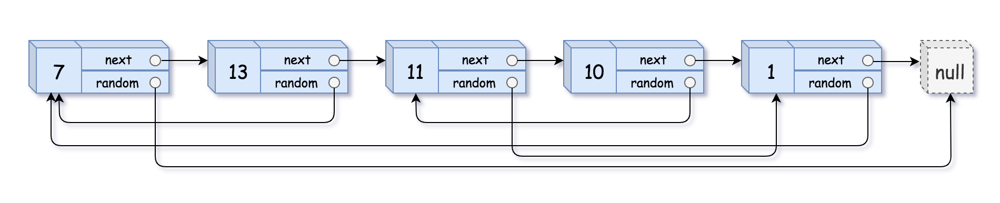

## 问题描述

给你一个长度为 n 的链表，每个节点包含一个额外增加的随机指针 random ，该指针可以指向链表中的任何节点或空节点。

构造这个链表的深拷贝。深拷贝应该正好由 n 个全新节点组成，其中每个新节点的值都设为其对应的原节点的值。新节点的 next 指针和 random 指针也都应指向复制链表中的新节点，并使原链表和复制链表中的这些指针能够表示相同的链表状态。复制链表中的指针都不应指向原链表中的节点。

例如，如果原链表中有 X 和 Y 两个节点，其中 X.random --> Y 。那么在复制链表中对应的两个节点 x 和 y ，同样有 x.random --> y 。

返回复制链表的头节点。

用一个由 n 个节点组成的链表来表示输入/输出中的链表。每个节点用一个 [val, random_index] 表示：

- val：一个表示 Node.val 的整数。
- random_index：随机指针指向的节点索引（范围从 0 到 n-1）；如果不指向任何节点，则为 null 。

你的代码只接受原链表的头节点 head 作为传入参数。

### 示例

**示例 1:**



```
输入：head = [[7,null],[13,0],[11,4],[10,2],[1,0]]
输出：[[7,null],[13,0],[11,4],[10,2],[1,0]]
```

**示例 2:**


```
输入：head = [[1,1],[2,1]]
输出：[[1,1],[2,1]]
```

**示例 3:**


```
输入：head = [[3,null],[3,0],[3,null]]
输出：[[3,null],[3,0],[3,null]]
```

### 约束条件

- 0 <= n <= 1000
- -10^4 <= Node.val <= 10^4
- Node.random 为 null 或指向链表中的节点。
- 节点数目不超过 1000 。

## 解决方案

这个问题可以通过几种不同的方法解决，下面介绍三种主要的解法：

### 方法一：哈希表映射 + 两次遍历

最直观的方法是使用哈希表建立原节点到新节点的映射关系。

**实现步骤：**

1. 第一次遍历：创建所有新节点，并建立原节点到新节点的映射
2. 第二次遍历：根据映射关系设置新节点的 next 和 random 指针

```go
func copyRandomList(head *Node) *Node {
    if head == nil {
        return nil
    }
    
    // 创建原始节点到复制节点的映射
    nodeMap := make(map[*Node]*Node)
    
    // 第一次遍历：创建所有新节点
    cur := head
    for cur != nil {
        nodeMap[cur] = &Node{Val: cur.Val}
        cur = cur.Next
    }
    
    // 第二次遍历：设置新节点的next和random指针
    cur = head
    for cur != nil {
        nodeMap[cur].Next = nodeMap[cur.Next]
        nodeMap[cur].Random = nodeMap[cur.Random]
        cur = cur.Next
    }
    
    return nodeMap[head]
}
```

### 方法二：原地修改 + 拆分（O(1)空间解法）

这种方法不使用额外的哈希表，而是通过修改原链表结构来实现深拷贝。

**实现步骤：**

1. 第一步：在每个原节点后插入对应的复制节点，形成 A->A'->B->B'->... 的链表结构
2. 第二步：设置复制节点的 random 指针，利用 cur.Random.Next 来获取对应的复制节点
3. 第三步：将交错的链表拆分成原链表和复制链表

```go
func copyRandomList(head *Node) *Node {
    if head == nil {
        return nil
    }

    // 第一步：在每个原节点后创建一个新节点
    cur := head
    for cur != nil {
        copyNode := &Node{
            Val:  cur.Val,
            Next: cur.Next,
        }
        cur.Next = copyNode
        cur = copyNode.Next
    }

    // 第二步：设置新节点的random指针
    cur = head
    for cur != nil {
        if cur.Random != nil {
            cur.Next.Random = cur.Random.Next
        }
        cur = cur.Next.Next
    }

    // 第三步：分离原链表和复制链表
    cur = head
    copyHead := head.Next
    for cur != nil {
        copyNode := cur.Next
        cur.Next = copyNode.Next
        
        if copyNode.Next != nil {
            copyNode.Next = copyNode.Next.Next
        }
        
        cur = cur.Next
    }

    return copyHead
}
```

### 方法三：递归 + 哈希表

这种方法使用递归和哈希表结合的方式解决问题。

```go
func copyRandomList(head *Node) *Node {
    visited := make(map[*Node]*Node)
    
    var deepCopy func(node *Node) *Node
    deepCopy = func(node *Node) *Node {
        if node == nil {
            return nil
        }
        
        // 如果已经创建过该节点，直接返回
        if copy, ok := visited[node]; ok {
            return copy
        }
        
        // 创建新节点
        copy := &Node{Val: node.Val}
        visited[node] = copy
        
        // 递归设置next和random指针
        copy.Next = deepCopy(node.Next)
        copy.Random = deepCopy(node.Random)
        
        return copy
    }
    
    return deepCopy(head)
}
```

## 错误分析

### 常见错误点和易错模式

在实现方法二（原地修改 + 拆分）时，有几个容易出错的地方：

#### 错误实现

```go
func copyRandomList(head *Node) *Node {
    cur := head

    // 第一步：创建交错链表
    for cur != nil {
        copyNode := &Node{
            Next: cur.Next,
            Val:  cur.Val,
        }
        cur.Next = copyNode
        cur = copyNode.Next
    }

    // 第二步：设置random指针
    cur = head
    for cur != nil {
        cur.Next.Random = cur.Random.Next  // 错误：没有检查cur.Random是否为nil
        cur = cur.Next.Next
    }

    // 第三步：拆分链表
    cur = head
    copy1 := cur.Next
    for cur != nil {
        tmpNext := cur.Next
        cur.Next = tmpNext.Next
        tmpNext.Next = cur.Next.Next  // 错误：没有检查cur.Next是否为nil
        cur = cur.Next
    }

    return copy1
}
```

#### 错误分析

上述实现有三个主要问题：

1. **没有处理空链表**：当 `head == nil` 时，应该直接返回 `nil`
2. **没有处理 Random 指针为空**：在设置 `cur.Next.Random` 时，如果 `cur.Random` 为 `nil`，会导致空指针异常
3. **链表拆分处理不当**：在拆分链表最后阶段，没有正确处理尾节点的情况，可能导致 `nil` 指针解引用

#### 修正实现

```go
func copyRandomList(head *Node) *Node {
    if head == nil {
        return nil
    }

    // 第一步：创建交错链表
    cur := head
    for cur != nil {
        copyNode := &Node{
            Next: cur.Next,
            Val:  cur.Val,
        }
        cur.Next = copyNode
        cur = copyNode.Next
    }

    // 第二步：设置random指针
    cur = head
    for cur != nil {
        if cur.Random != nil {
            cur.Next.Random = cur.Random.Next
        }
        cur = cur.Next.Next
    }

    // 第三步：拆分链表
    cur = head
    copyHead := head.Next
    for cur != nil {
        copyNode := cur.Next
        cur.Next = copyNode.Next
        
        if copyNode.Next != nil {
            copyNode.Next = copyNode.Next.Next
        }
        
        cur = cur.Next
    }

    return copyHead
}
```

## 复杂度分析

| 方法 | 时间复杂度 | 空间复杂度 | 优点 | 缺点 | 推荐度 |
| ---- | ---- | ----- | ---- | ---- | ---- |
| 哈希表映射 | O(n) | O(n) | 实现简单，直观易懂 | 需要额外空间 | ★★★★☆ |
| 原地修改 + 拆分 | O(n) | O(1) | 常数空间复杂度 | 实现复杂，易出错 | ★★★★★ |
| 递归 + 哈希表 | O(n) | O(n) | 代码精简，逻辑清晰 | 递归栈可能导致栈溢出 | ★★★☆☆ |

## 关键学习点

1. **链表操作的边界条件处理**：在链表问题中，始终要考虑空链表、单节点链表等边界情况
2. **空指针检查的重要性**：对可能为空的指针进行操作前，必须进行非空检查
3. **不使用额外空间的技巧**：如何通过修改原数据结构来避免使用额外空间
4. **深拷贝与浅拷贝的区别**：深拷贝需要复制所有相关联的对象，而不仅仅是直接引用

这道题是链表操作的经典问题，掌握它对理解更复杂的链表操作有很大帮助。原地修改的方法虽然实现复杂，但通过在原链表上巧妙地构建信息来降低空间复杂度，是一种值得学习的高级技巧。 