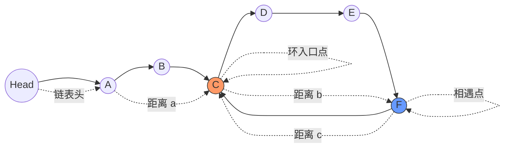

## 问题描述

给定一个链表的头节点 `head`，返回链表开始入环的第一个节点。如果链表无环，则返回 `null`。

如果链表中有某个节点，可以通过连续跟踪 next 指针再次到达，则链表中存在环。为了表示给定链表中的环，评测系统内部使用整数 `pos` 来表示链表尾连接到链表中的位置（索引从 0 开始）。如果 `pos` 是 -1，则在该链表中没有环。注意：`pos` 不作为参数进行传递，仅仅是为了标识链表的实际情况。

**不允许修改链表**。

### 示例

**示例 1：**
```
输入：head = [3,2,0,-4], pos = 1
输出：返回索引为 1 的链表节点
解释：链表中有一个环，其尾部连接到第二个节点。
```

链表可视化：
```
3 → 2 → 0 → -4
    ↑     ↓
    ← ← ← ←
```

**示例 2：**
```
输入：head = [1,2], pos = 0
输出：返回索引为 0 的链表节点
解释：链表中有一个环，其尾部连接到第一个节点。
```

链表可视化：
```
1 → 2
↑   ↓
← ← ←
```

**示例 3：**
```
输入：head = [1], pos = -1
输出：返回 null
解释：链表中没有环。
```

链表可视化：
```
1 → null
```

### 约束条件

- 链表中节点的数目范围在范围 [0, 10^4] 内
- -10^5 <= Node.val <= 10^5
- pos 的值为 -1 或者链表中的一个有效索引

### 进阶

你是否可以使用 O(1) 空间解决此题？

## 解题思路

### 方法一：快慢指针（Floyd 判圈算法）

本题的核心思路是使用**快慢指针**（也称为 Floyd 判圈算法或龟兔赛跑算法）来解决。这是一种**检测链表中是否存在环**并找到环入口点的经典算法。

#### 算法分析和数学证明

这个算法分为两个阶段：
1. **检测环的存在**：使用快慢指针，如果它们相遇，则存在环
2. **寻找环的入口**：通过数学关系确定环的入口点

让我们详细解析这个过程，并进行数学推导：

**第一阶段：检测环的存在**

1. 设置两个指针 `slow` 和 `fast`，初始时都指向链表头节点 `head`
2. `slow` 指针每次移动 1 步，`fast` 指针每次移动 2 步
3. 如果链表中存在环，这两个指针最终会在环中某个节点相遇
4. 如果 `fast` 指针到达了链表末尾（即 `fast` 或 `fast.next` 为 `null`），则链表不存在环

**第二阶段：寻找环的入口**

数学推导是这个算法的关键。假设：

- 链表头到环入口点的距离为 `a` 步
- 环入口点到相遇点的距离为 `b` 步
- 相遇点回到环入口点的距离为 `c` 步

那么环的总长度为 `b + c` 步。

#### 环形链表示意图

##### Mermaid 图示


##### 纯文本图示
```
                 环入口
                    ↓
head → A → B → C → D → E
                ↑       ↓
                ↑       ↓
                ↑       ↓
                G ← F ← F ← 相遇点
                
距离标记:
head到环入口C的距离: a
环入口C到相遇点F的距离: b
相遇点F返回环入口C的距离: c
```

另一种表示方式:
```
      a         b
    +---+     +---+
    ↓   ↓     ↓   ↓
head → → → → → → → +
            ↑     ↓
            ↑     ↓
            ↑     ↓
            + ← ← +
            ↑
            +
            c
```

当 `slow` 和 `fast` 指针相遇时：
- `slow` 走了 `a + b` 步
- `fast` 走了 `a + b + n(b + c)` 步，其中 `n` 是 `fast` 指针在环中绕的圈数

由于 `fast` 指针走的步数是 `slow` 指针的 2 倍，所以有：
```
a + b + n(b + c) = 2(a + b)
```

化简：
```
a + b + n(b + c) = 2a + 2b
n(b + c) = a + b
a = n(b + c) - b = (n-1)(b + c) + c
```

对于 n=1 的情况（即 fast 指针绕环一圈就与 slow 相遇），我们有：
```
a = c
```

这个结论非常重要：**从链表头到环入口的距离，等于从相遇点继续前进到环入口的距离**。

基于这个发现，我们的算法第二阶段为：
1. 将 `fast` 指针重新指向链表头节点
2. 保持 `slow` 指针在相遇点
3. 让两个指针每次都移动 1 步
4. 它们最终会在环的入口点相遇

这种方法的巧妙之处在于我们不需要知道环的长度或链表的长度，也不需要额外的空间来记录已访问过的节点。

## 代码实现

```go
/**
 * Definition for singly-linked list.
 * type ListNode struct {
 *     Val int
 *     Next *ListNode
 * }
 */
func detectCycle(head *ListNode) *ListNode {
    // 处理边界情况
    if head == nil || head.Next == nil {
        return nil
    }
    
    // 阶段一：检测环的存在
    slow, fast := head, head
    
    for {
        // 如果到达链表末尾，则无环
        if fast == nil || fast.Next == nil {
            return nil
        }
        
        // 快指针移动两步，慢指针移动一步
        fast = fast.Next.Next
        slow = slow.Next
        
        // 如果两指针相遇，则存在环
        if slow == fast {
            break
        }
    }
    
    // 阶段二：寻找环的入口
    // 重置快指针到链表头，慢指针保持在相遇点
    fast = head
    
    // 两个指针每次都移动一步
    for slow != fast {
        slow = slow.Next
        fast = fast.Next
    }
    
    // 当两指针再次相遇时，就是环的入口点
    return fast
}
```

## 复杂度分析

- **时间复杂度**：O(n)，其中 n 是链表中节点的数量。在最坏情况下，需要遍历整个链表一次才能确定是否有环，然后再遍历部分链表找到环的入口。
- **空间复杂度**：O(1)，只使用了两个指针，不需要额外的空间。

## 不同方法比较

| 方面 | 快慢指针法 | 哈希表法 |
| ---- | ---- | ----- |
| 时间复杂度 | O(n) | O(n) |
| 空间复杂度 | O(1) | O(n) |
| 优点 | 空间效率高 | 实现简单直观 |
| 缺点 | 数学分析较复杂 | 需要额外空间 |
| 推荐度 | ★★★★★ | ★★★☆☆ |

## 关键收获

1. **Floyd 判圈算法**是解决链表环检测问题的经典算法，它不仅可以检测环的存在，还能找到环的入口点。

2. 该算法的数学推导很巧妙：从链表头到环入口的距离等于从相遇点继续前进到环入口的距离。

3. 我们可以用 O(1) 的空间复杂度解决此问题，这比使用哈希表需要 O(n) 空间的方法更加高效。

4. 这种双指针的技巧在链表问题中非常常见，掌握这种思想可以帮助解决许多类似问题，如寻找链表中点、检测环、寻找倒数第 k 个节点等。 