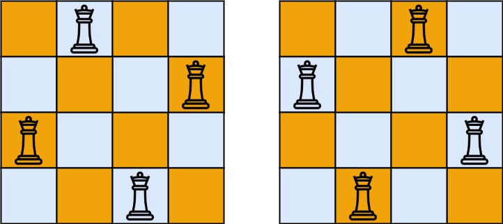

## 问题描述

N皇后问题是一个经典的回溯算法应用。根据国际象棋规则，皇后可以攻击与之处在同一行、同一列或同一斜线上的棋子。N皇后问题要求在N×N的棋盘上放置N个皇后，使得皇后之间互不攻击。

给定一个整数N，要求返回所有不同的N皇后问题的解决方案。每个解决方案包含一个不同的N皇后问题的棋子放置方案，其中'Q'表示皇后，'.'表示空位。

### 示例 1

**输入**：n = 4
**输出**：

```
[
 [".Q..",  // 解法1
  "...Q",
  "Q...",
  "..Q."],
 
 ["..Q.",  // 解法2
  "Q...",
  "...Q",
  ".Q.."]
]
```


**解释**：4皇后问题存在两个不同解法。



### 示例 2

**输入**：n = 1
**输出**：[["Q"]]

### 约束条件

- 1 <= n <= 9

## 解题思路

N皇后问题是回溯算法的经典应用。我们需要尝试在每一列放置一个皇后，同时保证它不会攻击到其他已放置的皇后。

### 核心思想

**核心洞见**：要快速判断一个位置是否可以放置皇后，我们需要高效检测该位置是否处于已有皇后的攻击范围内。

皇后的攻击路径有三种：

1. 同一行
2. 同一列
3. 同一斜线（包括主对角线和副对角线）

为了高效检测，我们使用三个布尔数组来标记已经被占用的行和两种对角线：

- `rowUsed[n]`：记录每一行是否已放置皇后
- `mainDiagUsed[2*n-1]`：记录主对角线（左上到右下）是否已放置皇后
- `subDiagUsed[2*n-1]`：记录副对角线（右上到左下）是否已放置皇后

### 对角线的数学特性

对角线的检测是本题的关键。对于棋盘上的任意一点(i, j)：

1. 主对角线（左上至右下）：同一主对角线上的所有点满足 **i+j 值相同**
   例如：(0,0), (1,1), (2,2) 都在同一主对角线上，它们的 i+j 都等于0+0=1+1=2+2=...
2. 副对角线（右上至左下）：同一副对角线上的所有点满足 **i-j 值相同**
   例如：(0,2), (1,1), (2,0) 都在同一副对角线上，它们的 i-j 都等于0-2=1-1=2-0=...

但是由于数组索引不能为负，对于副对角线，我们通常使用 `i-j+n-1` 或 `i-j+n` 来确保索引为非负值。

### 回溯过程

回溯算法的流程如下：

1. 按列递归，对于每一列，尝试在各行放置皇后
2. 放置前检查当前位置是否安全（行、主对角线、副对角线都未被占用）
3. 如果安全，则放置皇后，并递归处理下一列
4. 递归返回后，回溯（撤销放置的皇后），继续尝试下一个位置
5. 当成功放置了N个皇后（即处理完所有列），记录当前解

## 实现细节

我们使用深度优先搜索(DFS)实现回溯算法。关键步骤如下：

1. 创建解决方案集和棋盘表示：

   - 使用二维字节数组表示棋盘，初始化为全'.'
   - 使用三个布尔数组跟踪已占用的行和对角线
2. 定义DFS函数，按列递归：

   - 如果当前列等于n，说明找到一个解，将当前棋盘状态添加到结果中
   - 否则，尝试在当前列的每一行放置皇后
   - 检查位置(row, col)是否安全（行、主对角线、副对角线都未被占用）
   - 如果安全，标记占用，放置皇后，递归下一列
   - 递归返回后，撤销标记，移除皇后（回溯）

### 实例演示

以n=4为例，展示部分搜索过程：

```
初始状态：棋盘为空
....
....
....
....

尝试第0列第0行(0,0)：
Q...  ✓ 可以放置
....
....
....

尝试第1列第0行(0,1)：
QQ..  ✗ 同一行攻击，跳过
....
....
....

尝试第1列第1行(1,1)：
Q...  ✗ 对角线攻击，跳过
.Q..
....
....

尝试第1列第2行(2,1)：
Q...  ✓ 可以放置
..Q.
....
....

...依此类推
```

## 代码实现

下面是完整且易于理解的Go语言实现：

```go
func solveNQueens(n int) [][]string {
    // 结果集
    var result [][]string
  
    // 标记数组，记录已占用的行和对角线
    rowUsed := make([]bool, n)          // 标记行是否已被占用
    mainDiagUsed := make([]bool, 2*n)   // 标记主对角线(i+j)是否已被占用
    subDiagUsed := make([]bool, 2*n)    // 标记副对角线(n+i-j)是否已被占用
  
    // 初始化棋盘，所有位置都是'.'
    board := make([][]byte, n)
    for i := range board {
        board[i] = make([]byte, n)
        for j := range board[i] {
            board[i][j] = '.'
        }
    }
  
    // DFS函数，col表示当前处理的列
    var dfs func(col int)
    dfs = func(col int) {
        // 如果所有列都已处理，则找到一个解
        if col == n {
            // 将当前棋盘状态转换为字符串数组，并添加到结果中
            solution := make([]string, n)
            for i := range solution {
                solution[i] = string(board[i])
            }
            result = append(result, solution)
            return
        }
      
        // 尝试在当前列的每一行放置皇后
        for row := 0; row < n; row++ {
            // 检查位置(row, col)是否安全
            // 如果行、主对角线或副对角线已被占用，则跳过
            if rowUsed[row] || mainDiagUsed[row+col] || subDiagUsed[n+row-col] {
                continue
            }
          
            // 标记占用
            rowUsed[row] = true
            mainDiagUsed[row+col] = true
            subDiagUsed[n+row-col] = true
          
            // 放置皇后
            board[row][col] = 'Q'
          
            // 递归处理下一列
            dfs(col + 1)
          
            // 回溯：撤销标记和皇后放置
            board[row][col] = '.'
            rowUsed[row] = false
            mainDiagUsed[row+col] = false
            subDiagUsed[n+row-col] = false
        }
    }
  
    // 从第0列开始DFS
    dfs(0)
    return result
}
```

## 复杂度分析

### 时间复杂度

时间复杂度为 $O(N!)$，其中N是棋盘的大小。这是因为：

- 第一列有N个位置可选
- 第二列最多有N-1个位置可选
- 第三列最多有N-2个位置可选
- 以此类推

实际上，由于剪枝的存在，实际运行时间会远小于 $O(N!)$，但理论上最坏情况仍为 $O(N!)$。

### 空间复杂度

空间复杂度为 $O(N)$，主要包括：

- 三个标记数组：$O(N) + O(2N) + O(2N) = O(5N) = O(N)$
- 棋盘表示：$O(N^2)$
- 递归调用栈：$O(N)$

由于N的取值范围较小(1≤N≤9)，$O(N^2)$ 实际上也可以视为 $O(N)$。

## 关键收获

1. **回溯算法的应用**：N皇后问题展示了回溯算法在组合优化问题中的应用，通过尝试-验证-回溯的方式搜索解空间。
2. **高效的约束检查**：使用三个布尔数组记录已占用的行和对角线，可以在 $O(1)$ 时间内判断位置是否安全，而不需要每次遍历整个棋盘。
3. **数学特性的利用**：对角线的数学特性（i+j和i-j的不变性）使我们能够高效地检测对角线约束，这是解决此类问题的关键。
4. **递归与状态恢复**：回溯算法的精髓在于"状态恢复"，即尝试一个选择后，如果不满足条件，则撤销这个选择，恢复到之前的状态，继续尝试其他选择。

N皇后问题是组合优化中的NP难问题，没有多项式时间的解法。对于大规模的问题(N很大)，通常需要使用启发式算法或近似算法来解决。
