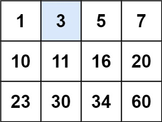
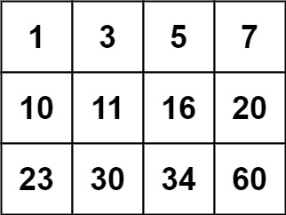

## 问题描述

[LeetCode 74 - 搜索二维矩阵](https://leetcode.cn/problems/search-a-2d-matrix/)是一个中等难度的二分查找问题。

题目要求在一个满足以下两个条件的 m × n 矩阵中，高效地查找目标值 target：
1. 每行中的整数从左到右按非严格递增顺序排列
2. 每行的第一个整数大于前一行的最后一个整数

需要判断 target 是否在矩阵中存在，存在返回 true，否则返回 false。

**示例 1：**



```
输入：matrix = [[1,3,5,7],[10,11,16,20],[23,30,34,60]], target = 3
输出：true
```

**示例 2：**



```
输入：matrix = [[1,3,5,7],[10,11,16,20],[23,30,34,60]], target = 13
输出：false
```

**约束条件：**
- $m = matrix.length$
- $n = matrix[i].length$
- $1 \leq m, n \leq 100$
- $-10^4 \leq matrix[i][j], target \leq 10^4$

## 错误解法与分析

在解决这个问题时，我尝试了几种解法，但其中三个解法都存在错误。下面是对这些错误解法的详细分析。

### 错误解法 1：错误的边界检查

```go
func searchMatrix(matrix [][]int, target int) bool {
	n, m := len(matrix), len(matrix[0])
	row := sort.Search(n, func(i int) bool {
		return matrix[i][m-1] >= target
	})

	// ❌ 错误点：使用列数(m)而非行数(n)进行边界检查
	if row >= m {
		return false
	}

	col := sort.SearchInts(matrix[row], target)
	return matrix[row][col] == target
}
```

**错误原因分析：**

这个解法中的主要错误在于边界检查使用了列数而不是行数。在检查二分查找返回的行索引是否越界时，应该与矩阵的行数 `n` 进行比较，而不是列数 `m`。

当 `row >= n` 时，表示找不到行满足条件（所有行的最后一个元素都小于 target），此时应该返回 false。

但是在错误代码中，使用了 `if row >= m`，这会导致在特定情况下出现问题：
- 当行数大于列数时（n > m），如果 n > row >= m，会错误地返回 false
- 当行数小于列数时（n < m），如果 row >= n 但 row < m，会继续执行导致数组索引越界

这个错误的严重性取决于矩阵的形状，但在最坏情况下会导致程序崩溃。

### 错误解法 2：错误的搜索策略和缺少边界检查

```go
func searchMatrix(matrix [][]int, target int) bool {
	// ❌ 错误点：错误的行选择策略
	row := sort.Search(len(matrix), func(i int) bool {
		return matrix[i][0] >= target
	})

	// ❌ 错误点：缺少边界检查
	col := sort.SearchInts(matrix[row], target)
	return matrix[row][col] == target
}
```

**错误原因分析：**

这个解法存在两个严重问题：

1. **错误的搜索策略**：这里使用的是找到第一个首元素大于等于 target 的行，这与问题的最优解法不符。由于矩阵的特性，我们应该找到最后一个最大元素小于等于 target 的行（即第一个最大元素大于 target 的行的前一行），或者找到第一个最大元素大于等于 target 的行。

2. **缺少边界检查**：没有检查 `row` 是否越界。如果 target 大于矩阵中的所有元素，`sort.Search` 可能返回等于 `len(matrix)` 的值，直接使用这个索引会导致 `matrix[row]` 数组越界访问。

这个错误解法在以下情况下会失败：
- 当 target 大于矩阵中所有元素时（返回 `row = len(matrix)`）
- 当 target 小于矩阵中第一个元素时（可能找错行）

### 错误解法 3：对搜索结果处理不当

```go
func searchMatrix(matrix [][]int, target int) bool {
	n, m := len(matrix), len(matrix[0])
	// ❌ 错误点1：使用了 > 而不是 >= 作为比较条件
	row := sort.Search(n, func(i int) bool {
		return matrix[i][m-1] > target
	}) - 1
	
	// ❌ 错误点2：调试代码遗留在生产代码中
	log.Println(row)
	
	// ❌ 错误点3：没有检查 row 是否有效（可能为负数）
	col := sort.SearchInts(matrix[row], target)
	return matrix[row][col] == target
}
```

**错误原因分析：**

这个解法存在三个问题：

1. **比较条件不当**：使用了 `matrix[i][m-1] > target` 而不是 `matrix[i][m-1] >= target`。当我们寻找第一个最大元素大于等于 target 的行时，这可能导致找错行，特别是当 target 恰好等于某行的最后一个元素时。

2. **未处理边界情况**：直接对 `sort.Search` 的结果减 1，但没有检查是否会导致 `row` 变为负数。如果 target 小于矩阵中的第一个元素，`sort.Search` 会返回 0，减 1 后变成 -1，这会导致索引越界。

3. **调试代码**：保留了 `log.Println(row)` 调试语句，这在生产代码中是不适当的。

这个错误解法在以下情况下会导致错误或程序崩溃：
- 当 target 小于矩阵中的第一个元素时，会导致 row = -1，引起数组越界
- 当 target 等于某行的最后一个元素时，可能会找错行

## 正确解法

经过分析，我改进的解法如下：

```go
func searchMatrix(matrix [][]int, target int) bool {
	n, m := len(matrix), len(matrix[0])
	
	// 查找第一个最后元素大于等于target的行
	row := sort.Search(n, func(i int) bool {
		return matrix[i][m-1] >= target
	})
	
	// 行索引越界，表示所有行的最后元素都小于target
	if row >= n {
		return false
	}
	
	// 在找到的行中二分查找target
	col := sort.SearchInts(matrix[row], target)
	
	// 确保列索引在范围内并且元素等于target
	return col < m && matrix[row][col] == target
}
```

### 为什么这个解法可以工作

1. **正确的搜索策略**：使用 `matrix[i][m-1] >= target` 作为条件，找到第一个最大元素大于等于 target 的行。根据矩阵性质，如果 target 存在，它一定在这一行。

2. **完整的边界检查**：
   - 检查 `row >= n`，确保找到的行索引在矩阵范围内
   - 隐式检查 `col < m`，确保找到的列索引在行范围内（虽然在这道题中由于 `sort.SearchInts` 的特性，这个检查可以省略，但保留它是个好习惯）

3. **正确的返回条件**：当且仅当 `matrix[row][col] == target` 时返回 true，确保找到的位置确实包含目标值。

## 关于 Go 中的 sort.Search 和 sort.SearchInts

这些错误的根源之一是对 Go 标准库中二分查找函数的误用或误解：

1. **sort.Search(n, f)** 返回 `[0,n)` 范围内第一个使 `f(i)=true` 的索引 i。如果没有这样的索引，返回 n。

2. **sort.SearchInts(a, x)** 返回有序切片 a 中第一个大于等于 x 的元素的索引。如果所有元素都小于 x，则返回 `len(a)`。

使用这些函数时的关键注意事项：
- **范围检查**：必须检查 `sort.Search` 和 `sort.SearchInts` 的返回值是否在有效范围内
- **边界条件**：理解当目标不在数组中时的行为
- **调整索引**：有些情况下需要调整返回的索引（如减1），但必须小心处理可能的负值

## 学习总结

从这个问题中，我学到了几个关键教训：

1. **始终检查边界条件**：在使用二分查找或任何索引相关操作时，必须确保索引在有效范围内。

2. **理解库函数行为**：深入理解标准库函数的行为，特别是它们在边缘情况下的返回值。

3. **选择正确的搜索策略**：根据问题特性选择最合适的搜索方法。在这个问题中，理解矩阵的排序特性是找到高效解法的关键。

4. **调整索引时要谨慎**：当需要对搜索结果进行调整（如减1）时，必须考虑这可能导致的边界问题。

5. **移除调试代码**：在提交最终解决方案前，确保移除所有调试语句。

这些考虑点不仅适用于这个特定问题，也适用于所有涉及索引操作和二分查找的算法问题。 