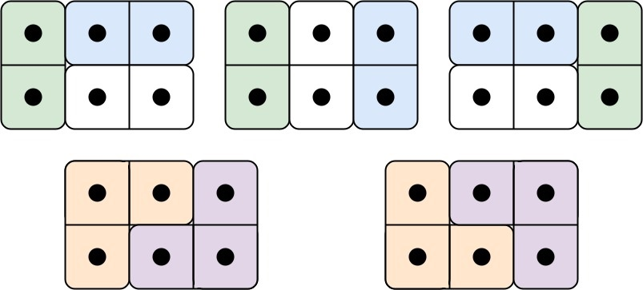

## 问题描述

有两种形状的瓷砖：一种是 2 x 1 的多米诺形，另一种是形如 "L" 的托米诺形。两种形状都可以旋转。


给定整数 n ，返回可以平铺 2 x n 的面板的方法的数量。返回对 109 + 7 取模 的值。

平铺指的是每个正方形都必须有瓷砖覆盖。两个平铺不同，当且仅当面板上有四个方向上的相邻单元中的两个，使得恰好有一个平铺有一个瓷砖占据两个正方形。

**示例 1:**
```
输入: n = 3
输出: 5
解释: 五种不同的方法如下所示。
```

下面是五种平铺方式的示意图：



**示例 2:**
```
输入: n = 1
输出: 1
```

**提示：**
- 1 <= n <= 1000

## 解题思路

这道题目是一个典型的**动态规划**问题，关键在于如何定义状态和转移方程。

首先考虑我们要铺的是一个 2 x n 的面板，每一列的状态可以有四种情况：
1. 状态 0：当前列没有被覆盖
2. 状态 1：当前列的上方格子被覆盖，下方格子未被覆盖
3. 状态 2：当前列的下方格子被覆盖，上方格子未被覆盖
4. 状态 3：当前列的两个格子都被覆盖

对于状态 1 和 2，意味着有一个 L 形状的瓷砖的一部分从前一列延伸到当前列中的一个格子。

定义 dp[i][j] 表示铺到第 i 列，当前列的状态为 j 的方案数量。

### 状态转移方程

观察不同状态之间的转移可以得到：

1. $dp[i][0]$（当前列都没有被覆盖）只能从 $dp[i-1][3]$ 转移而来，因为前一列必须完全覆盖才能导致当前列都没有覆盖。
2. $dp[i][1]$（当前列上方被覆盖）可以从 $dp[i-1][0]$ 和 $dp[i-1][2]$ 转移而来。
3. $dp[i][2]$（当前列下方被覆盖）可以从 $dp[i-1][0]$ 和 $dp[i-1][1]$ 转移而来。
4. $dp[i][3]$（当前列都被覆盖）可以从所有四种状态 $dp[i-1][0]$、$dp[i-1][1]$、$dp[i-1][2]$ 和 $dp[i-1][3]$ 转移而来。

转移方程如下：
- $dp[i][0] = dp[i-1][3]$
- $dp[i][1] = dp[i-1][0] + dp[i-1][2]$
- $dp[i][2] = dp[i-1][0] + dp[i-1][1]$
- $dp[i][3] = dp[i-1][0] + dp[i-1][1] + dp[i-1][2] + dp[i-1][3]$

### 初始状态设置

对于 $i = 0$ 的情况（即一个"虚拟"的前导列），我们需要设置合适的初始值：
- $dp[0][0] = 0$
- $dp[0][1] = 0$
- $dp[0][2] = 0$
- $dp[0][3] = 1$（表示前导列已完全覆盖，这是唯一有效的开始状态）

最终，$dp[n][3]$ 就是我们要找的答案，表示铺到第 $n$ 列且全部覆盖的方案数。

## 实现细节

在实现中，需要注意以下几点：

1. 由于答案可能很大，需要对 $10^9 + 7$ 取模
2. 我们需要特别处理 $n < 3$ 的边界情况
3. 动态规划数组需要初始化为 $(n+1) \times 4$ 的大小

让我们通过一个简单的例子（$n = 3$）来说明算法的执行过程：

初始状态：$dp[0][3] = 1$，其他初始值均为 $0$

第一列（$i = 1$）：
- $dp[1][0] = dp[0][3] = 1$
- $dp[1][1] = dp[0][0] + dp[0][2] = 0$
- $dp[1][2] = dp[0][0] + dp[0][1] = 0$
- $dp[1][3] = dp[0][0] + dp[0][1] + dp[0][2] + dp[0][3] = 1$

第二列（$i = 2$）：
- $dp[2][0] = dp[1][3] = 1$
- $dp[2][1] = dp[1][0] + dp[1][2] = 1$
- $dp[2][2] = dp[1][0] + dp[1][1] = 1$
- $dp[2][3] = dp[1][0] + dp[1][1] + dp[1][2] + dp[1][3] = 3$

第三列（$i = 3$）：
- $dp[3][0] = dp[2][3] = 3$
- $dp[3][1] = dp[2][0] + dp[2][2] = 2$
- $dp[3][2] = dp[2][0] + dp[2][1] = 2$
- $dp[3][3] = dp[2][0] + dp[2][1] + dp[2][2] + dp[2][3] = 5$

因此，对于 $n = 3$，答案是 $dp[3][3] = 5$。

## 代码实现

```go
const mod = 1e9 + 7

func numTilings(n int) int {
    // 确保数组大小足够，至少为4
    total := n + 1
    if total < 4 {
        total = 4
    }
    
    // 创建dp数组
    dp := make([][]int, total)
    for i := 0; i < total; i++ {
        dp[i] = make([]int, 4)
    }
    
    // 设置初始状态
    dp[0][0] = 0
    dp[0][1] = 0
    dp[0][2] = 0
    dp[0][3] = 1
    
    // 状态转移
    for i := 1; i <= n; i++ {
        dp[i][0] = dp[i-1][3]
        dp[i][1] = (dp[i-1][0] + dp[i-1][2]) % mod
        dp[i][2] = (dp[i-1][0] + dp[i-1][1]) % mod
        dp[i][3] = (dp[i-1][0] + dp[i-1][1] + dp[i-1][2] + dp[i-1][3]) % mod
    }
    
    return dp[n][3]
}
```

## 矩阵快速幂解法

仔细观察状态转移方程，可以发现这是一个线性递推关系。当我们面对这类问题时，可以使用矩阵快速幂来优化时间复杂度。

### 推导转移矩阵

根据状态转移方程：
- $dp[i][0] = dp[i-1][3]$
- $dp[i][1] = dp[i-1][0] + dp[i-1][2]$
- $dp[i][2] = dp[i-1][0] + dp[i-1][1]$
- $dp[i][3] = dp[i-1][0] + dp[i-1][1] + dp[i-1][2] + dp[i-1][3]$

我们可以写成矩阵形式：

$$
\begin{pmatrix} 
dp[i][0] \\ 
dp[i][1] \\ 
dp[i][2] \\ 
dp[i][3]
\end{pmatrix} = 
\begin{pmatrix} 
0 & 0 & 0 & 1 \\ 
1 & 0 & 1 & 0 \\ 
1 & 1 & 0 & 0 \\ 
1 & 1 & 1 & 1
\end{pmatrix} \times
\begin{pmatrix} 
dp[i-1][0] \\ 
dp[i-1][1] \\ 
dp[i-1][2] \\ 
dp[i-1][3]
\end{pmatrix}
$$

设上述矩阵为 $M$，则有：

$$
\begin{pmatrix} 
dp[n][0] \\ 
dp[n][1] \\ 
dp[n][2] \\ 
dp[n][3]
\end{pmatrix} = 
\begin{pmatrix} 
0 & 0 & 0 & 1 \\ 
1 & 0 & 1 & 0 \\ 
1 & 1 & 0 & 0 \\ 
1 & 1 & 1 & 1
\end{pmatrix}^n \times
\begin{pmatrix} 
dp[0][0] \\ 
dp[0][1] \\ 
dp[0][2] \\ 
dp[0][3]
\end{pmatrix} = 
M^n \times
\begin{pmatrix} 
0 \\ 
0 \\ 
0 \\ 
1
\end{pmatrix}
$$

### 使用矩阵快速幂解题

矩阵快速幂的核心思想是将 $M^n$ 的计算时间从 $O(n)$ 降低到 $O(\log n)$，类似于整数的快速幂算法。计算 $M^n$ 的过程如下：

1. 初始化结果矩阵 $R$ 为单位矩阵 $I$
2. 当 $n > 0$ 时：
   - 如果 $n$ 是奇数，$R = R \times M$
   - $M = M \times M$
   - $n = \lfloor n/2 \rfloor$

```go
func numTilings(n int) int {
    const mod = 1e9 + 7
    
    // 处理边界情况
    if n == 1 {
        return 1
    }
    if n == 2 {
        return 2
    }
    
    // 定义转移矩阵
    m := [][]int{
        {0, 0, 0, 1},
        {1, 0, 1, 0},
        {1, 1, 0, 0},
        {1, 1, 1, 1},
    }
    
    // 计算M^(n-1)
    res := matrixPow(m, n-1, mod)
    
    // 初始状态为[0,0,0,1]，经过矩阵乘法后第4个元素即为答案
    // 由于我们需要计算的是dp[n][3]，对应初始状态乘以矩阵M^n后的第4行
    return (res[3][0]*0 + res[3][1]*0 + res[3][2]*0 + res[3][3]*1) % mod
}

// 矩阵快速幂
func matrixPow(a [][]int, n int, mod int) [][]int {
    size := len(a)
    res := make([][]int, size)
    for i := 0; i < size; i++ {
        res[i] = make([]int, size)
        res[i][i] = 1 // 初始化为单位矩阵
    }
    
    // 快速幂计算
    for n > 0 {
        if n&1 == 1 {
            res = matrixMultiply(res, a, mod)
        }
        a = matrixMultiply(a, a, mod)
        n >>= 1
    }
    
    return res
}

// 矩阵乘法
func matrixMultiply(a, b [][]int, mod int) [][]int {
    size := len(a)
    result := make([][]int, size)
    for i := 0; i < size; i++ {
        result[i] = make([]int, size)
    }
    
    for i := 0; i < size; i++ {
        for j := 0; j < size; j++ {
            for k := 0; k < size; k++ {
                result[i][j] = (result[i][j] + a[i][k]*b[k][j]) % mod
            }
        }
    }
    
    return result
}
```

## 方法比较

| 方面                | 动态规划方法                     | 矩阵快速幂方法                  |
| ------------------- | -------------------------------- | ------------------------------- |
| 时间复杂度          | $O(n)$                           | $O(\log n)$                     |
| 空间复杂度          | $O(n)$ 或 $O(1)$（优化后）       | $O(1)$                          |
| 优点                | 实现简单，思路清晰               | 处理大数据时效率极高            |
| 缺点                | 对于 $n$ 很大时效率低            | 实现复杂，需要矩阵操作相关知识  |
| 适用情景            | $n$ 较小或需要中间状态           | $n$ 非常大且只需要最终结果      |
| 推荐度              | ★★★★☆                           | ★★★★★                          |

### 时间复杂度分析

1. **动态规划方法**：时间复杂度为 $O(n)$，因为我们需要从1到n遍历一次。
2. **矩阵快速幂方法**：时间复杂度为 $O(\log n)$，由于矩阵快速幂的性质，我们只需要进行约 $\log n$ 次矩阵乘法操作。

当 $n$ 非常大时（比如 $n=10^9$），动态规划方法会超时，而矩阵快速幂方法仍然可以高效计算结果。

### 空间优化

对于动态规划方法，由于每一步只依赖前一步的状态，我们可以将空间复杂度优化为O(1)：

```go
func numTilingsOptimized(n int) int {
    const mod = 1e9 + 7
    
    if n == 1 {
        return 1
    }
    
    // 只保存前一列的状态
    dp := [4]int{0, 0, 0, 1}
    
    for i := 1; i <= n; i++ {
        newDp := [4]int{}
        newDp[0] = dp[3]
        newDp[1] = (dp[0] + dp[2]) % mod
        newDp[2] = (dp[0] + dp[1]) % mod
        newDp[3] = (dp[0] + dp[1] + dp[2] + dp[3]) % mod
        dp = newDp
    }
    
    return dp[3]
}
```

## 复杂度分析

- **时间复杂度**：$O(n)$，其中 $n$ 是给定的整数。我们只需要遍历一次从 1 到 $n$ 的所有列，对每一列进行常数时间的操作。
- **空间复杂度**：$O(n)$，需要一个 $(n+1) \times 4$ 的二维数组来存储动态规划的状态。

## 优化空间复杂度

注意到每一列的状态只与前一列的状态有关，因此我们可以使用滚动数组优化空间复杂度至 $O(1)$。这里为了代码清晰，保留了原始实现。

## 关键收获

1. **状态表示的重要性**：这道题的关键在于如何表示每一列的状态，使得状态转移方程清晰明了。
2. **动态规划状态定义**：本题中，我们定义了四种状态来描述每一列的覆盖情况，这是解决此类组合计数问题的典型方法。
3. **初始状态的设置**：对于动态规划问题，正确设置初始状态对于得到正确结果至关重要。
4. **取模运算**：对于可能产生大数的问题，需要在每一步都进行取模操作，而不是只在最后取模。
5. **线性递推关系识别**：当发现状态转移存在线性递推关系时，可以考虑使用矩阵快速幂优化。
6. **算法选择的权衡**：根据问题规模和需求，在动态规划与矩阵快速幂之间做出合适的选择。

## 相关问题

- LeetCode 70: 爬楼梯 (类似的动态规划问题)
- LeetCode 62: 不同路径 (网格类动态规划)
- LeetCode 91: 解码方法 (状态转移问题)
- LeetCode 509: 斐波那契数 (可用矩阵快速幂优化)
- LeetCode 1220: 统计元音字母序列的数目 (矩阵快速幂应用)

通过这道题，我们可以学习到如何使用动态规划解决复杂的组合计数问题，特别是那些涉及到多种可能状态的问题。同时，我们也了解到当状态转移呈线性递推关系时，矩阵快速幂是一种强大的优化工具，能够将时间复杂度从 $O(n)$ 降低到 $O(\log n)$，这在处理大规模输入时尤为重要。 

## 矩阵快速幂解法的数学证明

矩阵快速幂的正确性基于矩阵乘法的结合律：$(A \times B) \times C = A \times (B \times C)$。

对于计算 $M^n$，我们可以使用二进制分解的思想：
$n = b_k 2^k + b_{k-1} 2^{k-1} + \ldots + b_1 2^1 + b_0 2^0$，其中 $b_i \in \{0, 1\}$

则 $M^n = M^{b_k 2^k} \times M^{b_{k-1} 2^{k-1}} \times \ldots \times M^{b_1 2^1} \times M^{b_0 2^0}$

例如，$M^{11} = M^8 \times M^2 \times M^1$，因为 $11 = 1011_2 = 2^3 + 2^1 + 2^0$

通过预计算 $M^1, M^2, M^4, M^8, \ldots, M^{2^k}$，我们可以在 $O(\log n)$ 的时间内计算 $M^n$。

而计算 $M^{2^i}$ 也非常简单：$M^{2^i} = M^{2^{i-1}} \times M^{2^{i-1}}$

这种算法的伪代码如下：

```
Function MatrixPow(M, n):
    R = I  // 单位矩阵
    while n > 0:
        if n is odd:
            R = R × M
        M = M × M
        n = n / 2
    return R
```

通过这种方法，我们将 $O(n)$ 次矩阵乘法优化至 $O(\log n)$ 次，极大提高了算法效率。

### 矩阵快速幂的实际应用

矩阵快速幂在计算线性递推关系时非常有用。除了本题之外，它还可以应用于：

1. 斐波那契数列计算：$F_n = F_{n-1} + F_{n-2}$
2. 计算一般形式的线性递推关系：$x_n = a_1 x_{n-1} + a_2 x_{n-2} + \ldots + a_k x_{n-k}$
3. 某些图论问题，如计算从顶点 $i$ 到顶点 $j$ 长度为 $k$ 的路径数量

在这些应用中，矩阵快速幂都可以将算法的时间复杂度从 $O(n)$ 优化至 $O(\log n)$，特别是当 $n$ 很大时，这种优化会带来巨大的性能提升。 