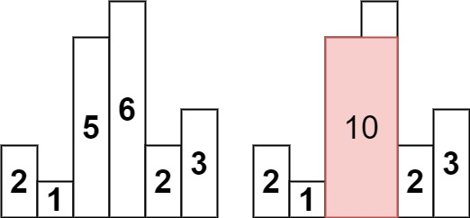
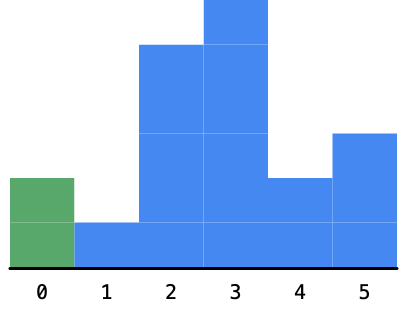

## 问题描述

给定 n 个非负整数，用来表示柱状图中各个柱子的高度。每个柱子彼此相邻，且宽度为 1 。

求在该柱状图中，能够勾勒出来的矩形的最大面积。



示例:

```
输入：heights = [2,1,5,6,2,3]
输出：10
解释：最大的矩形是从第三个柱子开始，到第四个柱子结束，高度为 5，宽度为 2，面积为 10
```

## 解题思路

这道题看似简单，实则暗藏玄机。我们需要在柱状图中找出面积最大的矩形。直观上看，这个矩形必须以某个柱子的高度为高，然后向两边尽可能延伸。

想象你在一排高矮不一的楼房中寻找能放置一个最大长方形广告牌的位置，你需要考虑：

1. 每个楼的高度（决定了广告牌的高度）
2. 能在多少个相邻楼上放（决定了广告牌的宽度）

我们将介绍三种方法来解决这个问题：从最直观但效率较低的暴力法，到高效精巧的单调栈解法。

### 方法一：暴力法 - 最直观的解法

暴力法就像是我们一个个尝试所有可能的矩形，就像小孩子一样挨个试一试。

思路非常直白：

1. 我们先选定一个柱子，把它的高度作为矩形的高
2. 然后像橡皮筋一样，尽可能地向左右两边拉伸，直到碰到比这个柱子矮的为止
3. 计算此时的面积，记录下最大值

比如对于柱子高度 `[2,1,5,6,2,3]`：

- 如果选择高度 5 的柱子，我们不能向左拉伸（因为左边的 1 比 5 矮），但可以向右拉伸一格（因为右边的 6 比 5 高）
- 此时得到的矩形宽度是 2，高度是 5，面积为 10

这是最容易想到的方法，也最符合我们的直觉思维：

```go
func largestRectangleArea(heights []int) int {
    n := len(heights)
    maxArea := 0

    for i := 0; i < n; i++ {
        height := heights[i]

        // 向左扩展
        left := i
        for left > 0 && heights[left-1] >= height {
            left--
        }

        // 向右扩展
        right := i
        for right < n-1 && heights[right+1] >= height {
            right++
        }

        // 计算面积
        width := right - left + 1
        area := height * width
        maxArea = max(maxArea, area)
    }

    return maxArea
}

func max(a, b int) int {
    if a > b {
        return a
    }
    return b
}
```

时间复杂度：$O(n²)$，其中 n 是输入数组的长度。
空间复杂度：$O(1)$。

这种方法在 LeetCode 上会超时，因此我们需要更高效的算法。

### 方法二：分治法 - 巧妙地分割问题

分治法的思想就像"兵分两路"战术：

1. 首先找到整个柱状图中**最矮的那个柱子**（就像找到一个军事分界线）
2. 用这个最矮柱子的高度乘以整个图的宽度，得到一个可能的面积
3. 然后将问题分成两半：最矮柱子左边的部分和右边的部分
4. 分别在这两部分中继续寻找最大面积
5. 最后从这三个面积（横跨整个区域的、只在左半部分的、只在右半部分的）中取最大值

这种方法的妙处在于：对于横跨的矩形，高度受限于最矮的柱子；对于不包含最矮柱子的矩形，我们可以在子区域中重复此过程。

看一个生动例子：假设我们有柱子 `[3,1,4,2]`：

- 最矮的柱子是第二个，高度为 1
- 用它计算一个面积：1×4 = 4
- 分割成左半部分 `[3]` 和右半部分 `[4,2]`
- 在左半部分中，最大面积是 3×1 = 3
- 在右半部分中，最大面积是 2×2 = 4
- 最终的最大面积是 4

```go
func largestRectangleArea(heights []int) int {
    return calculateArea(heights, 0, len(heights)-1)
}

func calculateArea(heights []int, start, end int) int {
    if start > end {
        return 0
    }

    if start == end {
        return heights[start]
    }

    // 找到最小高度的索引
    minIdx := start
    for i := start; i <= end; i++ {
        if heights[i] < heights[minIdx] {
            minIdx = i
        }
    }

    // 计算三种可能的情况下的最大面积
    useMin := heights[minIdx] * (end - start + 1)
    leftArea := calculateArea(heights, start, minIdx-1)
    rightArea := calculateArea(heights, minIdx+1, end)

    return max(useMin, max(leftArea, rightArea))
}

func max(a, b int) int {
    if a > b {
        return a
    }
    return b
}
```

时间复杂度：平均情况下为 $O(n \log n)$，最坏情况下为 $O(n²)$。
空间复杂度：$O(\log n)$，递归调用栈的空间。

### 方法三：单调栈（最优解）- 聪明的一趟扫描法

单调栈就像是一个聪明的"侦察兵"，能够高效地找出每个柱子的"左右邻居"（左右两边第一个比它矮的柱子）。

#### 单调栈的原理通俗解释

想象你站在平原上看一排高低不同的楼房，但你只能看到那些没被前面更高楼房挡住的楼：

1. 我们从左到右走，用一个栈记录"能看到的楼房"
2. 当遇到一个比栈顶更矮的楼时，意味着栈顶楼的"右边界"已经确定
3. 此时，我们计算以栈顶楼高为高的矩形面积，然后将它从栈中移除
4. 重复这个过程，直到栈顶楼不再比当前楼高
5. 最后，我们把当前楼也加入到栈中

**关键洞见**：通过这种方式，对于每个柱子，我们能够找到：

- 它左边第一个比它矮的柱子（栈中它下面的元素）
- 它右边第一个比它矮的柱子（导致它被弹出栈的元素）

有了这两个边界，我们就能计算以这个柱子高度为高的最大矩形面积。

这种方法只需要遍历数组一次，时间复杂度是 $O(n)$，是最高效的解法。

```go
func largestRectangleArea(heights []int) int {
    stack := []int{-1}  // 辅助栈，初始放入-1作为边界
    maxArea := 0
    n := len(heights)

    // 遍历每个柱子
    for i := range heights {
        // 当栈顶元素对应的柱子高度大于当前柱子高度时
        for stack[len(stack)-1] != -1 && heights[i] < heights[stack[len(stack)-1]] {
            // 弹出栈顶元素，计算以该柱子高度为高的矩形面积
            height := heights[stack[len(stack)-1]]
            stack = stack[:len(stack)-1]

            // 计算宽度：当前位置 - 新栈顶位置 - 1
            width := i - stack[len(stack)-1] - 1

            // 更新最大面积
            maxArea = max(maxArea, height * width)
        }
        // 将当前柱子的索引入栈
        stack = append(stack, i)
    }

    // 处理栈中剩余的柱子
    for stack[len(stack)-1] != -1 {
        height := heights[stack[len(stack)-1]]
        stack = stack[:len(stack)-1]
        width := n - stack[len(stack)-1] - 1
        maxArea = max(maxArea, height * width)
    }

    return maxArea
}

func max(a, b int) int {
    if a > b {
        return a
    }
    return b
}
```

时间复杂度：$O(n)$，每个元素最多被入栈出栈各一次。
空间复杂度：$O(n)$，栈的空间。

## 代码错误分析 - 我犯的错误

在最初的实现中，我犯了一个非常常见但很容易被忽视的错误：**没有处理栈中剩余的元素**。这就像是书写一篇文章时忘记了写结尾，故事戛然而止，显得不完整。

### ❌ 错误的代码

```go
func largestRectangleArea(heights []int) int {
    stack := []int{-1}
    maxArea := 0

    for i := range heights {
        for stack[len(stack)-1] != -1 && heights[i] < heights[stack[len(stack)-1]] {
            mid := stack[len(stack)-1]
            stack = stack[:len(stack)-1]
            left := stack[len(stack)-1]
            maxArea = max(maxArea, heights[mid]*(i-left-1))
        }
        stack = append(stack, i)
    }

    return maxArea  // ❌ 错误：没有处理栈中剩余的元素！
}
```

### 错误原因 - 通俗解释

想象你是一个摄影师，要为一排站着的人拍照。你的规则是：

1. 从左到右看，当看到一个比前面矮的人时，就给前面的人拍照
2. 拍照时需要确定这个人的"左右边界"（左右两边第一个比他矮的人）

**问题出在哪里？** 当你走完整排人后，还有些人没拍照！这些人右边没有比他们矮的人了，但他们仍然需要被拍照。

在我的原始代码中，这些"剩下的人"（栈中剩余的元素）被完全忽略了，它们代表的潜在最大矩形没有被计算。

例如，对于输入 `[2,1,5,6,2,3]`，遍历结束后栈中还会剩余：

- 索引 `-1`（哨兵值，不是实际柱子）
- 索引 `1`（高度为 1 的柱子）
- 索引 `4`（高度为 2 的柱子）
- 索引 `5`（高度为 3 的柱子）

这三个实际柱子**可能形成的矩形都没有被考虑**！

### ✅ 修正的解法

正确的做法是，遍历结束后，还需要"清空栈"，处理所有剩余的元素：

```go
// 处理栈中剩余的柱子
for stack[len(stack)-1] != -1 {
    mid := stack[len(stack)-1]
    stack = stack[:len(stack)-1]
    left := stack[len(stack)-1]
    // 这些柱子的右边界就是数组的末尾
    maxArea = max(maxArea, heights[mid]*(n-left-1))
}
```

这段代码就像是确保给所有人都拍了照，不落下任何一个。对于这些剩下的柱子，它们的右边界就是整个数组的末尾（因为右边没有更矮的柱子了）。

## 单调栈解法图解 - 一步一步看懂

为了让单调栈的工作原理更加容易理解，我们来通过一个图解示例，就像讲故事一样展示解题过程。以 `[2,1,5,6,2,3]` 为例：

### 图解流程



1. **初始准备**：

   - 栈 = [-1] （-1 是一个哨兵值，表示边界）
   - maxArea = 0

2. **处理第 1 个柱子（高度=2）**：

   - 因为栈为空，直接入栈
   - 栈 = [-1, 0] （0 是柱子的索引）

3. **处理第 2 个柱子（高度=1）**：

   - 发现 1 < 2，也就是当前柱子比栈顶柱子矮
   - 这意味着我们找到了栈顶柱子的右边界！
   - 弹出栈顶索引 0，计算面积：2 × (1-(-1)-1) = 2
   - 把当前柱子入栈，栈 = [-1, 1]

4. **处理第 3 个柱子（高度=5）**：

   - 5 > 1，当前柱子比栈顶高
   - 直接入栈，栈 = [-1, 1, 2]

5. **处理第 4 个柱子（高度=6）**：

   - 6 > 5，当前柱子比栈顶高
   - 直接入栈，栈 = [-1, 1, 2, 3]

6. **处理第 5 个柱子（高度=2）**：

   - 2 < 6，当前柱子比栈顶矮
   - 弹出栈顶索引 3，计算面积：6 × (4-2-1) = 6
   - 2 < 5，继续弹出栈顶索引 2，计算面积：5 × (4-1-1) = 10 ← 目前最大
   - 2 > 1，停止弹出
   - 把当前柱子入栈，栈 = [-1, 1, 4]

7. **处理第 6 个柱子（高度=3）**：

   - 3 > 2，当前柱子比栈顶高
   - 直接入栈，栈 = [-1, 1, 4, 5]

8. **处理剩余栈中元素**（这一步是我之前忽略的）：
   - 弹出索引 5，计算面积：3 × (6-4-1) = 3
   - 弹出索引 4，计算面积：2 × (6-1-1) = 8
   - 弹出索引 1，计算面积：1 × (6-(-1)-1) = 6

经过完整计算，最大面积是 **10**，对应的是高度为 5，宽度为 2 的矩形（从索引 2 到索引 3）。

### 关键理解点

单调栈的巧妙之处在于：

- 入栈：当前柱子比栈顶高，表示"还不知道右边界在哪"
- 出栈：当前柱子比栈顶矮，表示"找到了栈顶柱子的右边界"
- 剩余处理：遍历结束后栈中剩余的柱子，它们的右边界是数组的末尾

这个过程就像是在处理一排人的视线问题，每个人只能看到右边第一个比自己矮的人，单调栈帮我们在 O(n)时间内找到了所有这样的关系。

## 总结与反思

### 三种方法的对比

| 方法   | 优点               | 缺点         | 时间复杂度                  | 适用场景               |
| ------ | ------------------ | ------------ | --------------------------- | ---------------------- |
| 暴力法 | 最直观易懂         | 效率低       | $O(n²)$                     | 数据量小，面试初步思路 |
| 分治法 | 思路优雅           | 实现复杂     | $O(n \log n)$，最坏 $O(n²)$ | 处理递归问题，分而治之 |
| 单调栈 | 效率最高，一次遍历 | 需理解栈原理 | $O(n)$                      | 大数据量，最优解法     |

### 我的错误与教训

这道题我犯的错误（忘记处理栈中剩余元素）其实非常常见，但它给我们两个重要启示：

1. **算法的完整性很重要**：不要只关注主循环，还要考虑循环结束后的"收尾工作"。就像写故事不能忘记结尾一样。

2. **特殊情况的处理**：在这个问题中，特殊情况是"那些右边没有更矮柱子的元素"，它们也需要被正确处理。

### 单调栈的应用场景

单调栈不仅仅用于这道题，它是解决"下一个更大/更小元素"类问题的利器。其应用场景包括：

- 寻找数组中每个元素的下一个更大元素
- 寻找温度升高需要等待的天数（LeetCode 739）
- 计算矩形面积类问题

**记住**：单调栈的核心思想是维持栈内元素的单调性（递增或递减），这样可以在 $O(n)$时间内找到每个元素左右两侧第一个比它大/小的元素。
