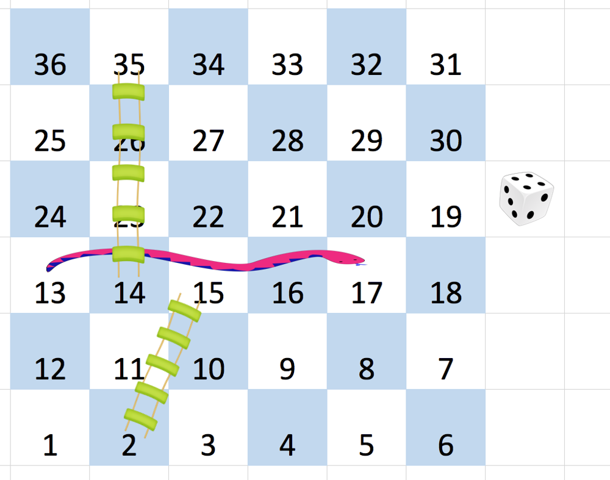

## 问题描述

给你一个大小为 `n x n` 的整数矩阵 `board`，其中 `n` 和 `board[i][j]` 都在范围 `[1, n]` 内。

蛇梯棋的棋盘上标有从 `1` 到 `n²` 的数字，按从左到右，从下到上的 **蛇形** 方式编号。

玩家从棋盘上的方格 `1` （总是在最后一行、第一列）开始出发。

每一回合，玩家都要从当前方格开始出发，按以下规则前进：
- 选择目标方格来决定下一步的移动，目标方格的编号是 `[curr + 1, curr + 6]` 的范围内任意整数 `curr` 是玩家当前所在的方格编号。
- 该选择模拟了掷 **六面骰子** 的情景，无论棋盘大小如何，玩家最多只能有 6 个目的地。
- 如果目标方格有蛇或梯子，玩家必须按蛇梯的指示前进。蛇梯的目的地不会有蛇或梯子。
- 注意，玩家在每回合的移动过程中最多只能爬过蛇或梯子一次：就算目的地是另一条蛇或梯子的起点，玩家也不能继续移动。

返回达到编号为 `n²` 的方格所需的最少移动次数，如果不可能，则返回 `-1`。

**示例 1:**
```
输入：board = [[-1,-1,-1,-1,-1,-1],[-1,-1,-1,-1,-1,-1],[-1,-1,-1,-1,-1,-1],[-1,35,-1,-1,13,-1],[-1,-1,-1,-1,-1,-1],[-1,15,-1,-1,-1,-1]]
输出：4
解释：
首先，从方格 1 [第 5 行，第 0 列] 开始。 
决定移动到方格 2，并必须爬过梯子移动到方格 15。
然后决定移动到方格 17 [第 3 行，第 5 列]，必须爬过蛇到方格 13。
接下来决定移动到方格 14，且必须爬过梯子移动到方格 35。 
最后决定移动到方格 36 [第 0 行，第 5 列]，游戏结束。 
可以证明需要至少 4 次移动才能到达最后一个方格，所以答案是 4。
```



**示例 2:**
```
输入：board = [[-1,-1],[-1,3]]
输出：1
```

## ❌ 错误分析过程

### 遇到的主要问题

#### 1. **内存限制超出 (Memory Limit Exceeded)**

**错误现象**: 
```
Memory Limit Exceeded
5/217 cases passed (N/A)
Testcase: [[-1,4,-1],[6,2,6],[-1,3,-1]]
Expected Answer: 2
```

**分析**: 这个错误是由于存在**循环蛇梯**导致的无限递归调用。在测试案例中：
- 位置 2 指向位置 6
- 位置 6 指向位置 2

形成了循环，`numToNode` 函数会无限递归调用自己，导致栈溢出。

#### 2. **坐标转换逻辑复杂**

蛇梯棋的编号规则相当复杂：
- 从棋盘底部开始编号（1 在最后一行第一列）
- 奇数行从左到右，偶数行从右到左
- 需要正确处理数组索引到棋盘编号的转换

**多次尝试的坐标转换方案**:

```go
// 方案1: 最初的错误实现
if row%2 == 0 && n%2 == 0 {
    col = n - 1 - col
}

// 方案2: 修正后的实现
if (n-1-row)%2 == 1 {
    col = n - 1 - col
}

// 方案3: 最终尝试的实现
row := (num - 1) / n
if row%2 == 1 {
    col = n - 1 - col
}
row = n - 1 - row
```

#### 3. **BFS 访问控制问题**

**问题**: 没有正确处理已访问节点的标记，导致：
- 重复访问同一个位置
- 算法效率低下
- 可能的无限循环

#### 4. **递归vs迭代的选择**

最初使用递归的 `numToNode` 函数来处理蛇梯跳转，但遇到循环蛇梯时会导致栈溢出。

## 解题思路分析

### 核心算法: BFS (广度优先搜索)

这是一个典型的**最短路径**问题，应该使用 BFS 来解决：

1. **状态表示**: 每个状态包含当前位置编号和步数
2. **状态转移**: 从当前位置可以移动到 `[curr+1, curr+6]` 范围内的任意位置
3. **蛇梯处理**: 如果到达的位置有蛇或梯子，需要跳转到指定位置
4. **终止条件**: 到达编号为 `n²` 的位置

### 关键难点

#### 1. **坐标转换**
```
棋盘编号示例 (4x4):
13  14  15  16
12  11  10   9
 5   6   7   8
 4   3   2   1

对应数组索引:
[0,0] [0,1] [0,2] [0,3]
[1,0] [1,1] [1,2] [1,3]
[2,0] [2,1] [2,2] [2,3]
[3,0] [3,1] [3,2] [3,3]
```

#### 2. **蛇梯处理**
- 需要在到达新位置后立即检查是否有蛇或梯子
- 避免无限递归调用
- 正确处理循环蛇梯的情况

#### 3. **访问控制**
- 使用 `visited` 数组避免重复访问
- 注意数组索引范围（编号1到n²）

## 错误代码实现历程

### 第一版：最初的错误实现

```go
package main

import "fmt"

type Location struct {
	X    int
	Y    int
	step int
	Num  int
}

func snakesAndLadders(board [][]int) int {

	n := len(board)

	var numToNode func(num int) Location

	numToNode = func(num int) Location {

		row := n - 1 - (num-1)/n
		col := (num - 1) % n
		if row%2 == 0 && n%2 == 0 {  // ❌ 错误的坐标转换逻辑
			col = n - 1 - col
		}

		if board[row][col] >= 0 {  // ❌ 应该是 != -1
			return numToNode(board[row][col])  // ❌ 递归调用，会导致循环蛇梯时栈溢出
		}

		return Location{X: row, Y: col, step: 0, Num: num}
	}

	start := numToNode(1)
	fmt.Println(start)  // 调试输出
	end := numToNode(n * n)

	cnt := 0

	queue := []Location{start}

	for len(queue) != 0 && cnt <= n*n {
		top := queue[0]
		queue = queue[1:]
		cnt++

		if top.X == end.X && top.Y == end.Y {  // ❌ 用坐标比较而不是编号
			return top.step
		}

		if board[top.X][top.Y] == -2 {  // ❌ 用修改原数组的方式标记访问
			continue
		}

		board[top.X][top.Y] = -2  // ❌ 破坏原数组

		for i := 1; i <= 6; i++ {
			if top.Num+i <= n*n {
				next := numToNode(top.Num + i)  // ❌ 递归调用
				next.step = top.step + 1

				queue = append(queue, next)
			}
		}
	}

	return -1
}
```

**问题分析**:
1. 坐标转换条件 `row%2 == 0 && n%2 == 0` 完全错误
2. 使用递归的 `numToNode` 函数处理蛇梯跳转，遇到循环时会栈溢出
3. 用修改原数组的方式标记访问，不够优雅且容易出错
4. 终止条件用坐标比较，不如直接用编号比较

### 第二版：尝试修复坐标转换和访问控制

```go
func snakesAndLadders(board [][]int) int {

	n := len(board)
	visited := make([]bool, n*n+1) // ✅ 使用visited数组

	var numToNode func(num int) Location

	numToNode = func(num int) Location {

		row := n - 1 - (num-1)/n
		col := (num - 1) % n
		
		// ✅ 修正行翻转逻辑：从底部数起的偶数行需要翻转
		if (n-1-row)%2 == 1 {
			col = n - 1 - col
		}

		if board[row][col] != -1 {  // ✅ 修正条件
			return numToNode(board[row][col])  // ❌ 仍然是递归调用
		}

		return Location{X: row, Y: col, step: 0, Num: num}
	}

	start := numToNode(1)
	start.step = 0
	
	queue := []Location{start}
	visited[1] = true

	for len(queue) != 0 {
		top := queue[0]
		queue = queue[1:]

		// ✅ 检查是否到达目标
		if top.Num == n*n {
			return top.step
		}

		for i := 1; i <= 6; i++ {
			nextNum := top.Num + i
			if nextNum <= n*n && !visited[nextNum] {
				next := numToNode(nextNum)  // ❌ 仍然递归
				next.step = top.step + 1
				visited[nextNum] = true
				queue = append(queue, next)
			}
		}
	}

	return -1
}
```

**问题分析**:
- ✅ 修正了坐标转换逻辑
- ✅ 使用了proper的visited数组
- ✅ 修正了终止条件
- ❌ 仍然使用递归处理蛇梯，循环蛇梯时会导致栈溢出

### 第三版：最终尝试的实现

```go
func snakesAndLadders(board [][]int) int {
    n := len(board)
    
    var numToNode func(num int) Location
    
    numToNode = func(num int) Location {
        row := (num - 1) / n  // ❌ 修改了计算方式，但可能不正确
        col := (num - 1) % n
        if row%2 == 1 {  // ❌ 翻转逻辑又变了
            col = n - 1 - col
        }
        
        row = n - 1 - row  // ❌ 后置转换
        
        return Location{X: row, Y: col, step: 0, Num: num}
    }
    
    start := numToNode(1)
    
    visited := make([]bool, n*n)  // ❌ 长度应该是 n*n+1
    
    queue := []Location{start}
    
    for len(queue) != 0 {
        top := queue[0]
        queue = queue[1:]
        
        for i := 1; i <= 6; i++ {
            
            if top.Num+i > n*n {
                break
            }
            
            next := numToNode(top.Num + i)
            if board[next.X][next.Y] > 0 {  // ❌ 应该是 != -1
                next = numToNode(board[next.X][next.Y])  // ❌ 仍然递归
            }
            if next.Num == n*n {
                return top.step + 1
            }
            
            if visited[next.Num] {  // ❌ next.Num 可能是n*n，会越界
                continue
            }
            
            visited[next.Num] = true
            
            next.step = top.step + 1
            
            queue = append(queue, next)
        }
    }
    
    return -1
}
```

**问题分析**:
1. **visited数组越界**: `visited := make([]bool, n*n)` 长度为n*n，但编号范围是[1,n*n]，访问 `visited[n*n]` 会越界
2. **递归问题未解决**: 仍然使用递归处理蛇梯跳转
3. **坐标转换逻辑**: 多次修改，但仍不确定正确性

## 正确解题思路分析

### 1. **坐标转换的正确逻辑**

蛇梯棋的编号规则需要仔细理解：

```
6x6棋盘编号示例：
31  32  33  34  35  36
30  29  28  27  26  25  
19  20  21  22  23  24
18  17  16  15  14  13
 7   8   9  10  11  12
 6   5   4   3   2   1

对应数组索引：
[0,0][0,1][0,2][0,3][0,4][0,5]
[1,0][1,1][1,2][1,3][1,4][1,5]
[2,0][2,1][2,2][2,3][2,4][2,5]
[3,0][3,1][3,2][3,3][3,4][3,5]
[4,0][4,1][4,2][4,3][4,4][4,5]
[5,0][5,1][5,2][5,3][5,4][5,5]
```

**正确的坐标转换公式**：

```go
func numToPos(num, n int) (int, int) {
    // 从底部数的行号（从0开始）
    bottomRow := (num - 1) / n
    
    // 转换为数组行索引
    row := n - 1 - bottomRow
    
    // 列索引
    col := (num - 1) % n
    
    // 偶数行（从底部数，索引1,3,5...）需要翻转
    if bottomRow%2 == 1 {
        col = n - 1 - col
    }
    
    return row, col
}
```

**关键理解**：
- `bottomRow = (num-1) / n` 计算从底部数的行号
- 从底部数的奇数行（bottomRow=0,2,4...）：从左到右
- 从底部数的偶数行（bottomRow=1,3,5...）：从右到左

### 2. **避免递归的蛇梯处理**

**错误方式**（会导致栈溢出）：
```go
func numToNode(num int) Location {
    row, col := numToPos(num, n)
    if board[row][col] != -1 {
        return numToNode(board[row][col])  // ❌ 递归调用
    }
    return Location{X: row, Y: col, Num: num}
}
```

**正确方式**（在BFS中直接处理）：
```go
// 在BFS循环中
nextNum := curr.Num + i
row, col := numToPos(nextNum, n)

// 处理蛇梯跳转
if board[row][col] != -1 {
    nextNum = board[row][col]  // 直接更新编号，不递归
}

// 检查是否已访问最终位置
if !visited[nextNum] {
    visited[nextNum] = true
    newRow, newCol := numToPos(nextNum, n)
    queue = append(queue, Location{X: newRow, Y: newCol, Num: nextNum, step: curr.step + 1})
}
```

### 3. **完整的正确实现**

```go
type Location struct {
    X    int
    Y    int
    step int
    Num  int
}

func snakesAndLadders(board [][]int) int {
    n := len(board)
    
    // 编号到坐标的转换函数
    numToPos := func(num int) (int, int) {
        bottomRow := (num - 1) / n
        row := n - 1 - bottomRow
        col := (num - 1) % n
        
        if bottomRow%2 == 1 {
            col = n - 1 - col
        }
        
        return row, col
    }
    
    // visited数组，注意长度是n*n+1，因为编号从1开始
    visited := make([]bool, n*n+1)
    
    // BFS队列，从编号1开始
    queue := []Location{{Num: 1, step: 0}}
    visited[1] = true
    
    for len(queue) > 0 {
        curr := queue[0]
        queue = queue[1:]
        
        // 检查是否到达终点
        if curr.Num == n*n {
            return curr.step
        }
        
        // 模拟掷骰子：1到6点
        for dice := 1; dice <= 6; dice++ {
            nextNum := curr.Num + dice
            
            // 超出边界则跳过
            if nextNum > n*n {
                break
            }
            
            // 获取目标位置坐标
            row, col := numToPos(nextNum)
            
            // 处理蛇梯：如果不是-1，则跳转到指定位置
            if board[row][col] != -1 {
                nextNum = board[row][col]
            }
            
            // 检查最终位置是否已访问
            if !visited[nextNum] {
                visited[nextNum] = true
                
                // 获取最终位置的坐标（用于完整性，实际可能不需要）
                finalRow, finalCol := numToPos(nextNum)
                
                queue = append(queue, Location{
                    X:    finalRow,
                    Y:    finalCol,
                    Num:  nextNum,
                    step: curr.step + 1,
                })
            }
        }
    }
    
    return -1  // 无法到达终点
}
```

### 4. **关键技术要点**

#### A. **坐标转换的数学原理**
```go
// 对于编号num（从1开始）：
bottomRow := (num - 1) / n     // 从底部数的行号（从0开始）
col := (num - 1) % n           // 在该行中的位置（从0开始）

// 蛇形路径的处理：
if bottomRow%2 == 1 {          // 偶数行（从底部数1,3,5...行）
    col = n - 1 - col          // 从右到左，需要翻转列索引
}

row := n - 1 - bottomRow       // 转换为数组行索引
```

#### B. **循环蛇梯的处理**
- **关键思想**: 在BFS中直接处理跳转，不使用递归
- **访问标记**: 对最终到达的位置进行标记，避免重复访问
- **一次跳转**: 题目保证蛇梯的目的地不会再有蛇梯

#### C. **BFS的优化要点**
```go
// 1. visited数组大小正确
visited := make([]bool, n*n+1)  // 编号范围[1, n*n]

// 2. 边界检查
if nextNum > n*n {
    break  // 超出棋盘范围
}

// 3. 终止条件
if curr.Num == n*n {  // 直接比较编号，不需要坐标
    return curr.step
}
```

### 5. **复杂度分析**

- **时间复杂度**: O(n²)
  - 每个位置最多访问一次
  - 总共n²个位置
  
- **空间复杂度**: O(n²)  
  - visited数组: O(n²)
  - BFS队列: 最坏情况O(n²)

## 仍存在的问题

### 1. **visited数组索引越界**
```go
visited := make([]bool, n*n)  // 长度为 n*n，索引范围 [0, n*n-1]
// 但是编号范围是 [1, n*n]，访问 visited[n*n] 会越界
```

### 2. **递归问题未解决**
仍然使用 `numToNode` 递归函数，遇到循环蛇梯时依然会有问题。

### 3. **坐标转换的正确性**
多次修改坐标转换逻辑，但仍不确定是否完全正确。

## 关键收获与反思

### 算法层面
1. **BFS是正确的选择**: 求最短路径问题应该使用BFS
2. **状态设计要清晰**: 明确每个状态包含的信息
3. **边界条件要仔细**: 数组索引、编号范围等细节很重要

### 实现层面
1. **坐标转换是核心难点**: 蛇梯棋的编号规则比较复杂
2. **递归vs迭代要权衡**: 对于可能有循环的场景，迭代更安全
3. **访问控制必不可少**: 避免重复访问和无限循环

### 调试技巧
1. **小数据测试**: 用简单的测试案例验证坐标转换逻辑
2. **边界条件检查**: 特别关注数组越界问题
3. **循环检测**: 对于图相关问题要考虑循环的处理

## 错误根因总结

通过深入分析，这道题的错误主要集中在以下几个方面：

### 1. **坐标转换理解不够深入**
- **错误**: 多次尝试不同的转换公式，但都没有正确理解蛇形编号的数学规律
- **正确**: 需要清楚理解 `bottomRow = (num-1)/n` 和翻转条件 `bottomRow%2 == 1`

### 2. **递归vs迭代的选择失误**
- **错误**: 使用递归处理蛇梯跳转，遇到循环时导致栈溢出
- **正确**: 在BFS主循环中直接处理跳转，避免函数调用栈问题

### 3. **边界条件处理不当**
- **错误**: visited数组长度为n*n，但编号范围是[1,n*n]，导致越界
- **正确**: visited数组长度应为n*n+1，或者将编号映射到[0,n*n-1]范围

### 4. **访问控制时机错误**
- **错误**: 在出队时才标记访问，或者标记时机不当
- **正确**: 在入队时立即标记最终位置为已访问

## 算法学习收获

### 技术层面
1. **坐标转换公式推导**: 
   - 理解二维编号到一维数组的映射关系
   - 掌握蛇形路径的数学规律

2. **BFS实现技巧**:
   - 合理的visited数组设计
   - 正确的访问标记时机
   - 边界条件的全面检查

3. **避免递归陷阱**:
   - 识别可能存在循环的场景
   - 选择迭代而非递归的处理方式

### 思维层面
1. **问题分解能力**: 将复杂问题拆分为坐标转换、蛇梯处理、BFS遍历等子问题
2. **边界意识**: 时刻关注数组索引范围、编号范围等边界条件
3. **调试思维**: 通过具体例子验证算法逻辑的正确性

### 代码质量
1. **函数设计**: 将坐标转换抽象为独立函数，提高代码可读性
2. **变量命名**: 使用有意义的变量名（如bottomRow）帮助理解
3. **注释习惯**: 在关键逻辑处添加说明，特别是数学公式部分

## 总结

LeetCode 909 蛇梯棋是一道综合性很强的题目，涉及：
- **图论**: BFS最短路径
- **数学**: 坐标转换公式推导  
- **编程技巧**: 避免递归、正确的访问控制

**核心教训**: 
1. **理论先行**: 在编码前要完全理解问题的数学模型
2. **细节关键**: 边界条件、数组索引等细节往往决定成败
3. **迭代优于递归**: 对于可能有循环的图问题，优先考虑迭代解法
4. **测试验证**: 用简单例子验证关键逻辑（如坐标转换）的正确性

**标记为错题的价值**: 通过完整记录错误过程和正确思路，为今后遇到类似的坐标转换、BFS遍历问题提供了宝贵的参考经验。这种深度分析比简单的AC更有学习价值。 