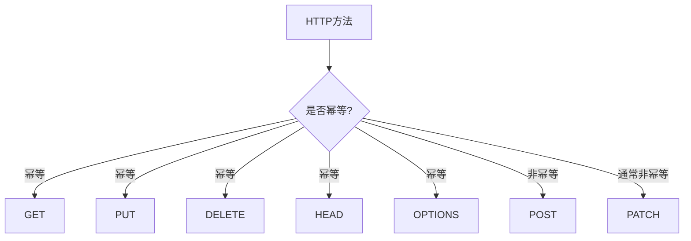
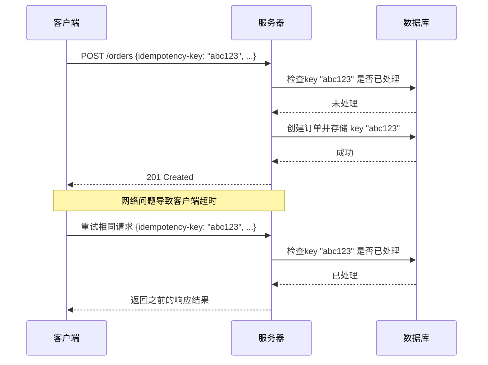
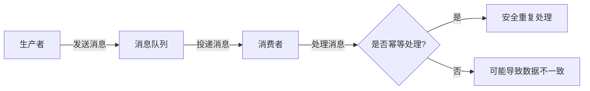
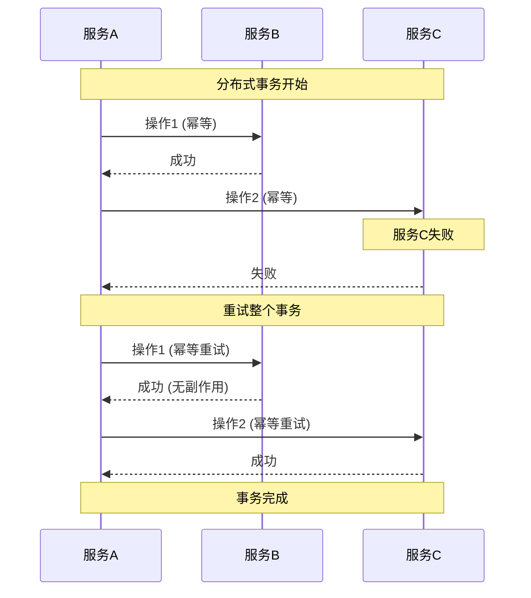

## 引言

在分布式系统和微服务架构日益普及的今天，系统的可靠性、一致性和容错性变得尤为重要。在这样的背景下，**幂等性(Idempotence)**作为一种核心设计原则，在确保系统可靠性方面发挥着至关重要的作用。

无论是设计RESTful API、消息队列处理系统、还是分布式事务处理，幂等性都是构建健壮系统的关键特性。本文将系统地介绍幂等性概念，并通过实际案例分析其在各种场景下的应用方法和最佳实践。

## 幂等性的基本概念

### 定义与起源

幂等性最初源自数学领域，描述了一种特殊的运算性质：对于操作 $f$，如果满足 $f(f(x)) = f(x)$，则称 $f$ 是幂等的。简单来说，就是无论对某个元素应用一次操作还是多次操作，结果都是相同的。

在计算机科学和系统设计中，幂等性被扩展为：**对系统进行一次操作与多次重复同样的操作，产生的系统状态变化是一致的**。

### 幂等性的核心特征

1. **结果一致性**：多次执行同一操作，最终系统状态相同
2. **副作用可控**：重复操作不会产生意外的副作用
3. **状态收敛**：无论执行多少次，系统最终会收敛到同一状态
4. **操作可重试**：失败后可以安全地进行重试

### 幂等与非幂等操作对比

| 幂等操作 | 非幂等操作 |
|---------|------------|
| 读取资源 (GET) | 创建新资源 (POST) |
| 设置资源为特定状态 | 递增计数器 |
| 删除特定资源 | 向列表追加元素 |
| 根据条件更新资源 | 无条件追加数据 |

## 为什么幂等性如此重要？

在分布式系统设计中，幂等性解决了许多关键挑战：

### 1. 分布式系统的不确定性

分布式环境中存在诸多不确定因素：网络延迟、分区、节点故障等。这些因素可能导致：

- 客户端超时后进行重试，但原操作实际已成功
- 消息重复投递到消费者
- 服务之间的通信失败，需要重新发送请求

在这些情况下，幂等操作确保系统不会因为重复处理而进入不一致状态。

### 2. 提升系统可靠性

- **简化错误恢复**：系统可以简单地重试失败的幂等操作，而无需复杂的补偿逻辑
- **增强容错能力**：即使某些操作重复执行，系统也能保持一致状态
- **减少数据不一致风险**：防止因重试导致的数据异常（如重复扣款、多次下单）

### 3. 改善用户体验

- 防止用户因网络问题导致的"双重提交"
- 允许用户安全地刷新页面或重试操作
- 提供更可预测和一致的系统行为

## HTTP方法的幂等性分析

在RESTful API设计中，HTTP方法的幂等性是一个核心设计考量：



### 幂等的HTTP方法

| HTTP方法 | 幂等性 | 安全性 | 说明 |
|---------|-------|-------|-----|
| GET | ✅ | ✅ | 只检索资源，不修改服务器状态 |
| HEAD | ✅ | ✅ | 与GET类似，但只返回头信息 |
| OPTIONS | ✅ | ✅ | 获取资源支持的方法，不修改状态 |
| PUT | ✅ | ❌ | 替换目标资源，重复操作结果相同 |
| DELETE | ✅ | ❌ | 删除资源，多次删除效果相同 |

### 非幂等的HTTP方法

| HTTP方法 | 幂等性 | 安全性 | 说明 |
|---------|-------|-------|-----|
| POST | ❌ | ❌ | 通常用于创建资源，多次调用可能创建多个资源 |
| PATCH | ❌/✅ | ❌ | 部分更新资源，根据实现可能是幂等的 |

> 注意: 这里的"安全性"指的是方法是否会修改服务器上的资源，而非安全防护措施。

## API设计中的幂等性实现

在API设计中实现幂等性有多种策略，以下是三种最常用的方法：

### 1. 使用幂等键 (Idempotency Keys)

为每个请求分配唯一标识符，服务器记录和检查这些标识符以防止重复处理：



**关键实现点**：
- 客户端生成全局唯一的幂等键（如UUID）
- 服务器存储已处理的幂等键及其响应
- 对于包含相同幂等键的请求，服务器返回存储的响应
- 设置幂等键的过期策略（TTL）

```javascript
// 服务器端伪代码
const processedRequests = new Map();

function processOrder(req, res) {
  const idempotencyKey = req.headers['idempotency-key'];
  
  if (!idempotencyKey) {
    return res.status(400).send('Missing idempotency key');
  }
  
  // 检查是否已处理过该请求
  if (processedRequests.has(idempotencyKey)) {
    const previousResponse = processedRequests.get(idempotencyKey);
    return res.status(previousResponse.status).send(previousResponse.data);
  }
  
  // 处理新请求
  try {
    // 创建订单逻辑...
    const order = createOrder(req.body);
    
    // 保存响应以备后续重试
    processedRequests.set(idempotencyKey, {
      status: 201,
      data: { orderId: order.id }
    });
    
    return res.status(201).send({ orderId: order.id });
  } catch (error) {
    // 处理错误...
    processedRequests.set(idempotencyKey, {
      status: 500,
      data: { error: error.message }
    });
    
    return res.status(500).send({ error: error.message });
  }
}
```

### 2. 条件请求与乐观锁

使用HTTP条件请求头和资源版本控制来确保幂等更新：

```javascript
// 客户端代码示例
async function updateUser(userId, userData) {
  // 先获取当前资源状态和ETag
  const response = await fetch(`/users/${userId}`);
  const etag = response.headers.get('ETag');
  
  // 使用If-Match头进行条件更新
  return fetch(`/users/${userId}`, {
    method: 'PUT',
    headers: {
      'Content-Type': 'application/json',
      'If-Match': etag
    },
    body: JSON.stringify(userData)
  });
}
```

**优势**：
- 防止并发更新导致的数据覆盖
- 符合HTTP标准，不需要额外的存储机制
- 客户端可以检测到资源已被修改并作出相应处理

### 3. 使用业务自然键

利用业务领域的自然唯一标识符来确保幂等性：

```javascript
// 使用业务自然键作为资源标识符
// POST /users
{
  "email": "user@example.com",  // 用作自然键
  "name": "John Doe",
  "role": "admin"
}

// 服务器端伪代码
function createUser(req, res) {
  const { email, name, role } = req.body;
  
  // 检查用户是否已存在
  const existingUser = findUserByEmail(email);
  if (existingUser) {
    // 用户已存在，返回现有用户
    return res.status(200).send(existingUser);
  }
  
  // 创建新用户
  const newUser = createNewUser(email, name, role);
  return res.status(201).send(newUser);
}
```

**适用场景**：
- 用户注册（邮箱作为自然键）
- 产品目录（产品编码作为自然键）
- 配置项（配置键作为自然键）

## 分布式系统中的幂等性

在分布式系统中，幂等性是确保系统稳定性和数据一致性的关键机制。

### 消息队列与事件处理

消息队列系统（如Kafka、RabbitMQ）通常会在网络故障后重试消息投递，而消费者必须准备好处理重复消息：



**非幂等与幂等消费者对比**：

```java
// 非幂等消费者示例（有问题）
public void processPayment(PaymentMessage message) {
    // 直接处理付款 - 重复处理会导致多次付款
    paymentService.deductAmount(message.getAccountId(), message.getAmount());
}

// 幂等消费者示例（安全）
public void processPayment(PaymentMessage message) {
    // 检查支付ID是否已处理
    if (paymentRepository.existsById(message.getPaymentId())) {
        log.info("Payment {} already processed, skipping", message.getPaymentId());
        return;
    }
    
    // 处理付款并记录已处理的支付ID
    paymentService.deductAmount(message.getAccountId(), message.getAmount());
    paymentRepository.saveProcessedId(message.getPaymentId());
}
```

### 实现消息队列幂等性的策略

1. **唯一消息ID**：为每条消息分配全局唯一ID
2. **消息去重表**：在消费者端维护已处理消息ID的记录
3. **业务状态检查**：基于业务状态判断是否已处理
4. **幂等性窗口期**：仅在特定时间窗口内进行去重处理

### 分布式事务中的幂等性

在分布式事务中，幂等操作可以极大简化补偿逻辑和故障恢复：



### 微服务架构中的幂等性传播

在微服务调用链中，幂等性应当从最外层API一直传播到所有下游服务：

1. **幂等键传播**：上游服务生成的幂等键通过请求头或消息属性传递给下游服务
2. **全链路跟踪**：使用分布式追踪工具（如Jaeger、Zipkin）来跟踪请求在服务间的流转
3. **一致性哈希**：确保相同请求始终路由到相同服务实例

## 基础设施中的幂等性

### Infrastructure as Code (IaC)

现代基础设施工具如Terraform、Ansible通过声明式配置实现幂等性操作：

```yaml
# Ansible幂等任务示例
- name: 确保Nginx已安装
  apt:
    name: nginx
    state: present
    
- name: 确保Nginx服务运行
  service:
    name: nginx
    state: started
    enabled: yes
```

Terraform示例：

```hcl
# 幂等的Terraform配置
resource "aws_s3_bucket" "example_bucket" {
  bucket = "example-bucket"
  acl    = "private"
}

resource "aws_iam_user" "example_user" {
  name = "example-user"
}
```

### 容器编排与Kubernetes

Kubernetes以声明式API为特色，使基础设施变更具有幂等性：

```yaml
# Kubernetes幂等资源定义
apiVersion: apps/v1
kind: Deployment
metadata:
  name: nginx-deployment
spec:
  replicas: 3
  selector:
    matchLabels:
      app: nginx
  template:
    metadata:
      labels:
        app: nginx
    spec:
      containers:
      - name: nginx
        image: nginx:1.14.2
        ports:
        - containerPort: 80
```

## 幂等性实现的挑战与解决方案

### 常见挑战

1. **并发处理**: 多个请求同时到达时如何确保幂等性
2. **幂等键存储**: 如何高效存储和查询幂等键
3. **跨服务幂等**: 如何在微服务架构中传播幂等性
4. **长时间运行的操作**: 如何处理长时间运行操作的幂等性
5. **幂等与业务规则冲突**: 某些业务场景可能本质上不是幂等的

### 解决方案

#### 1. 并发问题

多个客户端同时发送幂等请求时，可能导致竞态条件：

**解决方案**:
- **分布式锁**: 使用Redis、ZooKeeper实现分布式锁
- **乐观锁**: 使用版本号或条件更新防止并发冲突
- **唯一约束**: 在数据库层使用唯一约束确保幂等
- **事务隔离**: 选择适当的事务隔离级别（如SERIALIZABLE）

#### 2. 幂等键管理

幂等键的生成、存储和过期策略需要仔细设计：

**解决方案**:
- **客户端生成**: 在客户端生成UUID作为幂等键
- **TTL机制**: 实现幂等键的自动过期机制
- **分区存储**: 根据时间或业务维度分区存储幂等键
- **异步清理**: 定期清理过期的幂等键记录

#### 3. 系统边界与幂等性传播

在复杂系统中维持端到端的幂等性：

**解决方案**:
- **请求上下文**: 在整个调用链中传递请求上下文（包含幂等键）
- **分布式事务**: 使用TCC或Saga模式确保分布式事务的一致性
- **补偿逻辑**: 为非幂等操作设计补偿逻辑
- **异步确认**: 使用确认/回执机制防止重复处理

## 实际应用案例

### 案例1：支付系统的幂等性

支付处理是幂等性的典型应用场景，同一笔支付不能重复执行：

```java
@Transactional
public PaymentResponse processPayment(PaymentRequest request) {
    // 检查是否已存在相同支付ID的记录
    if (paymentRepository.existsByPaymentId(request.getPaymentId())) {
        // 返回已存在的支付结果
        Payment existingPayment = paymentRepository.findByPaymentId(request.getPaymentId());
        return mapToResponse(existingPayment);
    }
    
    // 处理新支付
    Payment payment = new Payment();
    payment.setPaymentId(request.getPaymentId());
    payment.setAmount(request.getAmount());
    payment.setStatus(PaymentStatus.PROCESSING);
    
    // 保存初始状态
    paymentRepository.save(payment);
    
    try {
        // 调用支付网关
        PaymentGatewayResponse gatewayResponse = paymentGateway.processPayment(
            request.getPaymentMethod(),
            request.getAmount()
        );
        
        // 更新支付状态
        payment.setStatus(gatewayResponse.isSuccessful() ? 
                          PaymentStatus.COMPLETED : PaymentStatus.FAILED);
        payment.setTransactionId(gatewayResponse.getTransactionId());
        paymentRepository.save(payment);
        
        return mapToResponse(payment);
    } catch (Exception e) {
        // 更新支付状态为失败
        payment.setStatus(PaymentStatus.FAILED);
        payment.setFailureReason(e.getMessage());
        paymentRepository.save(payment);
        
        throw new PaymentException("Payment processing failed", e);
    }
}
```

### 案例2：库存管理系统

电子商务系统中的库存管理必须确保不会多次扣减同一订单的库存：

```java
@Transactional
public void processOrderInventory(OrderInventoryRequest request) {
    // 检查订单ID是否已处理
    if (inventoryTransactionRepository.existsByOrderId(request.getOrderId())) {
        log.info("Order {} inventory already processed", request.getOrderId());
        return;
    }
    
    // 处理库存
    for (OrderItem item : request.getItems()) {
        Product product = productRepository.findById(item.getProductId())
            .orElseThrow(() -> new ProductNotFoundException(item.getProductId()));
        
        // 检查库存
        if (product.getAvailableStock() < item.getQuantity()) {
            throw new InsufficientStockException(product.getId());
        }
        
        // 减少库存
        product.setAvailableStock(product.getAvailableStock() - item.getQuantity());
        productRepository.save(product);
        
        // 记录库存交易
        InventoryTransaction transaction = new InventoryTransaction();
        transaction.setOrderId(request.getOrderId());
        transaction.setProductId(product.getId());
        transaction.setQuantity(item.getQuantity());
        transaction.setType(TransactionType.DEDUCT);
        transaction.setTimestamp(LocalDateTime.now());
        inventoryTransactionRepository.save(transaction);
    }
}
```

## 幂等性设计最佳实践

### 系统设计阶段

1. **明确幂等性需求**：在设计阶段识别哪些操作需要幂等性
2. **选择合适的幂等策略**：根据业务场景选择最适合的幂等实现方式
3. **统一幂等机制**：在整个系统中使用统一的幂等性处理框架
4. **考虑性能影响**：评估幂等性实现对系统性能的影响
5. **设计异常处理**：合理处理幂等性检查过程中的异常情况

### API设计

1. **优先使用幂等HTTP方法**：尽可能使用GET、PUT、DELETE等幂等方法
2. **文档化幂等性行为**：在API文档中明确说明每个接口的幂等性特性
3. **标准化幂等键处理**：定义清晰的幂等键格式和处理规范
4. **实现请求去重**：为非幂等接口实现请求去重机制
5. **重试策略**：为客户端提供明确的重试指导

### 实现与测试

1. **编写幂等性测试**：专门测试系统在重复操作下的行为
2. **模拟网络故障**：测试在各种网络故障场景下的系统行为
3. **压力测试**：在高并发场景下测试幂等性机制的有效性
4. **审计与监控**：记录和监控幂等性相关的事件和指标
5. **定期审查**：定期审查幂等机制的有效性和性能

## 结论

幂等性是现代分布式系统架构中确保可靠性和一致性的核心原则。通过在API设计、消息处理、分布式事务等各个层面实现幂等性，系统可以更好地应对网络不稳定性、服务故障和并发操作等挑战。

关键收益包括：

1. **提高系统可靠性**：即使在网络不稳定或服务故障的情况下，系统也能保持数据一致性
2. **简化错误处理**：客户端可以安全地进行重试，而无需担心副作用
3. **改善用户体验**：防止因网络问题或用户重复操作导致的数据错误
4. **支持自动化**：使自动化脚本和工具能够安全地重复执行
5. **降低运维复杂度**：简化故障恢复和系统维护流程

幂等性不仅是一个技术概念，更是一种系统设计哲学。在设计新系统或改进现有系统时，将幂等性作为核心设计原则之一，可以大幅提高系统的健壮性和可靠性。

## 参考资料

- [Understanding Idempotency](https://medium.com/cache-me-out/understanding-idempotency-68a50a837fc1)
- [The Idempotence Principle in Software Architecture](https://hackernoon.com/the-idempotence-principle-in-software-architecture)
- [REST API Design: Idempotent Operations](https://restfulapi.net/idempotent-rest-apis/)
- [Idempotency Patterns in Event-Driven Systems](https://www.confluent.io/blog/idempotent-kafka-consumers/)
- [HTTP Semantics: Idempotent Methods](https://tools.ietf.org/html/rfc7231#section-4.2.2)

