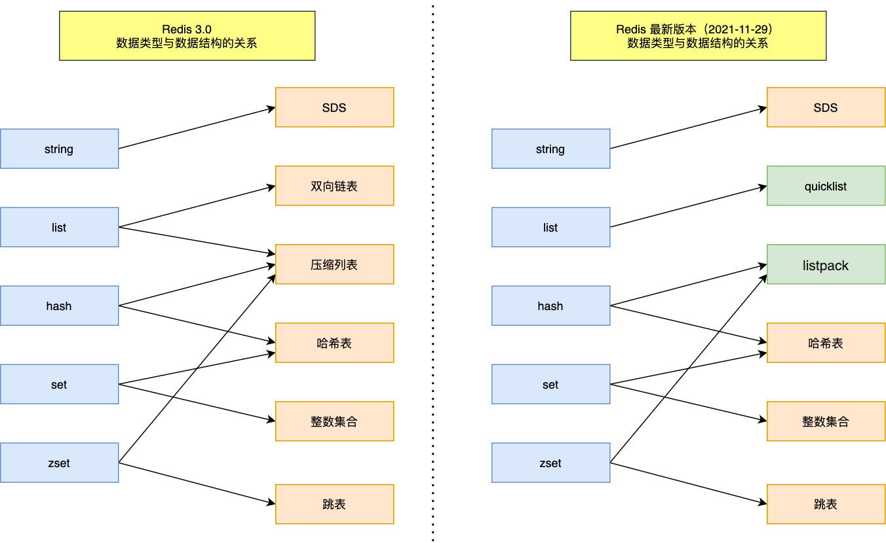

# Redis 知识库

Redis 是一个开源的、基于内存的数据结构存储系统，可以用作数据库、缓存和消息中间件。本站收集整理了 Redis 相关的核心知识、最佳实践和常见问题解决方案。

## 🔍 内容导航

### 基础知识

- **数据类型**

  - [字符串 (String)](/2025/05/10/八股文/REDIS/基础知识/数据类型/String/) - Redis 字符串类型的特性与使用场景
  - [列表 (List)](/2025/05/10/八股文/REDIS/基础知识/数据类型/List/) - Redis 列表类型及其应用
  - [哈希表 (Hash)](/2025/05/10/八股文/REDIS/基础知识/数据类型/Hash/) - Redis 哈希表的结构与操作
  - [集合 (Set)](/2025/05/10/八股文/REDIS/基础知识/数据类型/Set/) - Redis 集合类型的特性与用法
  - [有序集合 (Zset)](/2025/05/10/八股文/REDIS/基础知识/数据类型/Zset/) - Redis 有序集合的实现与应用场景
  - [BitMap 及其他高级数据类型](/2025/05/14/八股文/REDIS/基础知识/数据类型/Other/) - Redis 位图和其他特殊数据结构

- **数据结构**

  - [SDS (Simple Dynamic String)](/2025/05/18/八股文/REDIS/基础知识/数据结构/SDS/) - Redis 动态字符串 SDS 的实现原理与优势
  - [链表 (LinkedList)](/2025/05/21/八股文/REDIS/基础知识/数据结构/链表/) - Redis 链表的实现原理及其在 Redis 内部的应用
  - [哈希表 (Hash Table)](/2025/05/21/八股文/REDIS/基础知识/数据结构/哈希表/) - Redis 哈希表的实现原理、扩容策略和渐进式 rehash 机制
  - [压缩列表 (ZipList)](/2025/05/21/八股文/REDIS/基础知识/数据结构/压缩列表/) - Redis 压缩列表的设计原理与内存优化策略
  - [整数集合 (IntSet)](/2025/05/21/八股文/REDIS/基础知识/数据结构/整数集合/) - Redis 整数集合的实现原理与升级机制
  - [跳表 (SkipList)](/2025/05/27/八股文/REDIS/基础知识/数据结构/跳表/) - Redis 跳表的实现及在有序集合中的应用
  - [QuickList](/2025/05/27/八股文/REDIS/基础知识/数据结构/quicklist/) - Redis QuickList 如何结合链表与压缩列表的优势
  - [ListPack](/2025/05/27/八股文/REDIS/基础知识/数据结构/listpack/) - Redis 6.0 新引入的 ListPack 及其优势
  - [键值对数据库实现原理](/2025/05/18/八股文/REDIS/基础知识/数据结构/健值对数据库是怎么实现的/) - Redis 键值对数据库的底层实现和数据结构

  

- **持久化**

  - [RDB 持久化](/2025/05/30/八股文/REDIS/基础知识/持久化/RDB/) - Redis RDB 快照持久化机制，包括原理、优化与混合持久化
  - [AOF 持久化](/2025/05/30/八股文/REDIS/基础知识/持久化/AOF/) - Redis AOF 持久化详解，三种写回策略与重写机制
  - [大Key对持久化的影响](/2025/05/30/八股文/REDIS/基础知识/持久化/BIGKEY/) - 分析大Key对持久化性能的影响及优化策略

- **内存管理**

  - [过期删除和内存淘汰策略](/2025/06/03/八股文/REDIS/基础知识/内存管理/过期删除和内存淘汰/) - Redis 过期删除策略与内存淘汰策略的区别与实现原理

- **事务**
  - Redis 事务特性 - _敬请期待_
  - WATCH 机制 - _敬请期待_

### 高级特性

- **分布式锁**

  - Redis 分布式锁实现 - _敬请期待_
  - Redlock 算法 - _敬请期待_

- **消息队列**

  - 基于 List 的消息队列 - _敬请期待_
  - Pub/Sub 发布订阅 - _敬请期待_
  - Stream 数据流 - _敬请期待_

- **缓存设计**
  - [缓存雪崩、穿透、击穿问题详解](/2025/06/08/八股文/REDIS/缓存/缓存雪崩or穿透or击穿/) - 深入解析Redis缓存三大经典问题及其解决方案，包括互斥锁、双key策略、布隆过滤器等实践方法
  - 缓存更新策略 - _敬请期待_

### 集群架构

- **主从复制**

  - [Redis主从复制详解](/2025/06/03/八股文/REDIS/高可用/主从复制/) - Redis主从复制机制的完整实现原理，包括全量复制、增量复制和故障处理
  - 复制优化策略 - _敬请期待_

- **哨兵模式**

  - [Redis 哨兵模式详解](/2025/06/08/八股文/REDIS/高可用/哨兵/) - 详解哨兵机制的工作原理，包括故障检测、leader 选举、主从切换等核心功能
  - 故障转移机制 - _敬请期待_

- **集群模式**
  - [Redis Cluster 集群详解](/2025/06/08/八股文/REDIS/高可用/集群/) - Redis Cluster 集群的架构原理、哈希槽、重定向机制、Gossip通信协议和故障转移等核心机制
  - 数据分片与槽位分配 - _敬请期待_

---

## 📚 学习资源

- [Redis 官方文档](https://redis.io/documentation)
- [Redis 设计与实现](https://redisbook.readthedocs.io/en/latest/)
- [Redis 开发与运维](https://book.douban.com/subject/26971561/)

---

> 内容持续更新中，欢迎关注最新的 Redis 技术文章！  
> 最后更新时间：2025 年 6 月 8 日
